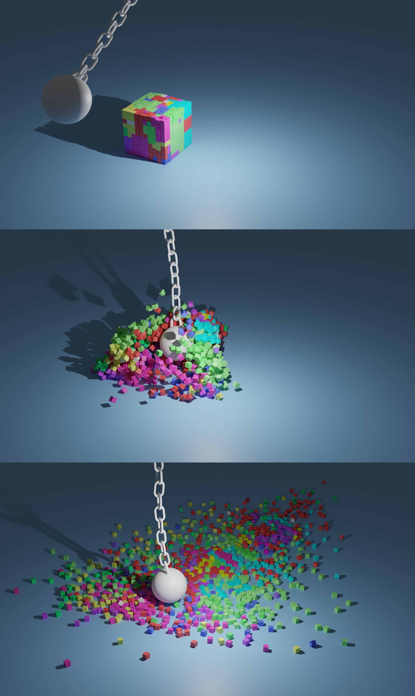
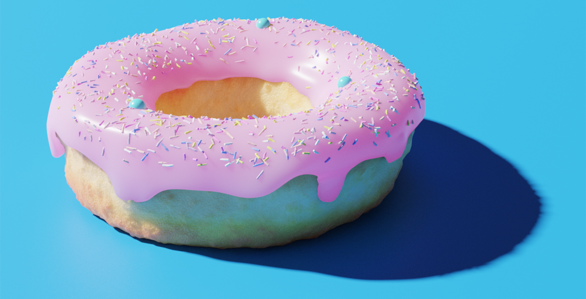
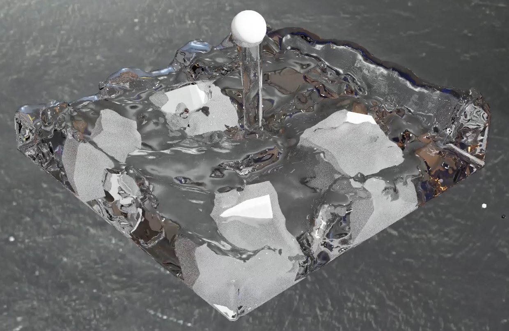
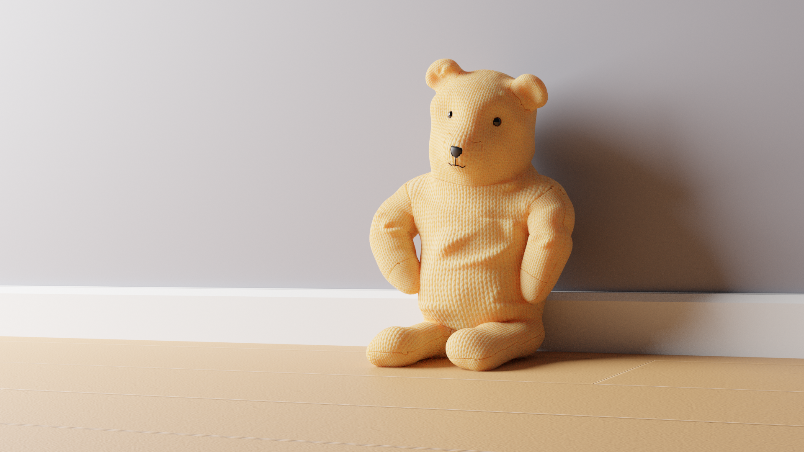
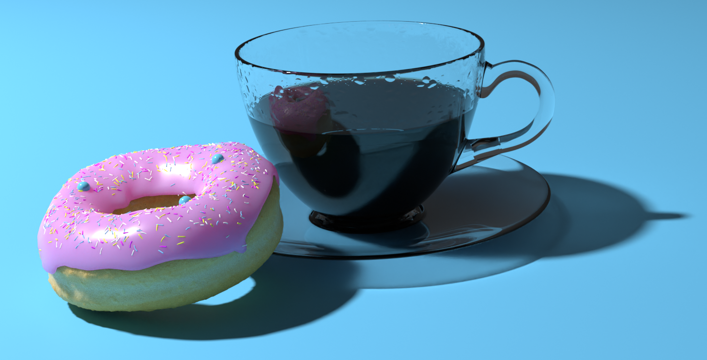

Title: Advanced Projects
Author: David Corish
Date: 16/07/2020
Category: 3D Modelling
Tags: 3D, 3D modelling, modelling, advanced, projects
Slug: advanced-projects
Series: 3D Modelling
Series_index: 13
Sortorder: 13

The following projects are here to give you an idea of the potential of Blender.

## "Duck in Water" - David Corish, estimated difficulty: 2/5

## "Renovation" - Anthony Gallas, estimated difficulty: 2/5

## "Cubes Simulation" - David Corish, estimated difficulty: 3/5

## "Doughnut" - David Corish, estimated difficulty: 4/5

## "Water Simulation" - David Corish, estimated difficulty: 4/5

## "Teddy Bear" - Anthony Gallas, estimated difficulty: 4/5

## "Coffee & Doughnut" - Anthony Gallas, estimated difficulty: 5/5

