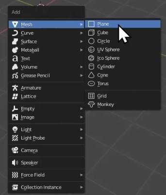

Title: Bowling Tutorial Part 1 - Modelling
Author: David Corish
Date: 16/07/2020
Category: 3D Modelling
Tags: 3D, 3D modelling, modelling, bowling
Slug: bowling-part1-modelling
Series: 3D Modelling
Series_index: 09
Sortorder: 09



## Introduction

This documentation is intended as a **text guide to accompany the first video in the 'Bowling' set of videos.** It will cover modelling your bowling pin.

## Step 1 - Deleting default cube and moving to a top-down view

**_Right-click_** the **_default cube._** Click **_delete._**

Press the **numpad 7** to move to a **top-down view.**

If your laptop doesn't have a number pad, go to the edit drop-down in the top-left corner of Blender's interface.
Enter the preferences menu. Choose input. From here, go to the keyboard section and tick 'Emulate Numpad'.

This will allow you to use the numbers across the top of your keyboard instead.

## Step 2 - Adding reference image

Before you continue, **find an image of a bowling pin online and download it.** This will be used to trace around when creating the outline of your model.

Press **_Shift+A_** to open the **_add_** menu. From here, **_image_** and then click **_reference._**

**Navigate to where you saved your bowling pin image** and then **click _load reference image._**

## Step 3 - Adding bezier curve and tracing around image

Press **_Shift+A_** to open the **_add_** menu. From here, go to **_curve_** and then click **_bezier._**

Once the curve has been added, **make sure that 2D is selected in the _curve properties menu._** This is because we're working with a 2D image.

Press **_tab_** to change to **_edit mode._**

Once you're in edit mode, **you will notice that the curve now has several points that you can control.** These points are going to be used to move the curve such that it traces around your bowling pin image.

Press **_G_ to _grab_ and move, _R_ to _rotate_ and _S_ to _scale_ the points/curve**.

**With a point selected, press _E_ to create another point**

Using these tools, **create a rough outline of the bowling pin.** This will be cleaned up in the next step.

## Step 4 - Converting curve to mesh and making tracing more accurate

Press **_tab_** to return to **_object mode._**

**Select the curve** and go to the **_object_ menu in the top-left** of the 3D viewport. From here, go to **_convert to_** and then select **_mesh from curve._**

Press **_tab_** to change to **_edit mode._**

The curve will now be made from a number of dots which you can manipulate to make your tracing more accurate.

**Make your tracing as accurate as possible.** Be especially sure that the bottom is level as you don't want your bowling pin to fall over later.

## Step 5 - Turning your 2D tracing into a 3D model

Go to the **_modifier menu_** at the **right-side of the viewport** and then click **_add modifier._**

Select the **_screw modifier._**

Change the **_axis_ to _Y_, _steps_ to _60_** & **_render steps_ to _60._**

**Click _apply._**

You now have a grey bowling pin!

## Step 6 - Adding a base colour

Go to the **top-right of the _viewport_** and switch to **_viewport shading._**

**Make sure** that your **bowling pin is selected.**

Go to the **_material properties_ tab**

Click **_new._**

From here, select **_base colour._** You can now **use the colour wheel to change the colour of your bowling pin.**

## Step 7 - Adding more colour

Press **_tab_** to change to **_edit mode._**

Go to the **top-right of the _viewport_** and click **_x-ray mode._** This will ensure that when we start modifying colour, we are changing both sides of the bowling pin.

**Click and drag over a section of your bowling pin** to select it.

Go to the **_material properties_ tab** and **click the _plus_ icon.**

Click **_new._**

Again, **select your colour** using the **_colour wheel._**

Click **_assign_** to change your selected section to the desired colour.

You can make it any variety of colours you want!

## Step 8- Deleting reference image & placing model on plane

Select your **_reference image._ _Right-click_** and then click **_delete._**

Press the **_scroll wheel_** to **orbit your view.**

If you don't have a scroll wheel, go to the edit drop-down in the top-left corner of Blender's interface.
Enter the preferences menu. Choose input. From here, go to the mouse section and tick 'Emulate 3 Button Mouse'.

You can now press alt + left-click as a replacement for a scroll wheel.

**Using _R_ to _rotate_ your bowling pin** and **_G_ to _move_** it, **place your bowling pin upright.**

Press **_Shift+A_** to open the **_add_ menu**. Go to **_mesh._** Click on **_plane._** This will add a floor for your bowling pin to stand on.

Press **_S_ to _scale_ up the plane.**

You can **change the colour of this plane using the _material properties_ tab** (the same way you changed the bowling pin colour).

Press **_G_ then _Z_** to **place your bowling pin slightly above the plane.**

## Conclusion

You have now **successfully modelled a bowling pin!**

In the **next part of this series, we're going to add physics** and then knock a set of bowling pins over with a bowling ball! Make sure to check it out.
