Title: Bowling Tutorial Part 2 - Animation & Physics
Author: David Corish
Date: 16/07/2020
Category: 3D Modelling
Tags: 3D, 3D modelling, modelling, bowling, animation, physics
Slug: bowling-part2-animation-physics
Series: 3D Modelling
Series_index: 10
Sortorder: 10



## Introduction

This documentation is intended as a **text guide to accompany the second video in the 'Bowling' set of videos.** It will cover adding physics to your bowling pin before using a bowling ball to knock a set over.

## Step 1 - Adding rigid body modifier to bowling pin

**Select your bowling pin.**

Go to the **right-side of** the **window** and select the **_physics properties_ tab.**

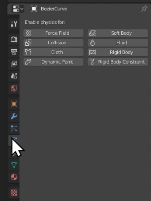

Click **_rigid body._** This makes your bowling pin a part of the physics simulation!

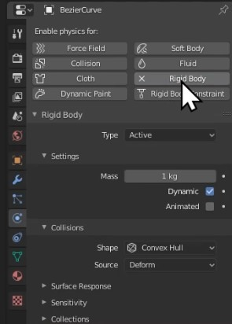

**Leave the settings as they are** for now.

## Step 2 - Adding rigid body modifier to plane

**Select your plane** and **repeat step 1.**

This time, **change the _rigid body type_ from _active_ to _passive._**

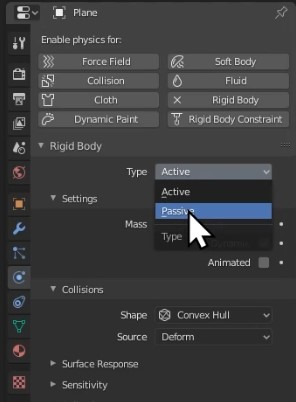

**Select your bowling pin** & press **_G_ then _Z_ to raise it slightly** above the plane.

**Press _spacebar_ to play the animation** and see your bowling pin fall to the ground.

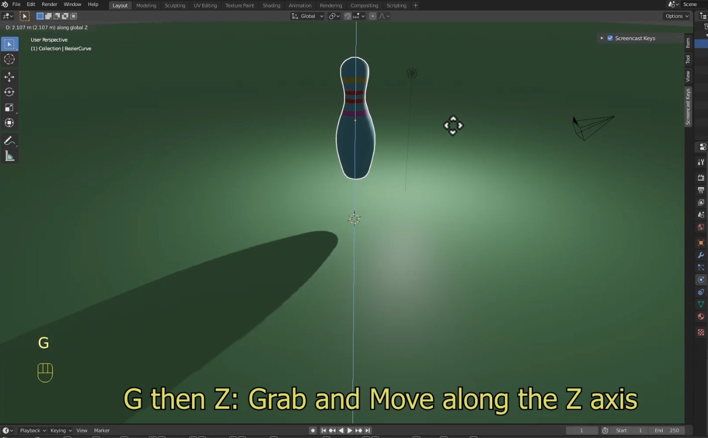

## Step 3 - Setting origin point of bowling pin

**Select your bowling pin** and **right-click** to open the **_object context menu._**

Go to **_set origin_** and then click **_origin to geometry._**

This changes your bowling pin's centre of gravity. The fall will now look more natural.

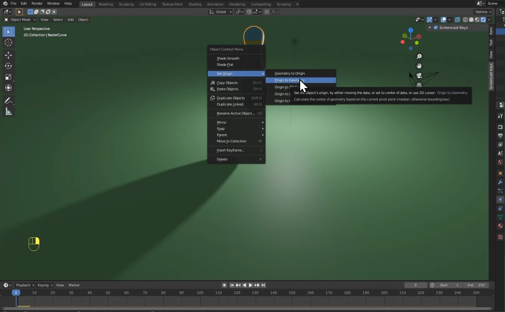

## Step 4 - Duplicating bowling pin

**Select your bowling pin** and **press _Shift+D_ to _duplicate._**

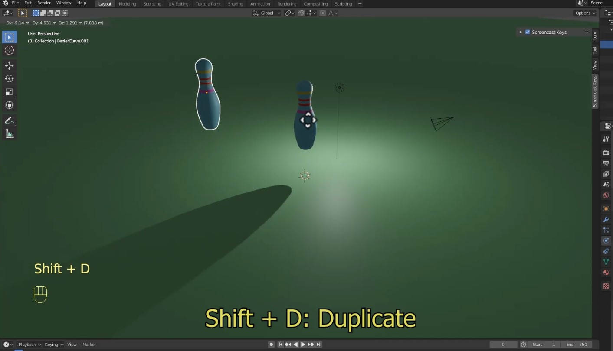

**Using the duplication tool, create a set of bowling pins** and place them onto your plane. This is the set that we're going to knock over with the bowling ball.

## Step 5 - Adding bowling ball

Press **_Shift+A_** to open the **_add_ menu.**

Go to **_mesh_** and then select **_UV sphere._**

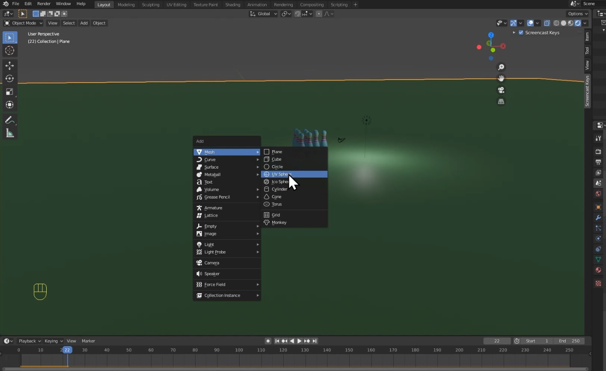

You **may notice that the bowling ball has a blocky look.** To fix this, **right click the bowling ball** and select **_shade smooth._**

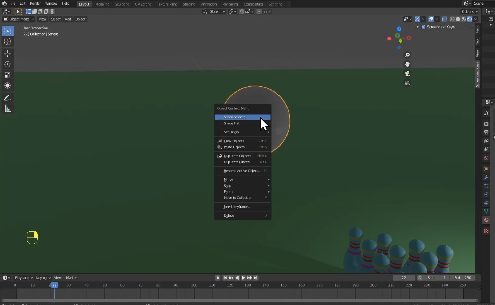

**Add a colour.** The method is the same as that used to colour the bowling pin! **To add shininess, change the _roughness slider_ on the _material_ to around 0.05.**

**Move your bowling ball to** approximately **where you want to start it rolling from.** This should be a little bit of distance from your bowling pins.

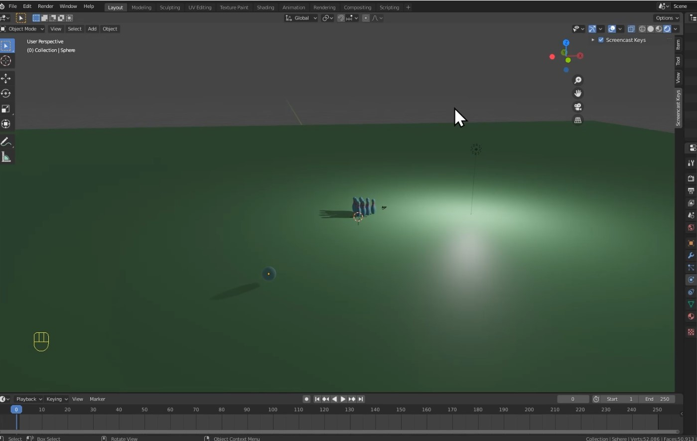

**To adjust the brightness of the scene,** select the **_light_** and go to the **_light properties tab._** From here, **increase the power** as necessary.

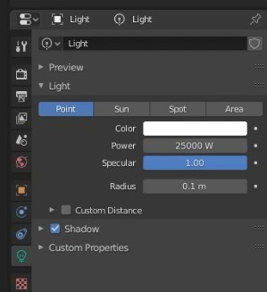

## Step 6 - Adding physics to/animating bowling ball

**Select your bowling ball** and add a **_rigid body modifier._** This time, **make sure that the _animated_ box is ticked.**

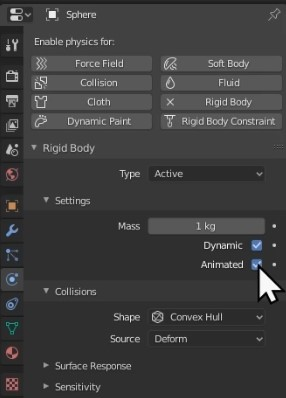

At the bottom of the screen, **make sure that the _blue marker_ on your timeline is at 0.**

**Select the bowling ball** and press **_I_** to open the **_insert keyframe menu._**

Select **_LocRotScale._**

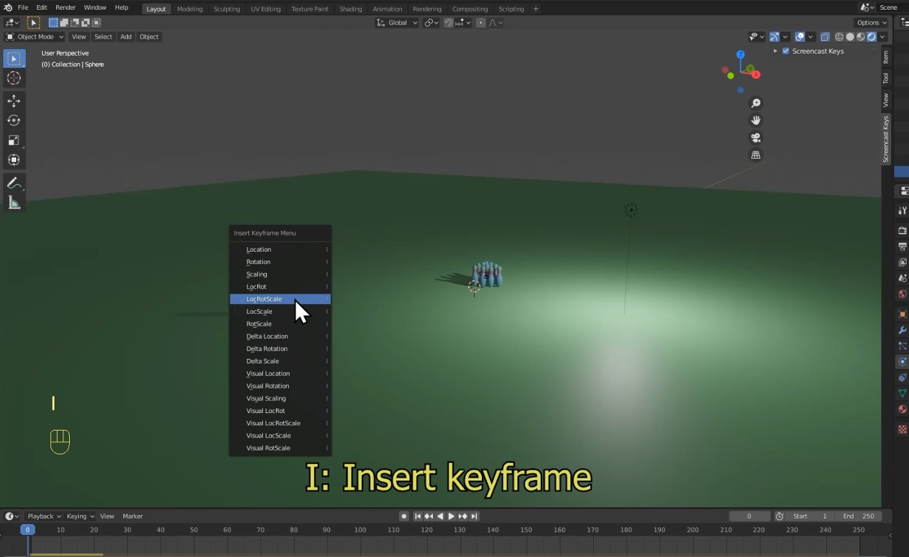

On the _timeline,_ **move your _blue marker_** forward **to frame 20** as seen in the below image.

**Give your bowling ball some forward momentum by moving it closer to the bowling pins.** Think of it as giving the bowling ball a push.

Again, **press _I_** and then **select _LocRotScale._**

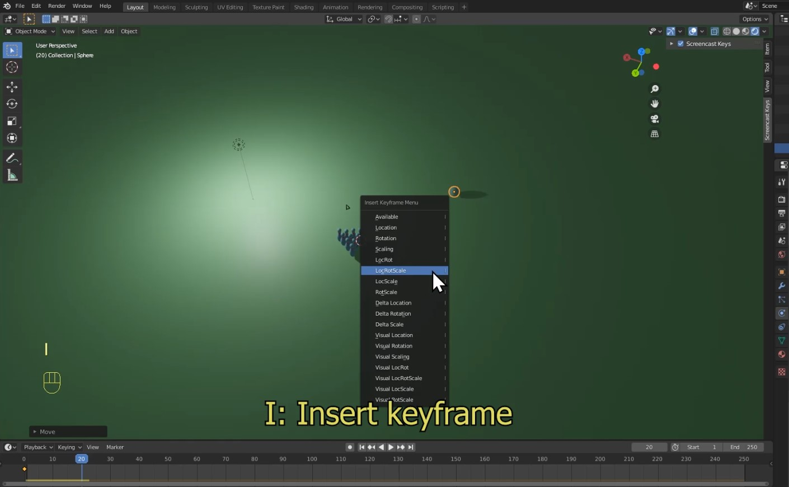

Move the **_blue marker_ to frame 10.**

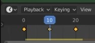

Go to the **_physics properties tab_** and **click the button beside animated. This adds another _keyframe._** This ensures that, up until this point, the bowling ball is controlled by your animation.

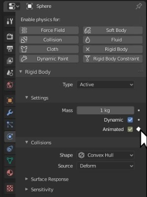

Move the **_blue marker_ to frame 11.**

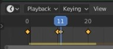

**Uncheck** the **_animated_ box in the _physics properties tab._ Click the button again to insert another _keyframe._** From this point forwards, your bowling ball will be controlled by the physics simulation.

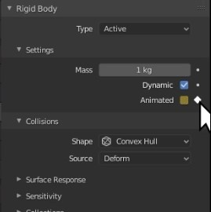

**Press _spacebar_ to see your bowling ball knock over the bowling pins!**

**To add _weight_** to the bowling ball, go to the **_physics properties tab_** and **increase the _mass._**

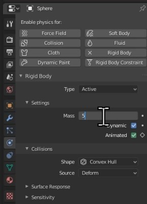

## Conclusion

You have now **successfully created a bowling simulation!**

In the **next part of this series, we're going to make our final render!** It will look very fancy so make sure to check it out.
