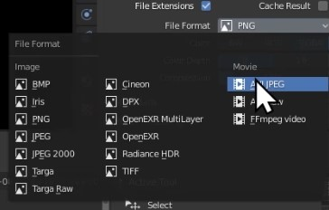

Title: Bowling Tutorial Part 3 - Rendering
Author: David Corish
Date: 16/07/2020
Category: 3D Modelling
Tags: 3D, 3D modelling, modelling, rendering
Slug: bowling-part3-rendering
Series: 3D Modelling
Series_index: 11
Sortorder: 11



## Introduction

This documentation is intended as a **text guide to accompany the third video in the 'Bowling' set of videos.** It will cover rendering your final bowling video.

## Step 1 - Camera

The **_camera_** is the **point of view** from which your **final render** will be **viewed from.**

**Make sure that** the **_camera_ is selected.**

**Using _G (move), R (rotate),_** and **_S (scale),_ adjust** the **position of** your **_camera._**

Press **_numpad 0_** to move to the **_camera's_ point of view.**

 Open the **_view_** menu in the top-right of the viewport and click the box beside **_lock camera to view._** This will allow your camera to orbit with your view and make positioning easier.

 **_Orbit_** the camera's view using **_MMB._**

 **_Pan_** the camera's view using **_Shift+MMB._**.

 (MMB = scroll-wheel)

You **may encounter an issue** where a **grey wall appears** as seen below.

To resolve this, **make sure that** your **_camera_ is selected** and then go to the **_camera properties tab._**

Change **_clip end_ to 500** or above.

This will remove the grey wall.

Before moving onto the next step, **adjust** the **camera until you're happy with its position.**

## Step 2 - Length of animation

Press **_spacebar_** and **watch your animation play.** At the moment, **it probably appears to be very long.**

To change this, **modify the _end_ value on your _timeline._** This can be found in the bottom right hand corner of the 3D viewport.

## Step 3 - Render engine

_Blender_ uses two very different render engines.

**_Eevee_ is fast and efficient** & produces **good lighting quality.**

**_Cycles_ is slow but accurate** & produces **excellent lighting quality.**

For **more information, refer to the _system requirements_ page.**

To **change render engine,** go to the **_render properties tab._** At the top, **use the dropdown menu to switch between _Eevee_ and _Cycles._**

## Step 4 - Final preparations

Click the **_plus icon_ at the top** of the screen **to add a new _workspace._**

Go to **_video editing_** and then select **_video editing._**

Go to the **right side of the screen** and **scroll down to _output._** If you want, **adjust the output folder.** The **default** is the **tmp folder** on your **C drive.**

**Open** the **_file format menu._**

Change the **file format to _AVI JPEG_** or your preferred output format.

**Return to** the **_layout tab._**

## Step 5 - Rendering!

**Press spacebar to let your animation play** one more time. This **will bake the data** to **ensure that it does not glitch** during rendering.

Go to the **top-left** and select **_render._** Select **_render animation._**

**Wait** for your machine to **finish rendering** all of the frames. This can take some time.

## Step 6 - Viewing your final videos

Open **_file explorer._** Open your **C drive.**

Locate **_tmp_ folder** by **typing _tmp_ in** the **search box** in the top-right.

**Your final video will be in this folder! Enjoy.**

## Conclusion

You should now have a **fully rendered bowling animation.** Thank you for reading this text guide and I hope you enjoyed!
