Title: Getting Started in Blender Part 1 - Adding, Removing, and Moving Objects
Author: Anthony Gallas
Date: 16/07/2020
Category: 3D Modelling
Tags: 3D, 3D modelling, modelling, introduction
Slug: getting-started-part1-adding-removing-moving-objects
Series: 3D Modelling
Series_index: 04
Sortorder: 04



## Introduction
This documentation is intended as a text guide to accompany the first video in the 'Getting Started' set of videos.

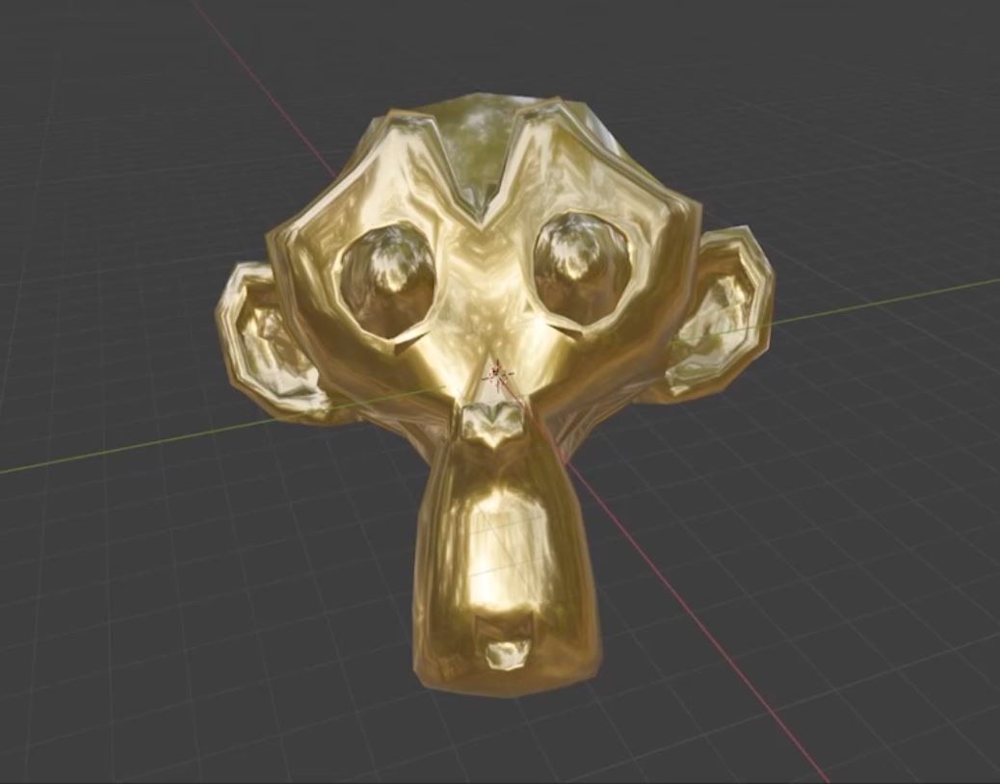

## Step 1 - Click "General" on the Blender Splash Screen and Delete Default Cube

After opening Blender, **click "General" on the Blender splash screen**.  After clicking, you will be on the "3D viewport" with the default cube

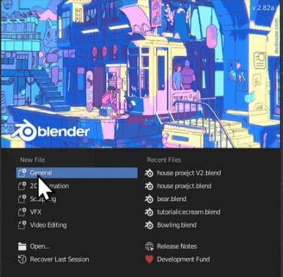

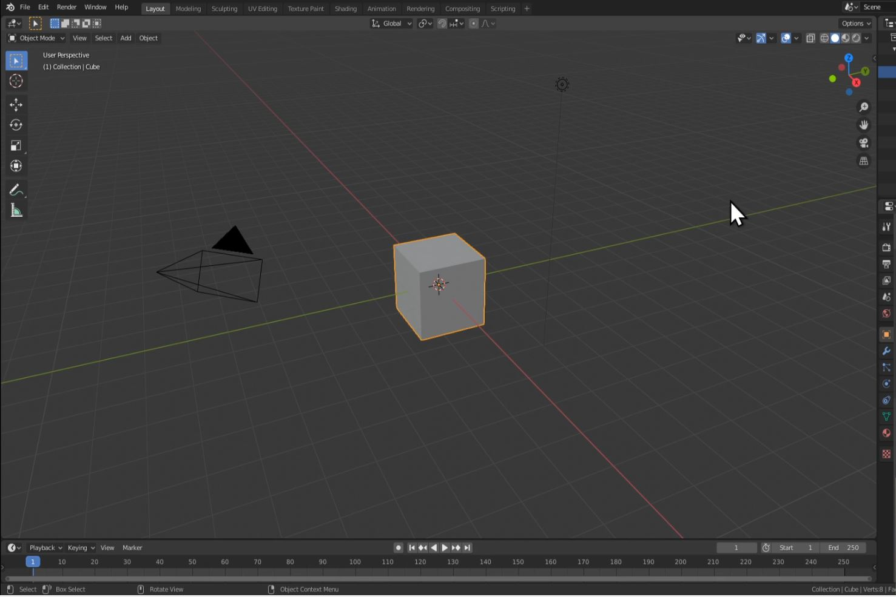

The 3D Viewport is where you will be 90% of the time while working on your projects

First, **delete the cube by left-clicking on the cube and pressing the "Delete" key.**  You can also delete the cube by pressing "X" and clicking delete.

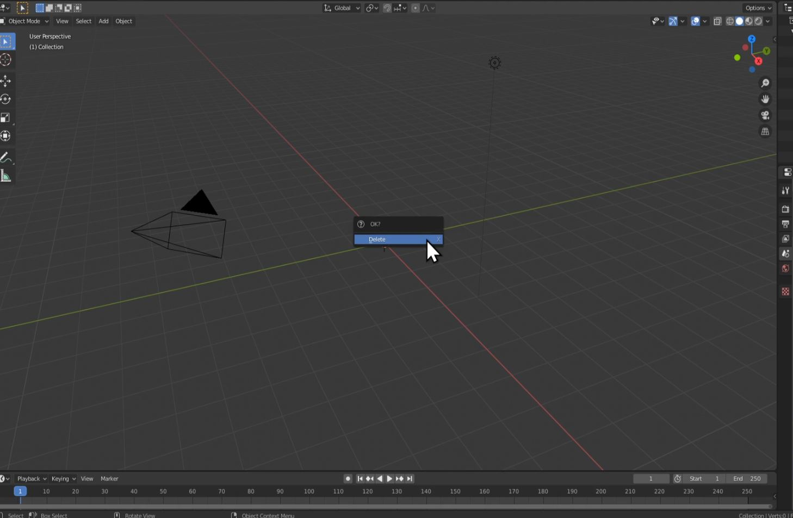

**The other two objects you see are the "Camera" and "Light".**  We wont be using those in this part of the tutorial, so **try deleting them yourself**.

## Step 2 - Add Monkey Head

Next, **press "Shift + A" to get a drop down menu.  Go to "_Mesh_" and select "_Monkey._"**

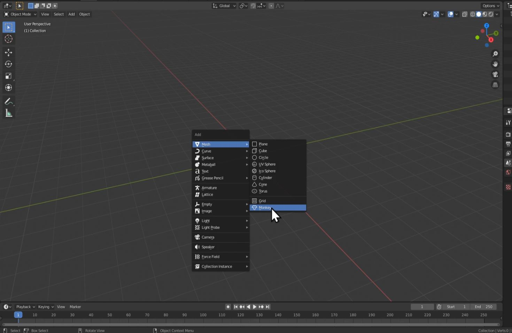

**Right-click on Monkey and click "_Shade Smooth_".**

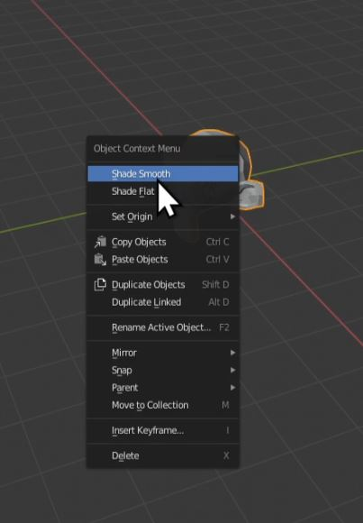

## Step 3 - Add a Material and Color Your Monkey Head

You will see a set of property tabs on the right side.  From those tabs, **select "_Material Properties_", then select "_New_" in the menu.**

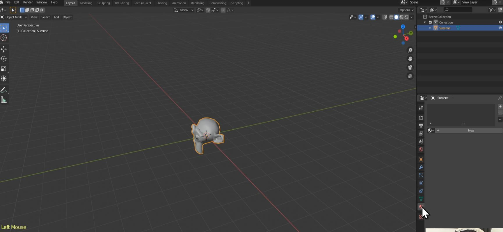

**Click on "_Base Colour_" and select a colour** you will like your monkey head to be.  **_NOTE: To see the effects on the model, press "Z" and click on "Material Preview" from the pie menu._**

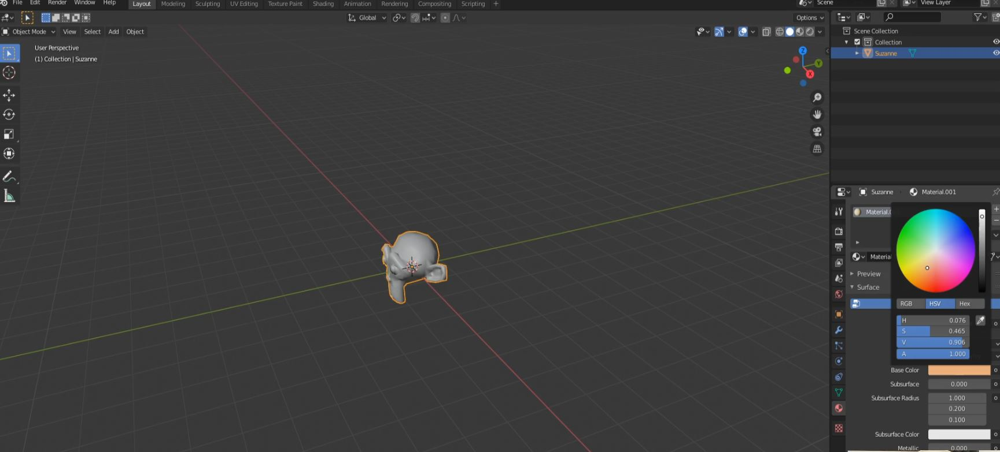

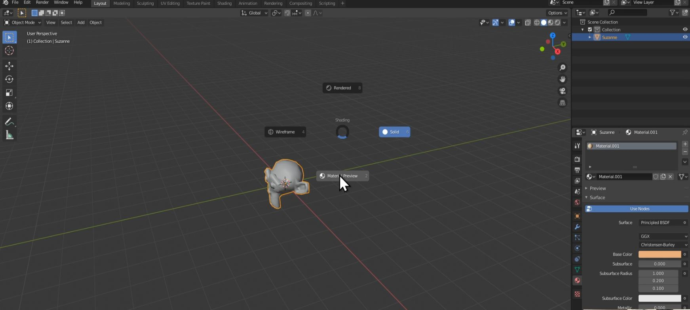

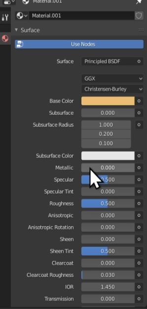

_**Challenge:**_ _Come up with something unique by playing with the other material settings_

## Step 4 - Moving Your Monkey Head

Ensure your monkey head is selected by left-clicking on it.

On the left side of your screen, you will see several options.  **Left-click on "_Move_".**  Three arrows will then appear on your monkey head.

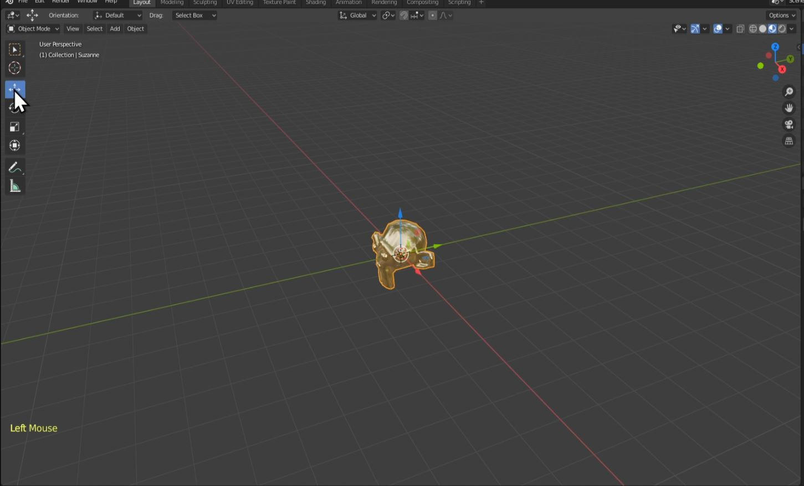

**Left-click and hold on each one of these arrows to move your monkey head.**

Red Line = X axis  
Green Line = Y axis  
Blue Line = Z axis  

**Click in the center of the monkey head (where the white circle is) to freely move your object.**

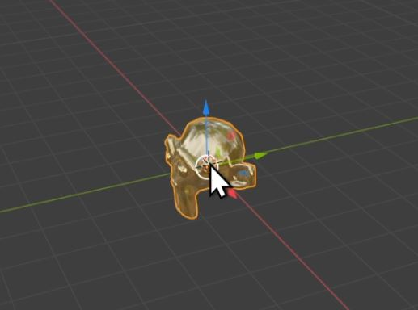

If you have moved your monkey head and want to get it back to the center, **Press Ctrl + Z to undo.**

**_NOTE: You might have to press Ctrl + Z multiple times_**

The hotkey to move an object is "G".  Imagine "G" for Grab.

Next, **press "G" and then press X,Y, or Z to move your object along one of the colored lines, or axis. Left-Click to set it in place.**

Finally, **press "G" again and click and hold Middle Mouse Button (MMB) and drag, to snap your object to one of the axis (the colored lines). Left Click to set in place.**

**_NOTE: If you don't have a scroll wheel, go to the edit drop-down in the top left corner of Blender's interface.
Enter the preferences menu. Choose input. From here, go to the mouse section and tick 'Emulate 3 Button Mouse'._ 
_You can now press alt + left-click as a replacement for a scroll wheel._**

## Step 5 - Rotating and Scaling Your Monkey Head

With your monkey head selected, **Left-click on "Rotate".**

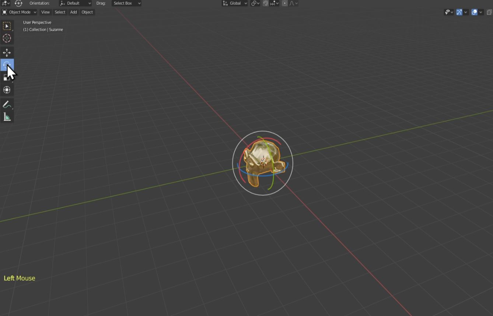

**Left-click and hold on the colored arcs around the monkey head to rotate the object.** Clicking in the center of the object will cause it to rotate freely.

The hotkey for rotating is "R".  **Press "R" and then press X,Y, or Z to rotate your object along one of the colored arcs, or axis.  Left-Click to set it in place.**

**_Challenge:_** _Try and get the monkey head to face you._

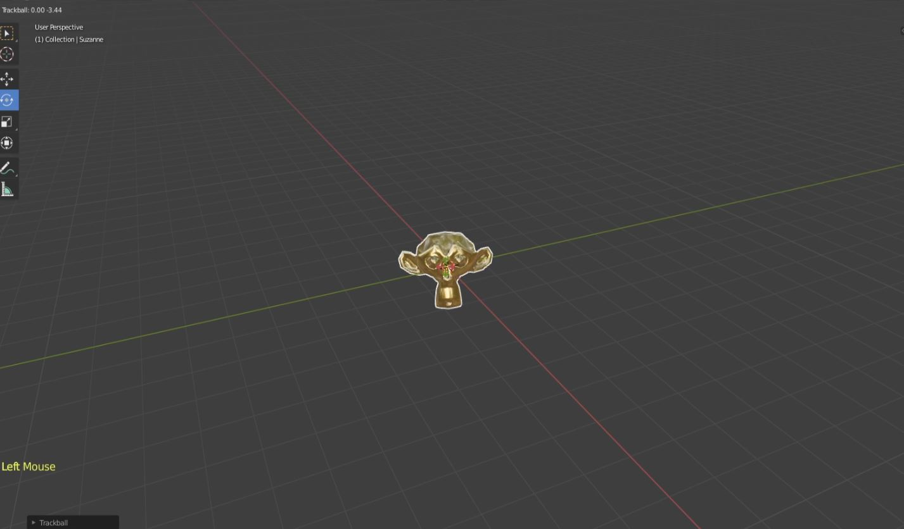

Next, with your monkey head selected, **Left-click on "Scale".**

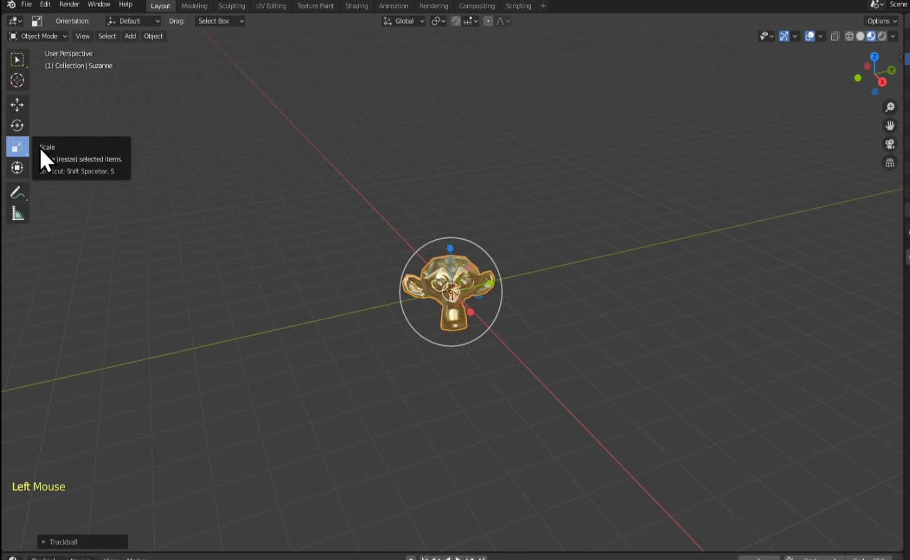

**Left-click and hold on the colored arrows around the monkey head to scale the object in different directions.**  Clicking in the center of the object will cause it to scale evenly in all directions

The hotkey for scaling is "S".  **Press "S" and then press X,Y, or Z to scale your object along one of the colored lines, or axis.  Left-Click to set it in place.**

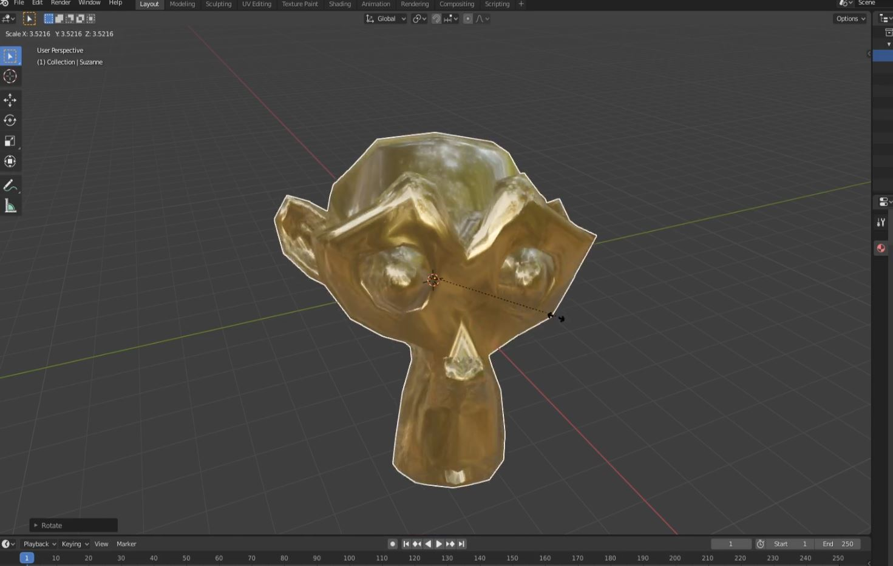

**_NOTE: Scaling back to the original size can be difficult, try using Ctrl + Z to undo instead._**
