Title: Getting Started in Blender Part 2 - Navigating the 3D ViewPort
Author: Anthony Gallas
Date: 16/07/2020
Category: 3D Modelling
Tags: 3D, 3D modelling, modelling, navigating, viewport, introduction
Slug: getting-started-part2-navigating-3d-viewPort
Series: 3D Modelling
Series_index: 05
Sortorder: 05



## Introduction
This documentation is intended as a text guide to accompany the second video in the 'Getting Started' set of videos.

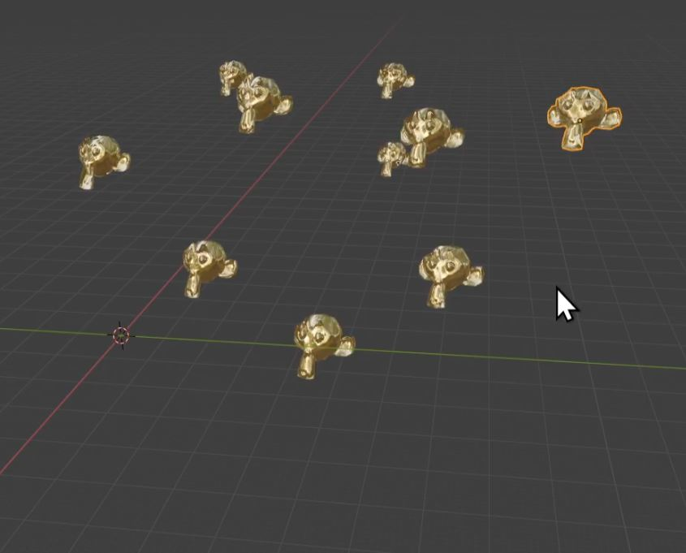

## Step 1 - Orbiting The ViewPort

To rotate the camera around your 3D object is known as "Orbiting the View."

Ensure that your monkey head is selected: **Left-Click on your Monkey head**

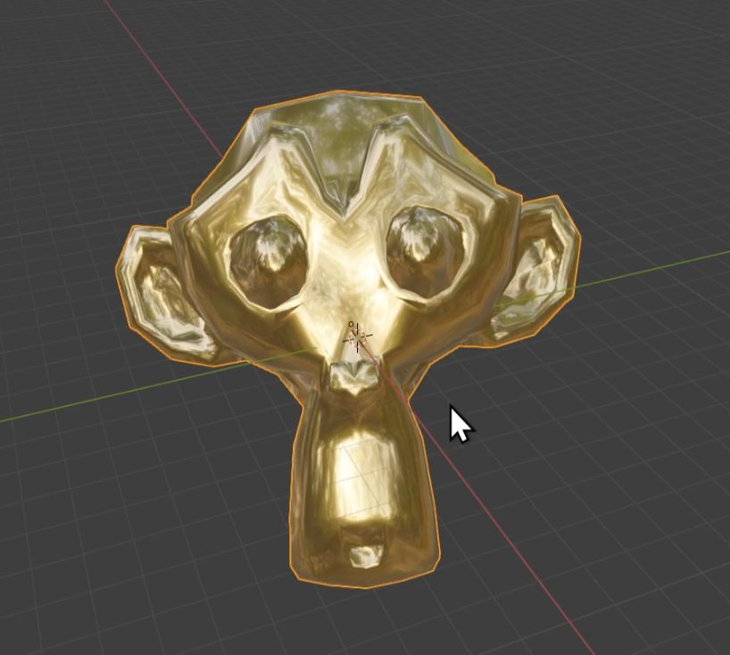

Next, press and hold Middle-Mouse-Button (MMB) and drag your mouse to rotate your view around the monkey head.

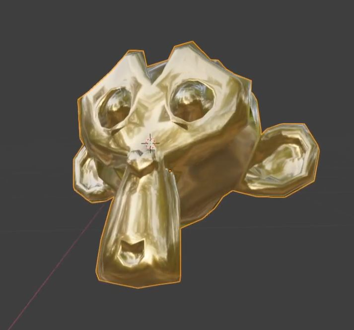

_Notice, as your drag your mouse to one end of the viewport that it appears on the otherside._

If you move your monkey head away from the center and try to rotate, it will rotate around wherever the monkey head is and no longer the center.

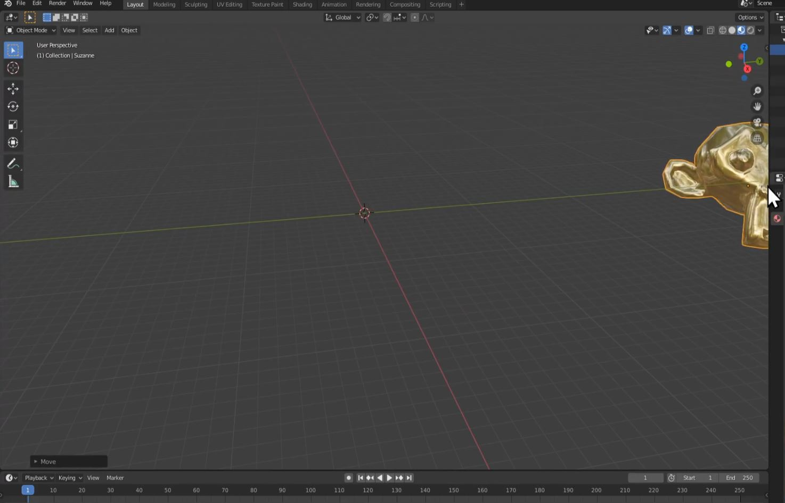

To orbit around our monkey head evenly again we need to **Focus** on it.

## Step 2 - Focusing on the Monkey Head

The quickest way to focus on an object is with the full-stop key on your numpad. _"Numpad ."_

**Ensure your Monkey head is selected and then press "Numpad ." to focus on your monkey**

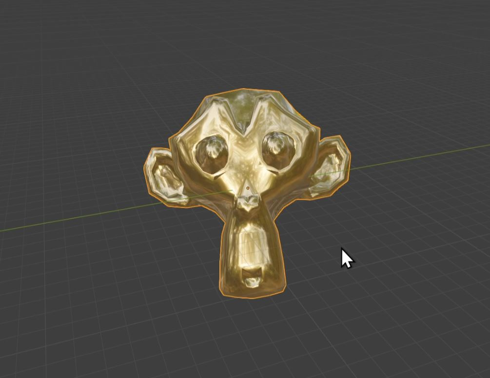

**_NOTE: If you don't have a Numpad, go to the edit drop-down in the top left corner of Blender's interface.
Enter the preferences menu. Choose input. From here, go to the keyboard section and tick 'Emulate Numpad'._** 
**Your main 1-0 keys will act as the numpad ones (useful for laptops)**

## Step 3 - Panning Your ViewPort and Zooming

In order to get our ViewPort back to the center (where the green and red lines cross) we can move our viewport through what is called "Panning"

**The hotkey to pan your camera is Press and Hold "Shift + MMB" and then drag your mouse.**  You will see Your view start panning across.

**Pan back to the Center now.**

Notice you dont need to stop panning if your mouse reaches the end of the screen, it will automatically appear on the other side.

**After reaching the center, by panning, select Your monkey head again and focus on it.**

Finally, you can **zoom in and out quickly through scrolling**.   **For a smooth accurate zoom, Press and Hold Ctrl + MMB and drag your mouse.**

## Step 4 - Clipping

Notice if zoom to close to your monkey that you will go through the wall and be inside it.   This is known as **Clipping**.

Most of the time we dont want to clip through the surface of an object.

In the upper right hand of the viewport, there is a small arrow tab.
**Click on the small arrow tab pictured below**

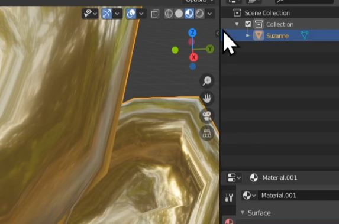

**Select the tab "View"**

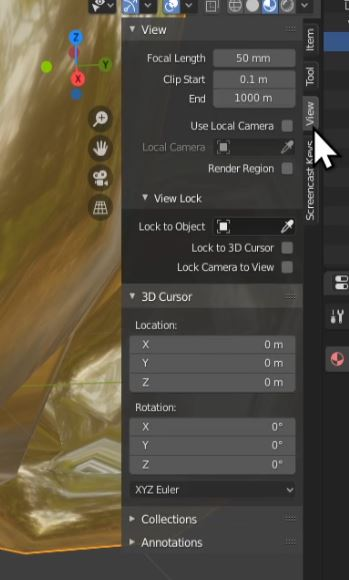

You will see the option **Clip Start**.  It's Default is 0.1m.

**Set Clip Start to .001M**

Changest this value to a smaller setting now allows our view to get much closer to the surface of our object before clipping through it.

## Step 5 - Duplicate and Place Several Monkey Heads from Your Original

To duplicate your monkey head, ensure that it is selected.

The Hotkey to duplicate is "Shift+D".  **Press "Shift+D" to duplicate your object and set it anywhere You like by left-clicking.**

_Notice how the copy is linked directly to your mouse pointer.  If you wish to move it along one of the axis, just press X, Y, or Z_

**Practice duplicating several monkey heads and moving them to different spots.**

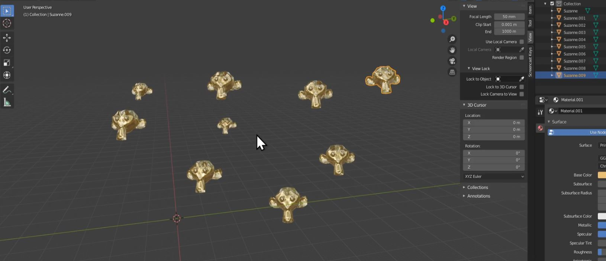

**Once set, practice panning, orbiting, and focusing on the different monkey heads**

_NOTE: Another way to focus is by pressing the "~" key, which will bring up a pie menu, and selected **"View Selected"**_

## Step 6 - Delete all but 1 of the Monkey Heads

**Drag a Box around all but 1 Monkey Head and Press "Delete."**

**Focus on your last monkey head with "Numpad . and move it back in the center"**

## Step 7 - Use the Gizmo Tools

In the upper right hand of the 3D viewport you will see a series of buttons

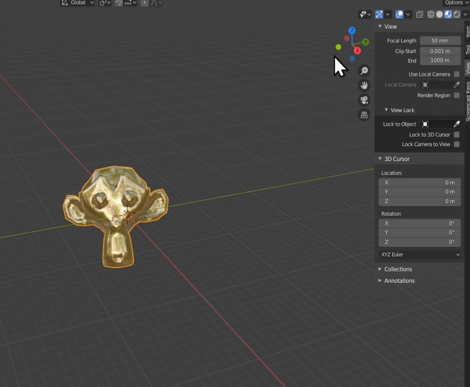

These buttons provide all the same navigating functions previously discussed.

**Left Click and Hold the top button to Orbit.** 
**Click and hold the magnifying glass to Zoom.** 
**Click and hold the Hand to Pan.** 

_The Camera button toggles through the view of the Camera._  
_The Perspective button changes the perspective the view is looking at the object._

If you do not wish to use these tools, you can turn them off by pressing the **Show Gizmo** button pictured below

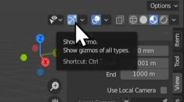

## Step 8 - Turn On/Off Overlays

**Next to the Gizmo toggle button is the Overlay toggle button.**

This button will turn off the grid and any overlays sitting over your models.  This is useful when trying to judge how your project is looking.

**Try turning the overlays Off and On.**

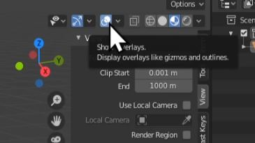

**Before**

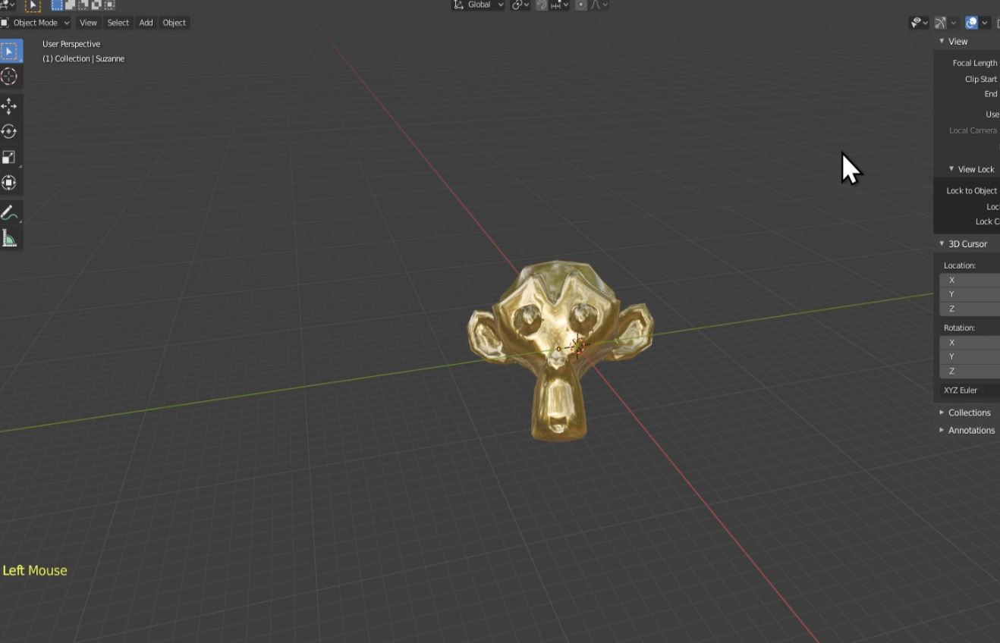

**After**

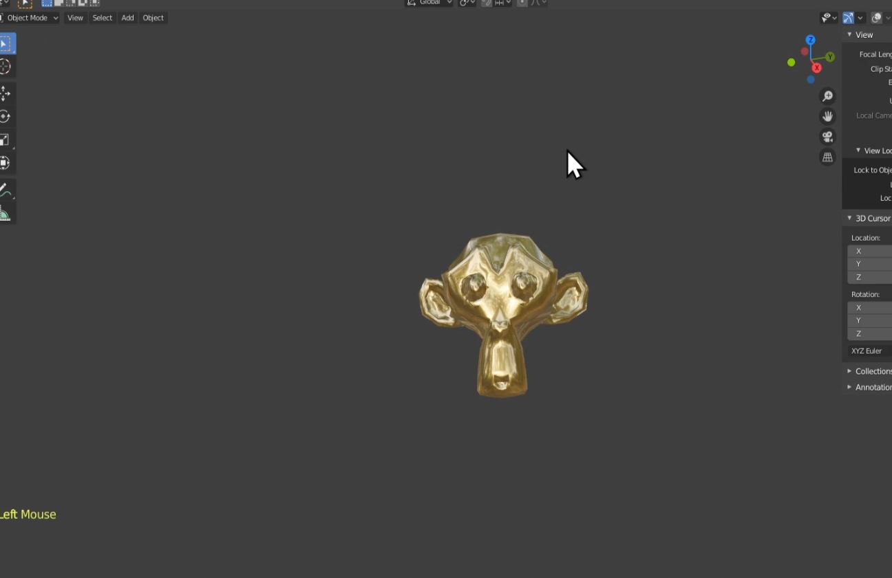
