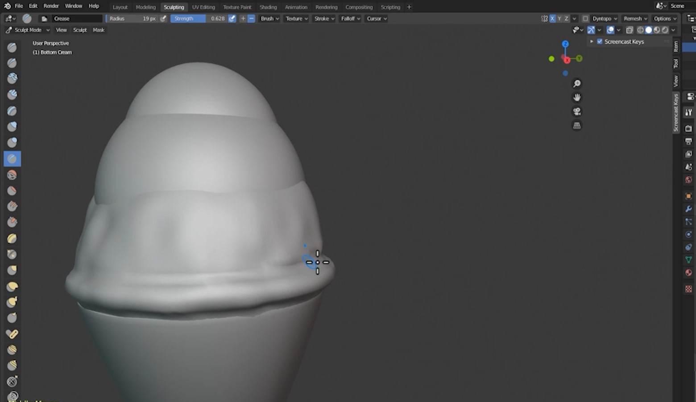

Title: Ice Cream Tutorial Part 2 - Sculpting
Author: David Corish
Date: 16/07/2020
Category: 3D Modelling
Tags: 3D, 3D modelling, modelling, Ice Cream, Ice Cream Project
Slug: ice-cream-part2-sculpting
Series: 3D Modelling
Series_index: 07
Sortorder: 07



## Introduction

This documentation is intended as a **text guide to accompany the second video in the 'Ice Cream Tutorial' series.**  It will cover colouring and sculpting your ice-cream cone.

## Step 1 - Colouring ice cream cone

**Make sure that your cone is selected.**

Go to the **_material properties tab._**

Click **_new._**

**Press _Z_** and go to the **_material preview menu._**

Select the colour of your cone by using **_base colour._**

Adjust the **_roughness_** to approximately **0.850.**

## Step 2 - Colouring your ice cream scoops

**Repeat step 1** for your ice cream scoops.

This time, **decrease** the **_roughness_** slider.

**Increase** the **_specular tint, sheen, sheen tint, clearcoat_** and **_clearcoat roughness_** sliders to add some extra shine.

**Repeat for all ice-cream scoops.**

## Step 3 - Sculpting the bottom scoop

In the top-right corner, select your **_bottom cream._** Make sure that the upside-down triangle is also selected.

Click into the **_sculpting tab_** at the top of the screen.

**Press _Z_** and go to the **_material preview menu._**

The three tools we're going to be using are the **_inflate, blob, and crease tools._**
These are 6th, 7th, and 8th tools from the top on the list at the left side of the screen.

**Switch off _X, Y,_ and _Z_** in the **top right of your _viewport_.** This will stop your sculpting tool from mirroring itself.

Start **clicking on the scoops to _inflate_** the mesh. **Hold _ctrl+click_ to _deflate_.** Add some imperfections to make the scoops look more realistic.

**Press _F_ to change your _brush size._** You can also change this in the top left of the viewport.

**Adjust the _strength_ in the top left of the viewport.**

Press **_Z_** and change to **_solid mode_** for a clearer view of the changes you're making.

Switch to the **_blob_ tool.**

**This time, click the _X_ in the top-right.**

**Hold _left-click_** and **move your mouse around the bottom of the scoop** to blob it out at the sides.

Switch to the **_crease_ tool.**

**Hold _left-click_** and **move your mouse just above the bottom of the scoop** to crease it above the blob.

## Step 4 - Sculpting the remaining scoops

Return to the **_layout tab_** at the top of the screen. **Select the  _middle scoop._**

**Repeat step 3 for the remaining scoops.**

## Conclusion

**You have now successfully sculpted an ice-cream cone.**

In the **next part of this series, we're going to make our final render!** This will involve adding the lighting, camera, and background.
