Title: Ice Cream Tutorial Part 3 - Lighting & Rendering
Author: David Corish
Date: 16/07/2020
Category: 3D Modelling
Tags: 3D, 3D modelling, modelling, Ice Cream, Ice Cream Project
Slug: ice-cream-part3-lighting-rendering
Series: 3D Modelling
Series_index: 08
Sortorder: 08



## Introduction

This documentation is intended as a **text guide to accompany the third video in the 'Ice Cream Tutorial' series**. It will cover lights, cameras, and rendering your final image.

## Step 1 - Render engine

Go to the **_rendering tab_** at the top of the screen.

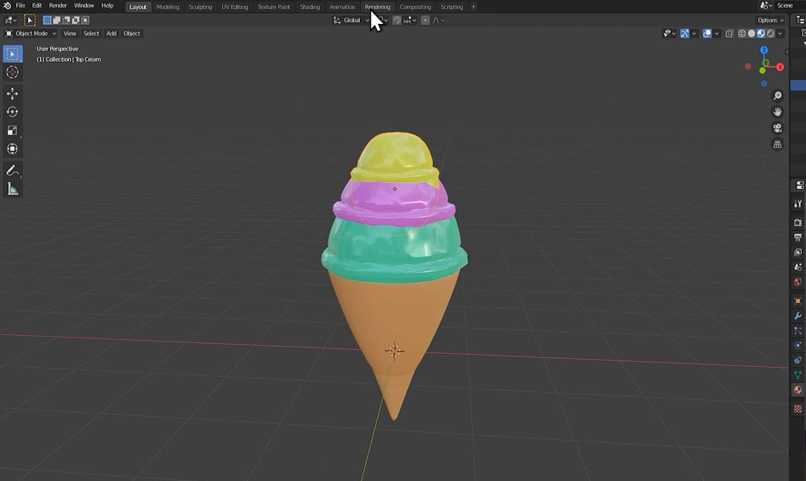

In the **top-right of the rendering window,** you can change the **_render engine_** and **_render quality._**

For the purpose of this project, we will be using **_Eevee_** with a **_render setting_** of **128.**

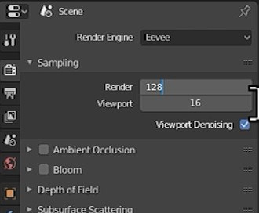

## Step 2 - Camera

Return to the **_layout tab._**

Press **_Shift+A_** to open the **_add_ menu.** Click **_camera._**

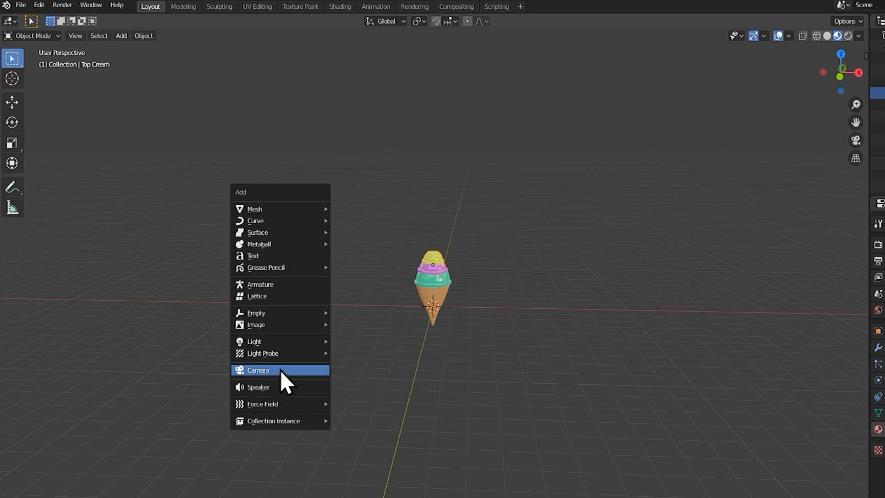

**Adjust these settings** in the bottom-left **until the _camera_ is** roughly **looking at the ice-cream.**

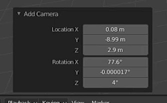

Press **_numpad 0_** to move to the **_camera's_ point of view.**

Open the **_view_** menu on the top-right of the viewport. **Click the box beside _lock camera to view._**

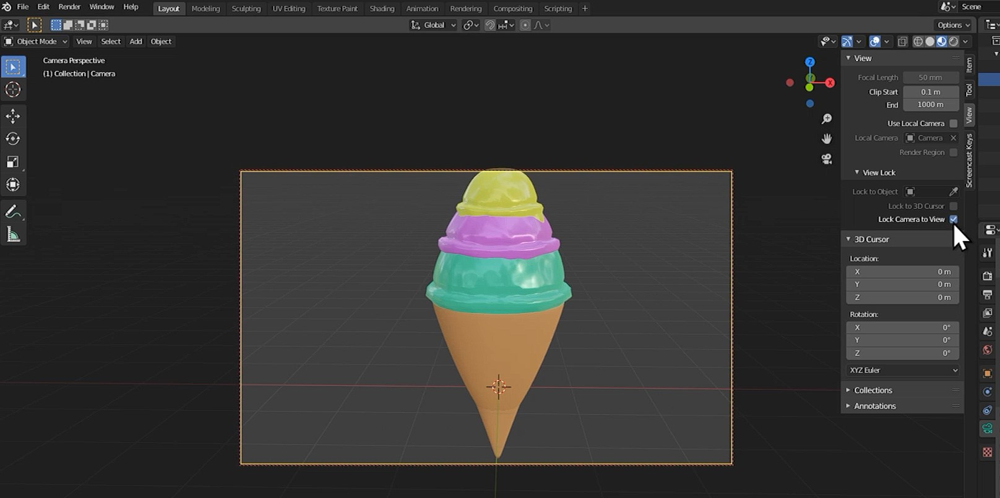

**_Orbit_** the camera's view using **_MMB._**

**_Pan_** the camera's view using **_MMB._**.

(MMB = Scroll-wheel)

Focus the camera onto your ice-cream.

Go to the **_output properties_** tab on the right-side of the window.

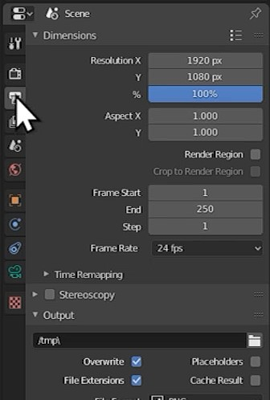

Adjust your resolution to 2000px by 2000px.

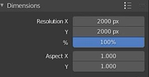

## Step 3 - Light

Press **_Shift+A_** to open the **_add_ menu.** Click **_light._** and then **_area._**

**_Position_** the **_light_** above and to the side of your ice-cream.

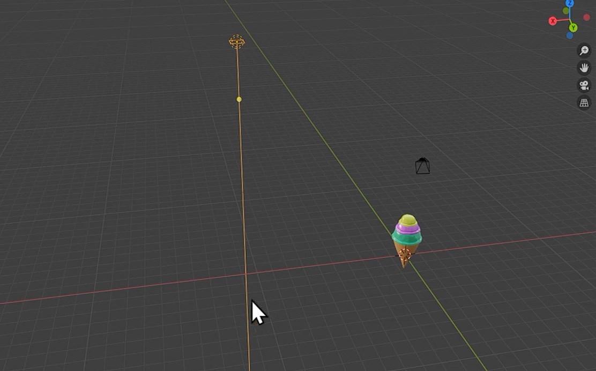

**_Click_** the **_yellow dot_** on the line coming from the light and drag it such that the **line points at the ice-cream.**

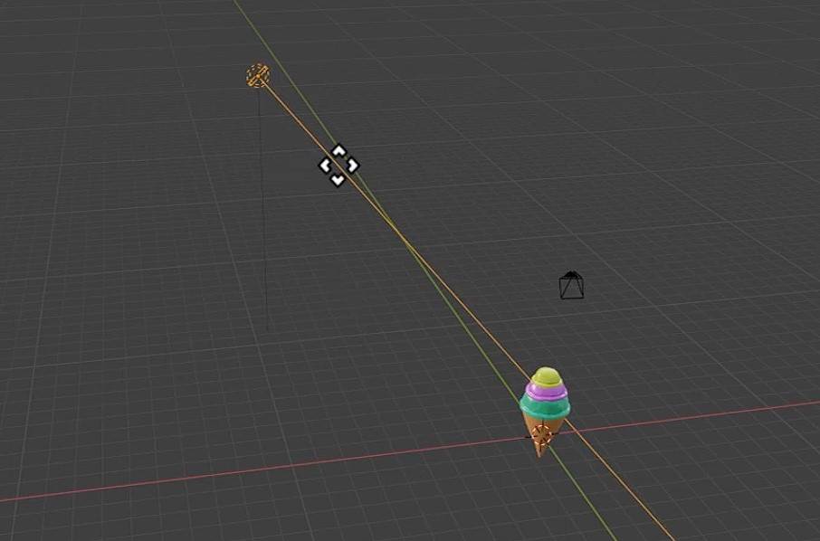

With the **_light_ selected,** click into **_object data properties_** on the right-side of the window.

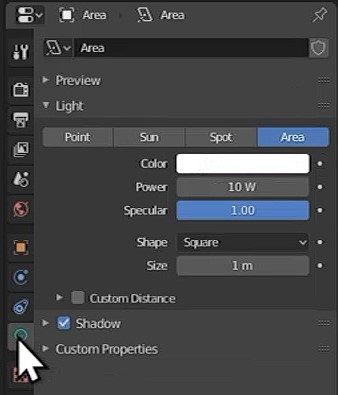

**Adjust the settings of your _light_** however you feel looks best.

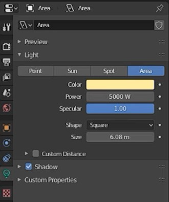

Press **_Z_** and go to **_rendered_** to see what the lighting looks like.

## Step 4 - Background

Click into **_world properties_** on the right-side of the window.

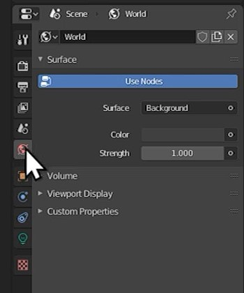

Use the **_colour wheel_** to change the **background colour.**

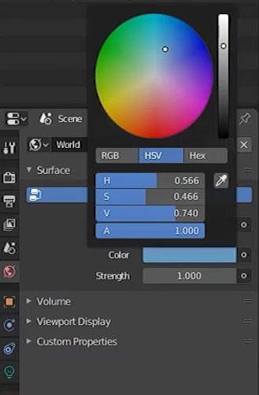

Select the **_light._** Press **_Shift+D_** to **_duplicate_** it.
Place this new **_light_** on the opposite side of the ice-cream. Press **_R_** to **_rotate_** the **_light_** until the line is pointing back at the ice-cream. **_Adjust_** the **_colour_** of the **_light_** if you want to add some extra colour.

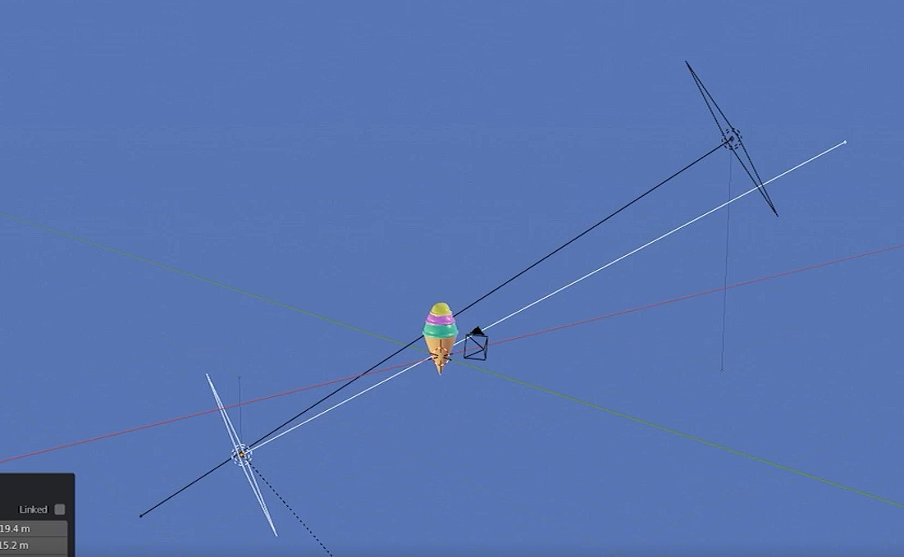

Press **_F12_** to **_render_** your final image!

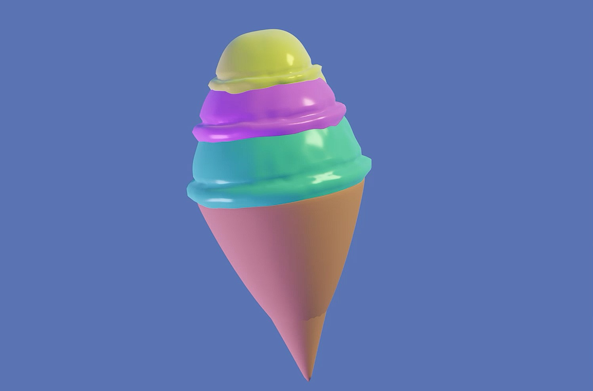

## Conclusion

You should now have a **fully rendered ice-cream.** Thank you for reading this text guide and I hope you enjoyed!
