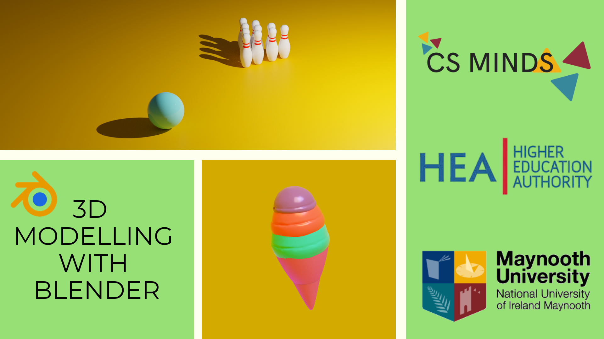

Title: Blender Set-up
Author: David Corish
Date: 16/07/2020
Category: 3D Modelling
Tags: 3D, 3D modelling, modelling, set-up
Slug: blender-set-up
Series: 3D Modelling
Series_index: 01
Sortorder: 01

# Welcome!
Have you ever wished you could create your very own 3D models?
Want to learn more about how your favourite animated movies are made?
You're in the right place!

## What is Blender?

**_Blender_ is a free _3D modelling tool_** used for creating animated films, visual effects, art and more.
Using Blender, you can create anything you can imagine.

For example, this short film was made entirely in Blender:
https://youtu.be/WhWc3b3KhnY

## How do I install Blender?

### Step 1
Go to https://www.blender.org/download/ & click download Blender.

Make sure that you download the right installer for your OS (Windows, Mac, or Linux).

### Step 2
Follow the steps of the installer programme.

## How do I save my work in Blender?

Go to file in the top left corner. Go to 'save' and choose where to save your .blend file.

Blender is prone to crashing so we highly recommended that you save your file every few minutes to avoid losing any work!

# Before you start

## If you don't have a number-pad
If your keyboard doesn't have a number pad, you need to set-up Blender to use
the row of numbers across the top of your keyboard.

To do this, go to the edit drop-down in the top left corner of Blender's interface.
Enter the preferences menu.

Choose input. From here, go to the keyboard section and tick 'Emulate Numpad'.

This will allow you to use the numbers across the top of your keyboard instead.

## If you don't have a scroll wheel

If your mouse doesn't have a scroll wheel or you are using a laptop touchpad,
you need to set up Blender to emulate a 3-button mouse.

To do this, go to the edit drop-down in the top left corner of Blender's interface.
Enter the preferences menu. Choose input. From here, go to the mouse section and tick 'Emulate 3 Button Mouse'.

You can now press alt + left-click as a replacement for a scroll wheel.

## If you're using a Mac

Our tutorials have been developed using Windows so there may be subtle differences between our videos and your software.

Shortcuts mostly carry over. However, certain shortcuts will be different. For example, F3 is Cmd + F.

If you encounter any difficulties, please refer to Blender's built-in list of shortcuts. To find this, go to the edit drop-down in the top left corner of Blender's interface. Enter the preferences menu. Choose keymap. From here, scroll down to see a list of every shortcut in Blender.

