Title: Spark AR
Author: David Corish
Date: 16/07/2020
Category: 3D Modelling
Tags: 3D, 3D modelling, modelling, ar
Slug: spark-ar
Series: 3D Modelling
Series_index: 12
Sortorder: 12

## What is Spark AR?

**_Spark AR Studio_** is an **augmented reality platform** for Windows & Mac that allows you to create AR filters for mobile devices. Create any object in Blender and see it in the real world!

Here is a duck we made in Blender and then placed into Spark AR.

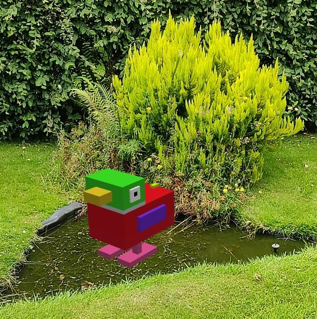

## How do I install Spark AR & Spark AR Player?

### Step 1
Go to https://sparkar.facebook.com/ar-studio/download/ & click download Spark AR Studio.

### Step 2
Follow the steps of the installer programme.

### Step 3
Open your phone's app store and search for 'Spark AR Player'

This app will allow you to test effects on your phone.

## Importing your Blender objects into Spark AR
### Step 1 - Exporting object from Blender

**Click and drag** over your Blender object. Make sure that you are only selecting the object you want to import.

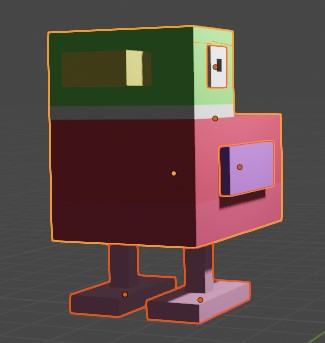

Go to the top left corner and click **_file._** Click **export** and then click **_Wavefront (.obj)._**

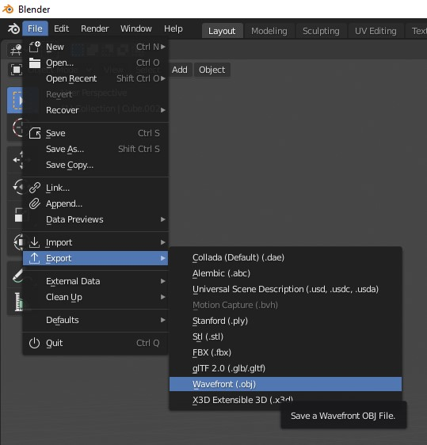

Choose where you want to save your object to and click **_export OBJ._**

### Step 2 - Starting a Spark AR project

Open Spark AR Studio and select **_new project._**

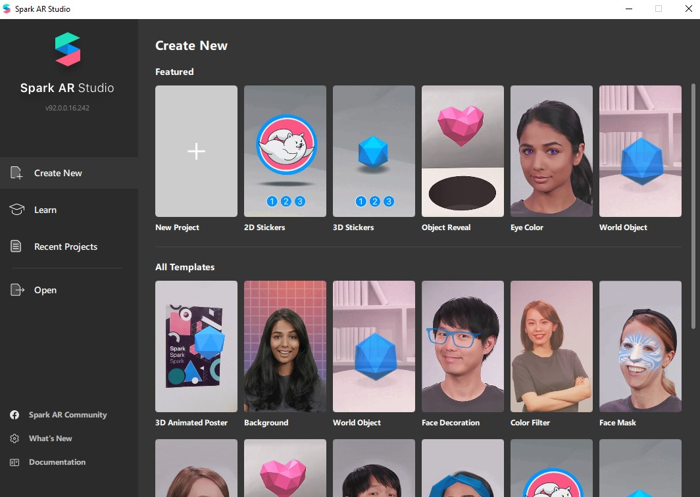

Click **_plane tracking._**

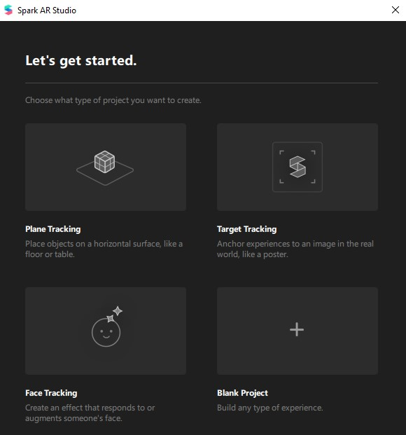

### Step 3 - Importing your Blender object

Go to the **_assets_** menu in the bottom left of the interface and click **_import: from computer._**

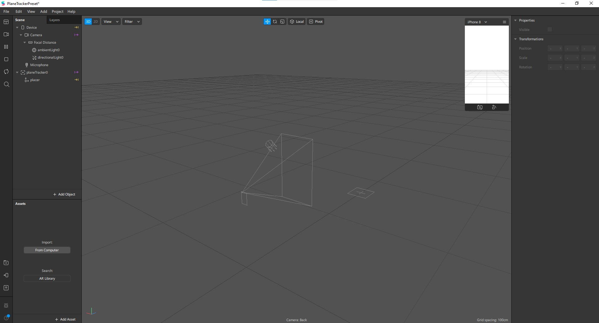

The assets menu should now look something like this.

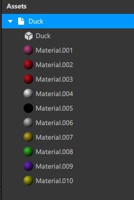

### Step 4 - Placing object into plane tracker

**Click and drag your object** from the assets menu and **place it onto the _planeTracker_** in the **_scene_** menu. The scene menu can be found in the top right.

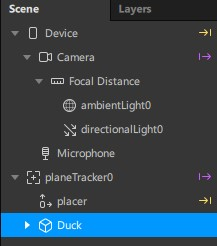

### Step 5 - Repositioning objects

Using the 3 tools at the top of your viewport, **reposition and resize your object.** I found that a small size a little bit of distance from the camera worked best.

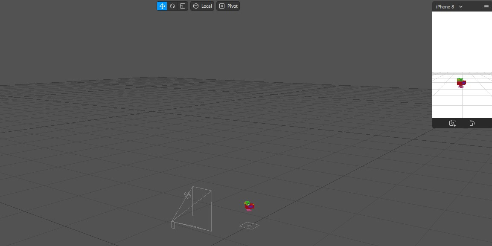

### Step 6 - Testing on mobile device

**Connect your mobile device to your PC/laptop** using its cable.

Open **_Spark AR player_** on your mobile device.

Go to **_Spark AR studio_** on your PC/laptop and then click **_test on device_** in the bottom left corner.

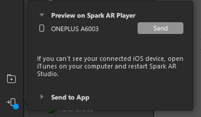

Your AR filter should now appear on your phone!

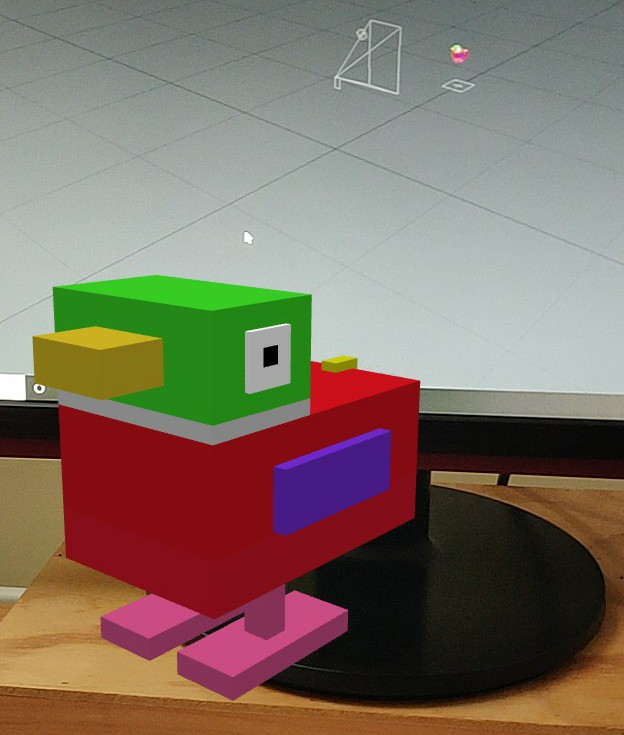

## Further development

More information on Spark AR can be found at https://sparkar.facebook.com/ar-studio/learn/
