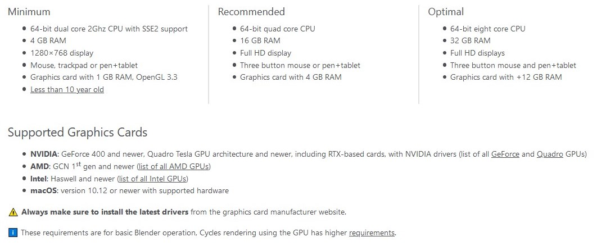
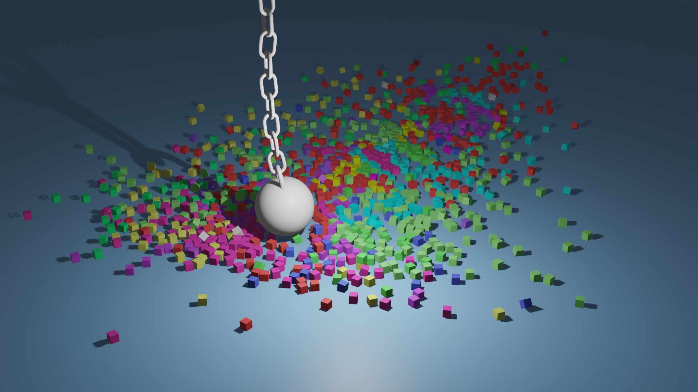
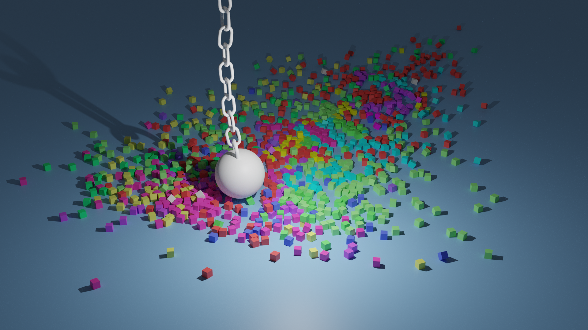
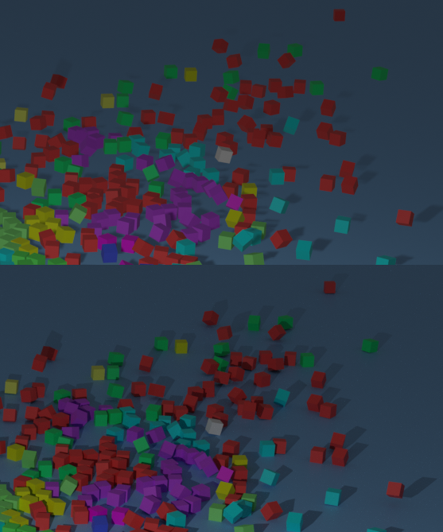
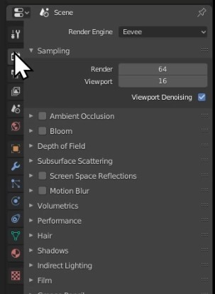

Title: Blender System Requirements
Author: David Corish
Date: 16/07/2020
Category: 3D Modelling
Tags: 3D, 3D modelling, modelling, system, requirements
Slug: blender-system-requirements
Series: 3D Modelling
Series_index: 02
Sortorder: 02

### What do I do if I don't meet the requirements?

There are several steps you can take to optimise Blender! The main one is to make sure that you are rendering in Eevee. Further details below.

## Render Engines

### Eevee

Eevee is a real-time engine with quick render times. It is highly efficient and should render your final image or animation with great results. Lighting is mostly accurate and will look pretty good! This engine is similar to that used in a video game.

Below is part of a wrecking ball animation rendered in Eevee. Using Eevee on my own PC, this 10 second animation took about two minutes to render.

### Cycles

Cycles is a fully ray-traced engine with lengthy render times. It will take far longer to render your image using Cycles. Ray-tracing simulates the effect of real light by calculating the path and bounce of individual photons. This is insanely compute-intensive but produces incredibly accurate lighting. This engine is similar to that used in an animated movie such as those made by Pixar or Dreamworks.

Below is part of a wrecking ball animation rendered in Cycles. Using Cycles on my own PC, this 10 second animation took about ninety minutes to render.

## Are they the same picture?

There are subtle differences between these but we can only spot them after zooming in.

## How do I switch render engine?

On the right side of your Blender interface, select the 'render properties' tab. From here, you can choose either Eevee or Cycles.

## Can I change the quality of the rendering?

Yes. Under render properties, go to sampling. Increase or decrease the number beside render to change the quality of your final render. This will increase/decrease the time it takes to render by reducing the accuracy of lighting and resolution of your final image.
