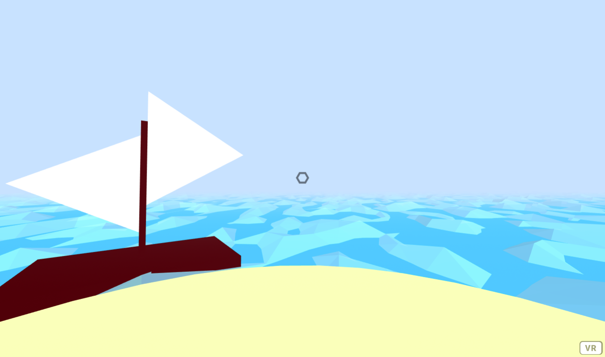
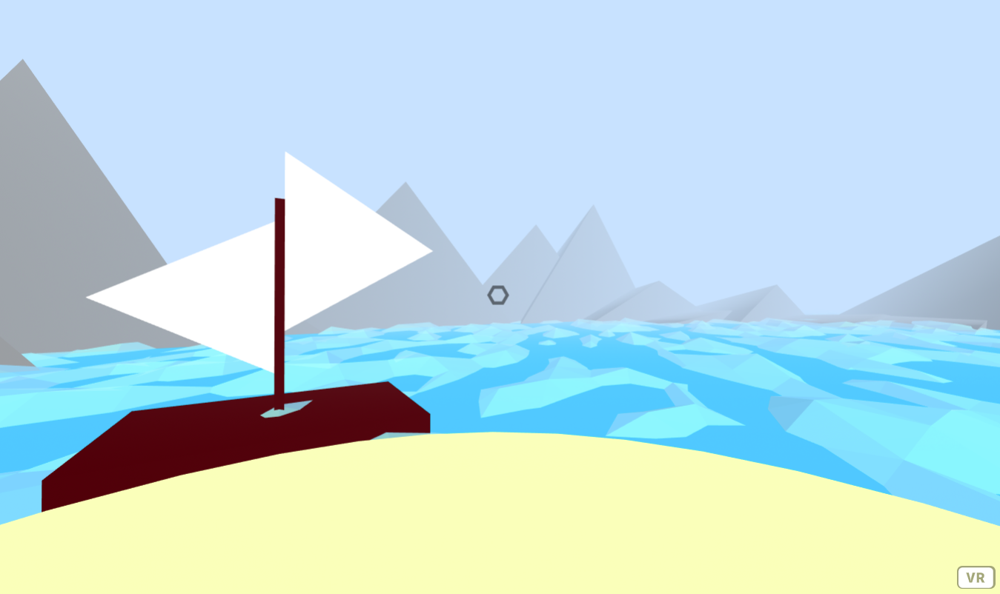
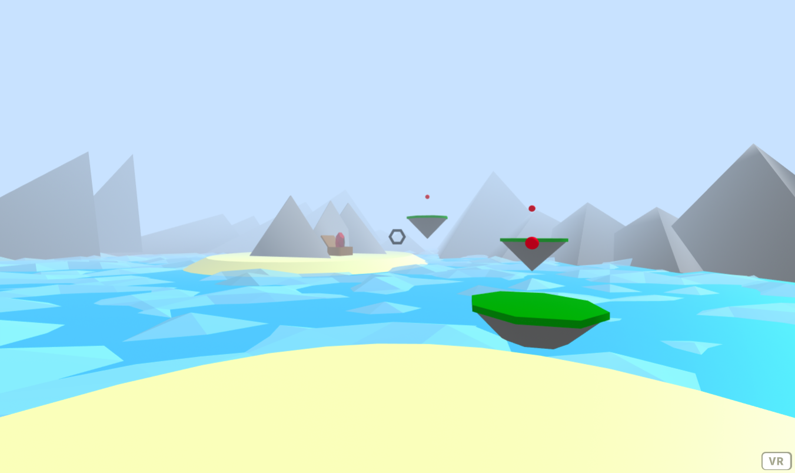
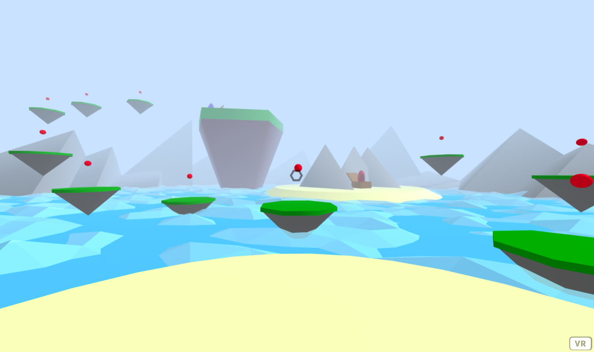
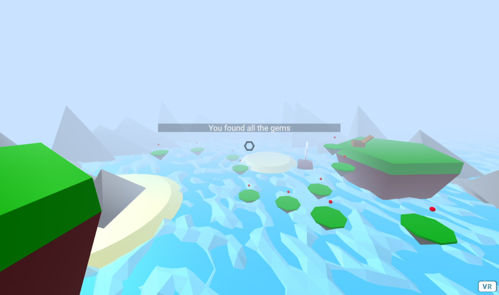

Title: Point Based Locomotion
Author: David McNamara
Date: 16/07/2020
Category: Web & VR
Tags: VR, virtual reality, locomotion, VR locomotion, VR movement
Slug: Point Based Locomotion
Series: Web & VR
Series_index: 08
Sortorder: 08

## **Web & Virtual Reality Point Based Locomotion**
Check out the files for each step for the code up to that point

## Point Based Movement
The point-based movement tutorial will allow the user the gaze at and move to teleportation points that are placed around the scene. This type of locomotion may be useful when designing scenes that require the user to be in specific locations around the scene.
## **Step 1: Scene Setup & Mixins**
In this tutorial to demonstrate point-based movement, the user will navigate through a scene set in the ocean where they are to collect treasure.

This scene will require the aframe, and will also use aframe-extras. Include links to these in the head of the file.
```HTML
<!-- A-Frame -->
    <script src="https://aframe.io/releases/1.0.4/aframe.min.js"></script>
    <!-- extras -->
    <script src="https://cdn.jsdelivr.net/gh/donmccurdy/aframe-extras@v6.1.0/dist/aframe-extras.min.js"></script>
```
To use fog in this tutorial, rather than using a-scene use
```HTML
<a-scene fog="color: #c2e4ff; density: 0.05; far: 10; near: 0; type: exponential">
```
This scene will reuse many objects, so to save time and to prevent rewriting code. Create the following mixins in a-assets.

The platform related mixins will define how these platforms will look. The user will be moving between these platforms.
```HTML
<!-- platform mixin-->
        <a-mixin
          id="platform"
          geometry="primitive: cone; radiusBottom: 0; radiusTop: 1; segmentsRadial: 8"
          material="color: #6b6b6b"
        >
        </a-mixin>
        <!-- grass mixin -->
        <a-mixin
          id="grass"
          geometry="primitive: cylinder; height: 0.1; segmentsRadial: 8"
          scale=""
          position="0 0.5 0"
          material="color: #008f0a"
        >
        </a-mixin>
```
The sea stack mixin is going to be a large piece of rock that treasure will be placed on later in this tutorial
```HTML
<!-- sea stack mixin -->
        <a-mixin
          id="sea-stack"
          geometry="primitive: cone; radiusBottom: 0.1; radiusTop: 0.5; segmentsRadial: 5"
          scale="10 10 10"
          material="color: #541717"
        >
        </a-mixin>
        <!-- sea stack top mixin -->
        <a-mixin
          id="sea-stack-top"
          geometry="primitive: cone; radiusBottom: 0.5; radiusTop: 0.5; segmentsRadial: 5"
          material="color: green"
          scale="1 0.1 1"
        ></a-mixin>
```
The sand mixin is used to create small pieces of land
```HTML
<!-- sand mixin -->
        <a-mixin
          id="sand"
          geometry="primitive: cone; radiusBottom: 5; radiusTop: 3"
          material="color: #f8f0a4"
        >
        </a-mixin>
```
The gem mixin defines how the treasure will look to the user. Make sure to also define the sky texture as the gem uses this image for reflection.
```HTML
<!-- sky texture -->
        
        <!-- gem mixin -->
        <a-mixin
          id="gem"
          geometry="primitive: dodecahedron"
          scale="0.3 0.65 0.3"
          position="0 0.75 0"
          material="color: #ff0000; opacity: 0.9; metalness: 0.9; 
                    roughness: 0; sphericalEnvMap: #sky"
        >
        </a-mixin>
```

Now that all of the mixins have been defined, creating the rest of the scene will be much easier.

To make the user rig that is suitable for this scene. Ensure that follow this rig structure including giving each entity a unique id. Set the raycaster to only interact with clickable objects, and set it's far value to 6, this means that only clickable objects within 6 units from the user will be able to be interacted with. The user position is set to -10 0 0 so the user will initially spawn on an island
```HTML
<!-- User Rig-->
      <a-entity id="user" position="-10 0 0">
        <a-camera id="camera" wasd-controls-enabled="false">
          <a-cursor
            id="caster" fuse="true" fuse-timeout="1000"
            raycaster="objects: .clickable; far: 6"
            geometry="radiusOuter:0.03;
                    radiusInner: 0.02;
                    segmentsTheta: 6"
            material="color: black;
                     opacity: 0.5"
            animation__fusing="property: scale; startEvents: fusing; 
                               easing: easeInCubic; dur: 1000; from: 1 1 1; to: 0.5 0.5 0.5"
            animation__mouseleave="property: scale; startEvents: mouseleave; 
                                   easing: easeInCubic; dur: 1000; to: 1 1 1"
          ></a-cursor>
        </a-camera>
      </a-entity>
```
To create the ocean, create two entities, one for the base color of the water, and another that uses the aframe-extra ocean component. This will create an animated ocean effects. Set the width, depth and density to match the scale of the base water.
```HTML
<!-- water -->
      <a-entity
        geometry="primitive: plane"
        material="color: #00b3ff"
        scale="100 100 1"
        rotation="-90 0 0"
      >
      </a-entity>
      <a-entity
        id="ocean"
        ocean="width: 100; depth: 100; density: 100"
        rotation="-90 0 0"
        scale=""
      >
      </a-entity>
```
To make an island for the user to stand on, use the sand mixin and set its position.
```HTML
<!-- island -->
      <a-entity id="island" mixin="sand" position="-10 0 0"></a-entity>
```
```HTML
<!-- sky -->
      <a-sky src="#sky"></a-sky>
```
To make a simple decorative boat.
```HTML
 <!-- boat -->
      <a-entity id="boat" position="-10 0 -5">
        <a-entity
          geometry="primitive: cylinder; segmentsHeight: 1; segmentsRadial: 3"
          material=""
          scale="1.2 0.23 1.2"
          rotation="-60 -90 90"
          position="0.65 2.25 0"
        >
        </a-entity>
        <a-entity
          geometry="primitive: cylinder; segmentsRadial: 3; segmentsHeight: 1"
          material=""
          scale="1 0.23 1"
          rotation="0 -90 90"
          position="-0.55 1.6 0"
        >
        </a-entity>
        <a-box material="color: #470000" scale="0.1 2.5 0.1" position="0 1.5 0">
        </a-box>
        <a-box material="color: #470000" scale="3 0.5 1.91"> </a-box>
      </a-entity>
```


## Step 2: Mountain Range
To help build the scene and create a defined background to the scene. Let's make a mountain range the surrounds the play area of the user.

First create an entity that will contain the circular mountain range. Set the rotation to -90 degrees about the X-axis, and set the scale to 25 25 1. This will be an appropriate size for this tutorial. Include the mountain component, this is the custom component that will create the mountains, set the number of peaks to the number of peaks that you would like to be generated.
```HTML
<!-- mountain -->
<a-entity  id="mountainRange" rotation="-90 0 0" scale="25 25 1" mountain="peaks: 36"></a-entity>
```

In the script above the body, register a new component.

The mountain component will have a schema that defines the number of peaks and the radius that the mountain range will have.

Create an init function that will trigger when this element is first initialized.

Create a variable angle, this is the angle in degrees of each segment in the circle. As there is 360 degress in a circle, the angle of each segment will be 360/the number of peaks.

Create a variable c. This represents the center point coordinates of the circle. This is equal to this elements position value.

Create a for loop that starts at 0 and ends at the user defined number of peaks.

Inside of the for loop, create a variable x and y that is the x,y coordinate pair that each peak will be placed. 
```
The formula for x = radius * Math.cos((angle*i) * Math.PI/180).
The formula for y = radius * Math.sin((angle*i) * Math.PI/180).
```

Create a variable base, this will define how big each peak will be, this can be made random, so each peak will be a different size. To get a random number in a range, base = Math.random() * (max - min) + min. Where max and min are the maximum and minimum value that you would like the random number to be.

Create a peak entity, and define it's geometry, material , scale and position. See below for these. The scale should be dependent on the base value and the position should be equal to the x y value that was calculated for this peak.

Append each peak to this element.
```JavaScript
// mountain
    AFRAME.registerComponent("mountain", {
      schema:{
        peaks:{type: "number", default: 36},
        radius:{type: "number", default: 1}
      },
      init: function(){
        var angle = 360/this.data.peaks;
        var c = this.el.getAttribute("position");
        for(var i = 0 ; i < this.data.peaks; i++){
          var x = c.x + this.data.radius * Math.cos((angle*i)*Math.PI/180);
          var y = c.y + this.data.radius * Math.sin((angle*i)*Math.PI/180);
          var base = Math.random() * (0.5 - 0.2) + 0.2;
          var peak = document.createElement("a-entity");
          AFRAME.utils.entity.setComponentProperty(peak, 
                                                   "geometry", {primitive: "cone", segmentsHeight: 1, segmentsRadial: 3});
          AFRAME.utils.entity.setComponentProperty(peak, "material", {color: "grey"});
          AFRAME.utils.entity.setComponentProperty(peak, "scale", {x: base, y: base, z: Math.random()*10});
          AFRAME.utils.entity.setComponentProperty(peak, "position", {x: x, y:y});
          this.el.appendChild(peak);
        }
      }
    });
```


## Step 3: Cave & Teleportation Component

The first location where there will be treasure to be collected will be a small cave on an island.

The cave is an entity with the island mixin and some mountain peaks positioned around the island.
```HTML
<!-- cave -->
      <a-entity id="cave" position="5 2 10" rotation="0 -90 0" scale="2 2 2" material="color: grey; segmentsHeight: 1">
        <a-entity geometry="primitive: cone; segmentsRadial: 3; segmentsHeight: 1" scale="1 2 2" material="color: grey">
        </a-entity>
        <a-entity geometry="primitive: cone; segmentsRadial: 3; segmentsHeight: 1" scale="1 2 2" 
                  position="1.5 0 0" rotation="0 -70.73908826023683 0" material="color: grey">
        </a-entity>
        <a-entity geometry="primitive: cone; segmentsRadial: 3; segmentsHeight: 1" scale="1 2 2" 
                  position="2.3 0 0" material="color: grey">
        </a-entity>
       <a-entity mixin="sand" position="1 -1.25 0">
        </a-entity>
      </a-entity>
```
To place the treasure chest on the island. First in the a-assets asset manager, define the provided 3D model of the chest.
```HTML
<!-- tresure chest 3D model -->
        <a-asset-item id="chest" 
                      crossorigin="anonymous"
                      src="https://cdn.glitch.com/6ae9d56a-d924-4dad-a1f6-de69356245cf%2Fchest.glb?v=1594371097890">
        </a-asset-item>
```
When the chest 3D model has been defined. Create an entity that uses the 3D model, position and rotate it appropriately. To place the gem inside of the treasure chest, create an entity inside of the chest, and set the mixin value to gem. You can change the color of this gem. Give the gem class clickable so that the user can click the gem, and also give the gem the collectable component. This is a custom component that will later be written in this tutorial.
```HTML
<!-- cave chest -->
      <a-entity id="caveChest" gltf-model="#chest" position = "3 0.5 12" rotation = "0 -90 0">
        <!-- gem -->
        <a-entity mixin = "gem" material = "color: red" class = "clickable" collectable>
        </a-entity>
      </a-entity>
```
For the user to get to the treasure. The user will move by gazing at different platforms. Each platform structure is the same. The only attribute that will be different for each platform is it's position.

Each platform will look like this.
```HTML
<a-entity mixin="platform" position="-9 0 5">
        <a-entity mixin="grass">
          <a-entity
            geometry="primitive: sphere; radius: 0.1"
            material="color: red"
            teleport="offset: 0 -1 0"
            class="clickable"
            position="0 1 0">
          </a-entity>
        </a-entity>
 </a-entity>
```
Using this platform structure. Create a set of platforms using these positions. This will make a path of platforms that the user will be able to use to get the treasure. Note that the full platform structure has been collapsed in the reference image.
```HTML
<a-entity mixin="platform" position="-9 0 5"> . . .</a-entity>
<a-entity mixin="platform" position="-8 1 10"> . . .</a-entity>
<a-entity mixin="platform" position="-3 2 12"> . . .</a-entity>
```
To make the teleport component. In the script above the body register a new component.

The teleport component uses a schema that defines an offset value that the user can define. This offset value will be used to influence the final teleport location of a given point. Create an init function that will be triggered when this element is first initialized. Create a variable offset which is the parsed coordinates of the given offset value.  Add a click event listener to this element. When this event triggers, create a variable user, which is the user element. Create a variable worldPos which uses the information from this event. to get the world position coordinates from the current target of the raycaster, or the absolute position of the teleportation point that the user is looking at. Using the aframe  setComponentProperty ,set the user's position to the worldPos + the offset
```JavaScript
// teleport
    AFRAME.registerComponent("teleport", {
      schema: {
        offset: { type: "string", default: "0 0 0" }
      },
      init: function() {
        var offset = AFRAME.utils.coordinates.parse(this.data.offset);
        this.el.addEventListener("click", function(evt) {
          var user = document.getElementById("user");
          var worldPos = evt.currentTarget.object3D.getWorldPosition(new THREE.Vector3());
          AFRAME.utils.entity.setComponentProperty(user, "position", {
            x: worldPos.x + offset.x,
            y: worldPos.y + offset.y,
            z: worldPos.z + offset.z
          });
        });
      }
    }); 
```
The user can now look at the teleportation points of the platforms and move to that location. The user can also define an offset if they wish to do so.


## Step 4: Sea Stack

To add a sea stack to the scene. Create an entity with mixin sea-stack and another with sea-stack-top. Position appropriately.
```HTML
<!-- sea-stack 1 -->
      <a-entity id = "sea-stack1" position ="14 1.5 5">
        <a-entity mixin="sea-stack">
          <a-entity mixin = "sea-stack-top" position="0 0.55 0" ></a-entity>
        </a-entity>
      </a-entity>
```
To add a treasure chest on this sea stack, add an entity that uses the chest 3D model, position and rotate appropriately. Place a gem inside of the chest.
```HTML
<!-- sea-stack 1 chest -->
      <a-entity id="chest1" gltf-model="#chest" position = "14 7.5 2" rotation = "0 -180 0">
        <!-- gem -->
        <a-entity mixin = "gem" material = "color: blue" class = "clickable" collectable>
        </a-entity>
     </a-entity>
```
Using the same platform structure as before, create a set of platforms with the following positions so that the user will be able to navigate up the sea stack to get the treasure.
```HTML
<!-- sea-stack platform -->
<a-entity mixin="platform" position="0 0 0"> . . .</a-entity>
<a-entity mixin="platform" position="-5 0.25 2.5"> . . .</a-entity>
<a-entity mixin="platform" position="1 0.5 -3.5"> . . .</a-entity>
<a-entity mixin="platform" position="4 2 -6"> . . .</a-entity>
<a-entity mixin="platform" position="5 3 -10"> . . .</a-entity>
<a-entity mixin="platform" position="6 4 -14"> . . .</a-entity>
<a-entity mixin="platform" position="10 5 -12"> . . .</a-entity>
<a-entity mixin="platform" position="14 6 -10"> . . .</a-entity>
<a-entity mixin="platform" position="15 7 -8"> . . .</a-entity>
<a-entity mixin="platform" position="14 7.5 -4"> . . .</a-entity>
```



## Step 5: Collection Component

Let's add one final treasure chest for the user to get. Place another sea stack with the same structure in a different location
```HTML
<!-- sea-stack 2 -->
      <a-entity id="sea-stack2" position="-7 -2 -13">
        <a-entity mixin="sea-stack">
          <a-entity mixin = "sea-stack-top" position="0 0.55 0"></a-entity>
        </a-entity>
      </a-entity>
```
With another treasure chest placed on the sea stack.
```HTML
<!-- sea-stack 2 chest -->
      <a-entity id="stackChest2" gltf-model="#chest" position = "-7 4 -10">
        <!-- gem -->
        <a-entity mixin = "gem" material = "color: green" class="clickable" collectable>
        </a-entity>
      </a-entity>
```
And another set of platforms with the following positions.
```HTML
<!-- sea-stack 2 platform -->
<a-entity mixin="platform" position="-1 1 -6"> . . .</a-entity>
<a-entity mixin="platform" position="-3 2.5 -8"> . . .</a-entity>
<a-entity mixin="platform" position="-6 3.5 -7.5"> . . .</a-entity>
```

Now that there are 3 gems for the user to collect, let's write the collectable component.

In the script above body. Create a global variable items, which will be used as a count for the number of items that the user has to collect. Register a new component. The collectable component uses an init function that triggers when this element is first initialized. Increment the items variable. Add a click event listener to this element. When this event triggers, decrement the items, as the user has collected this item. Set this.outerHTML to an empty string "". This will remove the item that the user has just clicked on.  Run the checkWin() function. This function will alert the user when they have collected all of the collectable items.
```JavaScript
// collectable component
    var items = 0; // the number of collectable items in the scene
    AFRAME.registerComponent("collectable", {
      init: function(){
        items++; // increment the numbers of items that have to be collected
        this.el.addEventListener("click", function(){
          // when the item is clicked
          --items; // decrement the items left
          this.outerHTML = ""; // remove it
          checkWin(); // check if the user has won
        });
      }
    });
```
The checkWin() function simply checks if there are no more items left to be collected. When there are no more items to be collected. Create an entity, that is a plane with width and height set to auto. Give this entity a text value of the message that you want to display to the user when they have collected all of the gems. Set the material to black with 0.5 opacity, to improve contrast between the text and plane. And set the position 0 0.1 0.

To place this text in front of the user's line of sight, append the text to the caster element.
```JavaScript
function checkWin(){
      // if there are no more items to collect
      if(items==0){
        // create text to display to the user
        var text = document.createElement("a-entity");
        AFRAME.utils.entity.setComponentProperty(text, "position", {x: 0, y:0.1, z:0});
        AFRAME.utils.entity.setComponentProperty(text, 
                                                 "material", {color: "black", opacity: "0.25"});
        AFRAME.utils.entity.setComponentProperty(text, 
                                                 "geometry", {primitive: "plane", height: "auto", width: "auto"});
        AFRAME.utils.entity.setComponentProperty(text, 
                                                 "text", {value: "You found all the gems", align: "center"});
        // place the text in front of the user
        document.getElementById("caster").appendChild(text);
      }
    }  
```


## Further Tasks:

 - Change the parameters of the fog, or remove the fog completely to
   either improve the sight of the user or make it more difficult for
   them to see.
 - Change the scale of the mountain range and rearrange the collectables
   to create new scene layouts, you will also have to create new
   platform paths to reach them.
 - Experiment with the points teleport offset value, can you create some
   interesting user interactions with points with different offset
   values?
