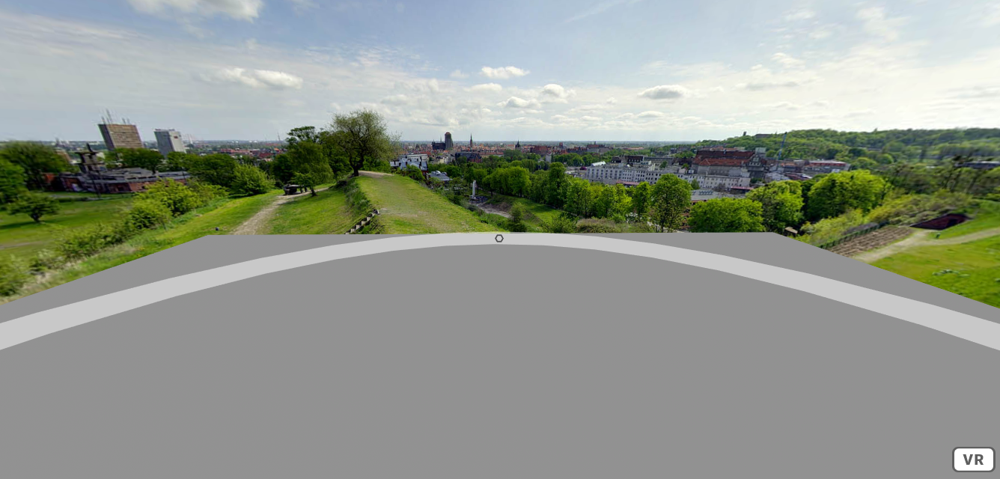
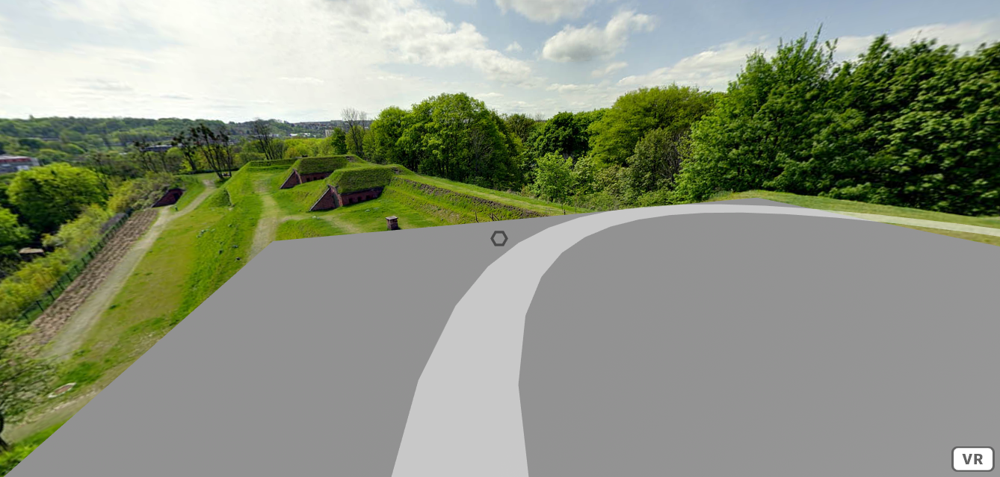
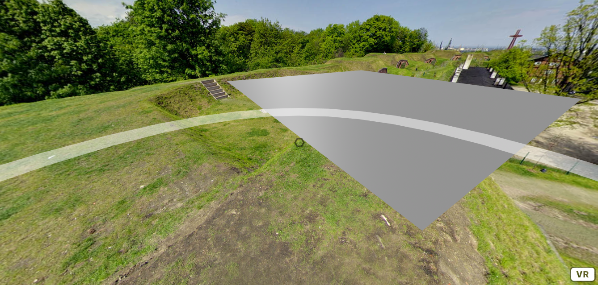
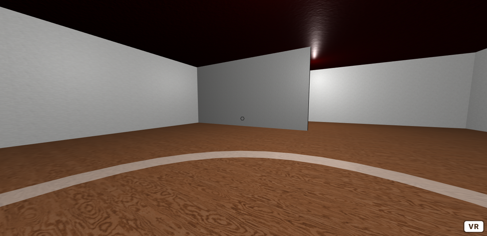
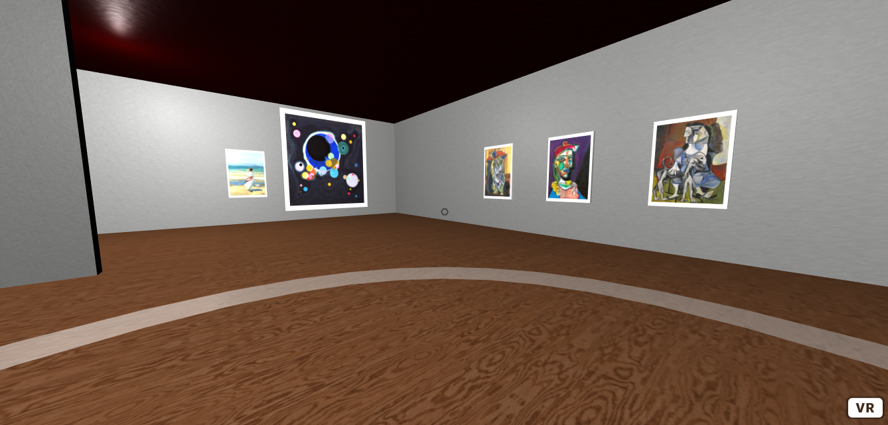

Title: Ring Based Locomotion
Author: David McNamara
Date: 16/07/2020
Category: Web & VR
Tags: VR, virtual reality, locomotion, VR locomotion, VR movement
Slug: Ring Based Locomotion
Series: Web & VR
Series_index: 07
Sortorder: 07

## **Web & Virtual Reality Ring Based Locomotion**
Check out the files for each step for the code up to that point

## Point Based Movement

The ring based movement tutorial will allow the user the gaze at a ring that surrounds and follows the user as they move about the scene. This ring will allow the user to move freely about the scene. This type of locomotion may be useful when designing scenes where the user should freely explore or have an unrestricted movement range.
## **Step 1: Ring Setup**
This tutorial will use the a-frame framework
```HTML
<!-- A-Frame -->
    <script src="https://aframe.io/releases/1.0.4/aframe.min.js"></script>
```
In the a-assets asset manager, include all of the provided textures, normal maps, and images.
Create an a-sky and set its texture to the provided sky texture.
```HTML
<!-- Asset Manager -->
<a-assets>
    
</a-assets>
<!-- sky -->
<a-sky src="#sky"></a-sky>
```
For the first few steps, to help demonstrate movement ring, create a very basic floor.
```HTML
<!-- floor -->
<a-plane
    id="floor"
    position="0 0 0"
    rotation="-90 0 0"
    scale="10 10 1"
    color="grey"
></a-plane>
```
To make the user camera rig.
```HTML
<!-- User -->
<a-entity id="user">
  <a-camera id="camera" wasd-controls-enabled="false">
    <a-cursor
      id="caster"
      fuse="true"
      fusetimeout="1000"
      geometry="radiusOuter:0.03;
              radiusInner: 0.02;
              segmentsTheta: 6"
      material="color: black;
               opacity: 0.5"
      raycaster="objects: .clickable"
      animation__fusing="property: scale; startEvents: fusing; 
                         easing: easeInCubic; dur: 1000; 
                         from: 1 1 1; to: 0.5 0.5 0.5"
      animation__mouseleave="property: scale; startEvents: mouseleave; 
                             easing: easeInCubic;
                             dur: 1000; to: 1 1 1"
    ></a-cursor>
  </a-camera>
</a-entity>
```
To make the movement ring. Create a new entity, set the class to be clickable so that the user can interact with then ring. Set the position to 0 0.6 0 and set its rotation to be -90 degrees about the X-axis. set the geometry to be a ring with radiusInner = 2.78 and radiusOuter = 3.2 and segmentsTheta = 36. To make the ring less obvious to the user, set the opacity to 0.5. Make sure to also give the ring the teleport and follower components, which are custom components that will be written later in this tutorial.
```HTML
<!-- movement ring -->
<a-entity
  follower
  teleport
  class="clickable"
  position="0 0.6 0"
  rotation="-90 0 0"
  material="opacity: 0.5"
  geometry="primitive:  ring;  radiusInner:  2.78;  
            radiusOuter:  3.2;  segmentsTheta:  36"
></a-entity>
```

## Step 2: Teleport Component

To create custom components, make a script before the body. Inside of this script is where all of the custom components will be written.

To create the teleport component that will allow the user to move to the point on the ring where the user is looking at. The teleport component uses an init function which triggers when this element is initialized. Add an event listener to this element that triggers when it is clicked. Make sure to name the event function, as it will be needed to get information about the event. Create a variable user, which is the user element.  Create a variable pos, which is the position of the user. Create a variable ringPos, which uses the intersection point information from the event to find where exactly the user was looking when the event was triggered.  Using the ringPos and pos, reassign the pos so that the user will be placed where they were looking on the ring. Set the users position to the new pos value.
```JavaScript
// teleport component
    AFRAME.registerComponent("teleport", {
      init: function() {
        this.el.addEventListener("click", function(evt) {
          var user = document.getElementById("user");
          var pos = user.getAttribute("position");
          var ringPos = evt.detail.intersection.point;
          pos.x += ringPos.x - pos.x;
          pos.y = pos.y;
          pos.z += ringPos.z - pos.z;
          user.setAttribute("position", pos);
        });
      }
    });
```
This method of teleportation using the intersection data from the raycaster can be extended to other geometries not just a ring.

## Step 3: Follower Component

The follower component is used to ensure the the movement ring will always follow the user about the scene. This will allow the user to move freely around the scene.

The follower component uses a tick function to readjust the position of the ring with respect to the position of the user. The tick function will repeat itself every tick of the scene.

Create a variable user, which is the user element.

Create a variable currentPos, which is the position that the user is located.

Create a variable pos, which uses the a-frame clone function to copy the currentPos.

The position of the ring will now be the same as the position of the user. To make sure that the user can still see the ring at the same height was before, increment the pos.y value by 0.6. This will pervent the user from noticing any changes in vertical position of the ring.

Set the position of this element to be the updated pos value.
```JavaScript
// follower
    AFRAME.registerComponent("follower", {
      tick: function() {
        var user = document.getElementById("user");
        var currentPos = user.getAttribute("position");
        const pos = AFRAME.utils.clone(currentPos);
        pos.x += 0;
        pos.y += 0.6;
        pos.z += 0;
        this.el.setAttribute("position", pos);
      }
    });
```

## Step 4: Art Gallery

To save time create two mixins that define the paint and wood material that will be used for the textures in the art gallery.
```HTML
<!-- Paint Material Mixin -->
        <a-mixin
          id="paintTexture"
          material="src:  #paint;
                          repeat:  20 10;  
                          normalMap: #paintNormal;
                          normalTextureRepeat: 20 10"
        >
        </a-mixin>
<!-- Wood Material Mixin -->
        <a-mixin
          id="woodTexture"
          material="src:  #wood;  
                          repeat:  10 10;
                          normalMap:  #woodNormal;  
                          normalTextureRepeat:  10 10;
                          roughness: 1"
        >
        </a-mixin>
```
To create the art gallery building, first create a box with children boxes for each wall and the roof. The parent box, will be scaled 20 0.8 15. This size will be inherited by it's children, so each child box should be scaled down appropriately. Position each of the walls and roof so to make a room. To apply the textures to the floor, walls and ceiling. Set each box's mixin value to either the wood or paint texture mixin. These mixins have already been defined in the a-assets asset manager. To change the color of the paint, either change the color of the paint in the mixin to apply it to all objects. Or to change the color of an individual object, set the material color of that object to the color that you would prefer the paint to be.
```HTML
<!-- art gallery -->
      <a-box
        id="gallery" scale="20 0.8 15"
        class="clickable" mixin="woodTexture">
        <a-box
          id="leftWall" scale="0.01 5 1"
          position="-0.5 3 0"
          class="clickable" mixin="paintTexture"
        ></a-box>
        <a-box
          id="rightWall" scale="0.01 5 1"
          position="0.5 3 0"
          class="clickable" mixin="paintTexture"
        ></a-box>
        <a-box
          id="frontWall" scale="1 5 0.01"
          position="0 3 -0.5"
          class="clickable" mixin="paintTexture"
        ></a-box>
        <a-box
          id="backWall" scale="1 5 0.01"
          position="0 3 0.5"
          class="clickable" mixin="paintTexture"
        ></a-box>
        <a-box
          id="roof" material="color: red"
          position="0 6 0" mixin="paintTexture"
        ></a-box>
        <a-box
          id="room2" position="-0.25 3 0.25" 
          scale="0.01 5 0.5" mixin="paintTexture"
        ></a-box>
        <a-box
          id="room3" position="0.25 3 -0.25"
          scale="0.01 5 0.5" mixin="paintTexture"
        ></a-box>
      </a-box>
```
To Light up the art gallery, create some custom lights. For this sized art gallery, 3 point lights at 0.5 intensity will appropriately light the room.
```HTML
<!-- custom lights -->
      <a-entity id="lightRow">
        <a-entity
          light="intensity: 0.5; type: point"
          position="-7.5 4 0"></a-entity>
        <a-entity
          light="intensity: 0.5; type: point"
          position="0 4 0"></a-entity>
        <a-entity
          light="intensity: 0.5; type: point"
          position="7.5 4 0"></a-entity>
     </a-entity>
```

## Step 5: Artwork

To add artwork to the scene, add all of the art pieces that you would like to use into the a-assets asset manager along with all of the textures and mixins that you have already added.  You will also have to create 2 new mixins. A mixin with id canvas and a mixin with id art. These will be used to easily place many artworks in the scene without having to rewrite as much code.
```HTML
<a-mixin
          id="canvas"
          geometry="primitive: box"
          scale="1 1.5 0.1"
          material="color: white"
        >
        </a-mixin>
        <a-mixin
          id="art"
          geometry="primitive: plane"
          scale="0.9 0.9 1"
          position="0 0 0.55"
          class="clickable"
        >
        </a-mixin>
```
When placing some artwork you will need to create 2 entities, one for the canvas and the other to place the art on. Below is a guide on how to create and position these so that they will be placed on the walls and guides on how to size them.

To place a small artwork:
```HTML
<!-- Small Artwork -->
      <a-entity mixin="canvas" position="0 2 -7.4" class="clickable">
        <a-entity mixin="art" material="src: #painting1"> </a-entity>
      </a-entity>
```
To place a large artwork:
```HTML
<!-- Large Artwork -->
      <a-entity mixin="canvas" position="7.5 2.5 -7.4" class="clickable" scale="3 3.5 0.1" material="">
        <a-entity mixin="art" material="src: #monaLisa"> </a-entity>
      </a-entity>
```
To place the artwork on the front wall. Set Z position = -7.4. Set Y rotation = 0

To place the artwork on the back wall. Set Z position = 7.4 Set Y rotation = -180

To place the artwork on the right wall. Set X position = 9.8 Set Y rotation = -90

To place the artwork on the right wall. Set X position = -9.8 Set Y rotation = 90


## Further Tasks:

 - Try changing the movement ring's segmentsTheta value. This determines
   how many sides the ring will have. What shapes can you make the
   movement ring?
 - Use your own artwork, experiment with different scaling and
   positioning of the artwork.
 - Change the color of the paint and the lights to your favorite colors.
 - Can you change the layout of the art gallery by adding, removing or
   repositioning the walls?
