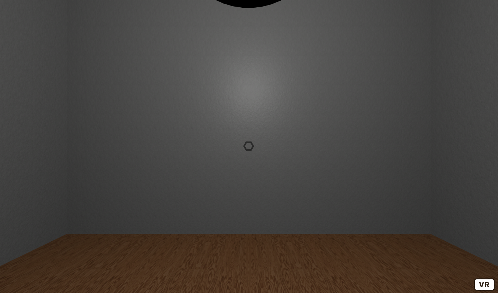
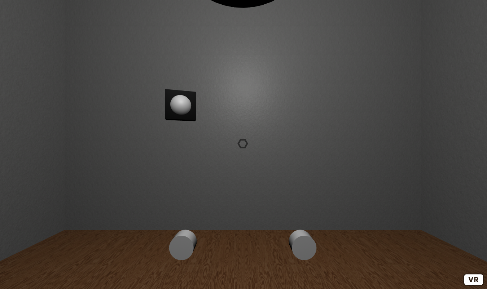
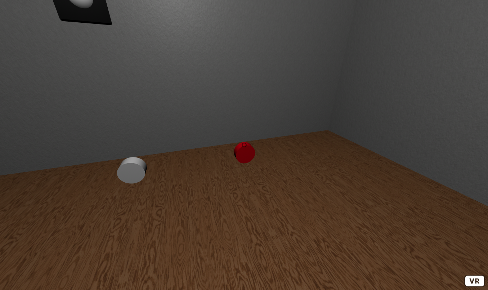
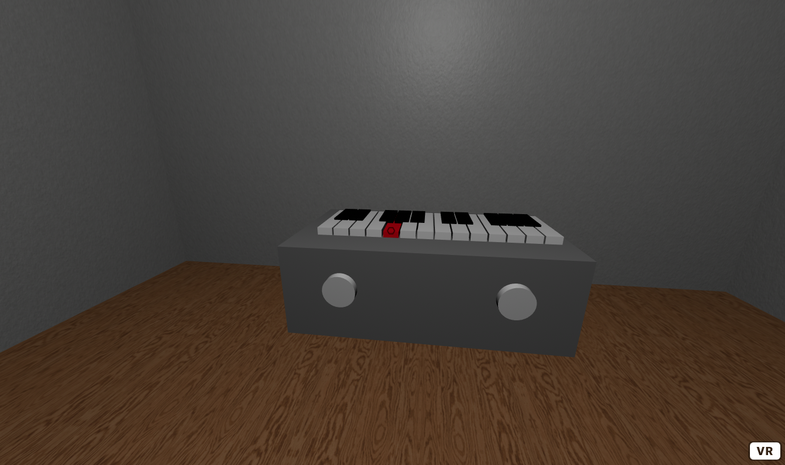

Title: Sound 
Author: David McNamara
Date: 16/07/2020
Category: Web & VR
Tags: VR, virtual reality, sound, VR sound
Slug: Sound
Series: Web & VR
Series_index: 05
Sortorder: 05

## **Web & Virtual Reality Sound**
Check out the files for each step for the code up to that point

## **Step: 1 Setup Scene**
Include the a-frame framework to your code and the ToneJS framework
```HTML
<!-- a-frame framework -->
<script src="https://aframe.io/releases/1.0.4/aframe.min.js"></script>
<!-- tone.js framework for audio -->
<script src="https://unpkg.com/tone"></script>
```
For this tutorial, upload all of the provided assets to the glitch asset manager and create a source reference for each assets in the a-assets asset manager.
```HTML
<!-- asset manager -->
      <a-assets>
        <!-- music -->
        <audio
          id="music"
          src="https://cdn.glitch.com/509184ea-3f5e-493b-bed4-85356e02df74%2FFlight_To_Tunisia.mp3?v=1591718643253"
        ></audio>
        <!-- wood -->
        
        <!-- wood normal -->
        
        <!-- paint -->
        
        <!-- paint normal -->
        
        <a-mixin
          id="paintTexture"
          material="src:  #paint;
                          repeat:  20 10;  
                          normalMap: #paintNormal;
                          normalTextureRepeat: 20 10"
        >
        </a-mixin>
      </a-assets>
```
To save time and write less code, let's create a a-mixin that defines a paint texture material that will be used to texture the walls of the scene.
```HTML
<a-mixin
	 id="paintTexture"
     material="src:  #paint;
	           repeat:  20 10;  
               normalMap: #paintNormal;
               normalTextureRepeat: 20 10"
     >
</a-mixin>
```
To define the user rig that will allow the user to move around the scene and to interact with the scene.
```HTML
<!-- User -->
      <a-entity id="user">
        <a-camera id="camera">
          <a-cursor
            id="caster"
            fuse="true"
            fuse-timeout="100"
            geometry="radiusOuter:0.03;
                    radiusInner: 0.02;
                    segmentsTheta: 6"
            material="color: black;
                     opacity: 0.5"
            raycaster="objects: .clickable"
            animation__fusing="property: scale; startEvents: fusing; 
                               easing: easeInCubic; dur: 100; from: 1 1 1; to: 0.5 0.5 0.5"
            animation__mouseleave="property: scale; startEvents: mouseleave; 
                                   easing: easeInCubic; dur: 100; to: 1 1 1"
          ></a-cursor>
        </a-camera>
      </a-entity>
```
To make the room that this scene will be in, create an entity and scale it to the size of the room that you would like to make. Apply a wood material to the floor. Add 4 walls and give these the paint material mixin that was already defined. Add a roof to this room.
```HTML
<!-- recording studio -->
      <a-box
        id="room"
        scale="5 0.8 5"
        material="src:  #wood;  
                  repeat:  5 5;
                  normalMap:  #woodNormal;  
                  normalTextureRepeat:  5 5;
                  roughness: 1">
        <a-box
          id="leftWall" scale="0.01 5 1"
          position="-0.5 3 0"
          mixin="paintTexture">
        </a-box>
        <a-box
          id="rightWall" scale="0.01 5 1"
          position="0.5 3 0"
          mixin="paintTexture">
        </a-box>
        <a-box
          id="frontWall" position="0 3 -0.5"
          scale="1 5 0.01"
          mixin="paintTexture">
        </a-box>
        <a-box
          id="backWall" position="0 3 0.5"
          scale="1 5 0.01"
          mixin="paintTexture">
        </a-box>
        <a-box
          id="roof" position="0 6 0"
          mixin="paintTexture"
          material="color: red">
        </a-box>
      </a-box>
```
To light up this room, create a point light source and place it in the room above the user.
```HTML
<!-- custom lighting -->
<a-entity id="lightRow">
	<a-entity
	    light="intensity: 0.75; type: point; castShadow: true"
          position="0 3 0"
    ></a-entity>
</a-entity>
```
To decorate the room let's make a disco ball. Create a sphere and set it's  material  roughness to a low value around 0.3, and it's mertalness value to 1. This will make the disco ball reflective. To make this ball look more like a disco ball, make this material have flatShading: true. This will make the reflections lower quality and more pixelated, giving the illusion of a mirrored disco ball. To make the disco ball spin, add an animation to it. Set the animation property to rotation. Where it rotates from 0 0 0, to 0 360 0, with duration (dur) 10000, that follows a linear easing, and loops.

## Step 2: Piano & Speaker
By default aframe uses positional audio, this means that the an audio source will pan and sound differently depending on the user's location to the sound source. If the user is closer to the source, the sound will be louder, if the user is further away, the sound will get  quieter. When the user looks around or if the source moves, the user may hear the sound louder in one ear over another.

To demonstrate positional audio, let's make a speaker that moves around the room. Create an entity and position it above the user and apply the same rotation animation that was applied to the disco ball. Inside of this entity, make another entity that will be used as the actual sound source, give this entity a box geometry and scale it appropriately set this entity's position to 2 0 0. Also give this entity the sound attribute, and set its source to the music that was defined in the \<a-assets> asset manager. Due to the size of the room, an appropriate rolloffFactor is 2.5. To make this box look more like a speaker, nest another entity with a sphere geometry, and an animation that changes it's scale from 1 0.5 0.5 to 0.75 0.25 0.25 with duration (dur) 250 and loops.

This will make a speaker that is rotating around the room, note that there will be no audio playing from the speaker just yet, as there must be some user interaction to start the music
```HTML
<!-- speaker -->
      <a-entity
        position="0 2 0"
        animation="property:  rotation; from: 0 0 0; to: 0 360 0;
                   dur: 10000; easing: linear; loop: true">
        <a-entity
          id="speaker"
          geometry="primitive: box"
          position="2 0 0"
          scale="0.1 0.3 0.3"
          sound="src: #music; rolloffFactor: 2.5"
          material="color: black">
          <a-entity
            geometry="primitive: sphere"
            scale="1.1 0.5 0.5"
            material="color: white"
            animation="property: scale; from: 1.1 0.5 0.5; 
                       to: 0.75 0.25 0.25; dur: 250; loop: true"
          ></a-entity>
        </a-entity>
      </a-entity>
```
To make a piano, create an entity with attribute piano, and set the octaves value to 2, and position to 0 0.5 -2. This will place an entity that will turn into a piano later in this tutorial, that will have 2 octaves.

Let's create 2 buttons that the user can interact with to start and stop the music, and another to change the synth or the sound that the piano will make.

Create 2 cylinders with class clickable, radius 0.1, a rotation -90 0 0, and height 0.1. Give each of these cylinders the push-down component, which will later be defined. Give one button the music-player component, and the other the change-synth component. Also set the positions of these buttons 0.5 0.25 0.5 and -0.5 0.25 0.5.
```HTML
<!-- piano -->
      <a-entity piano="octaves: 2" position="0 0.5 -2">
        <!-- Music start and stop button -->
        <a-cylinder
          music-player push-down
          color="white"
          class="clickable"
          radius="0.1"
          position="0.5 0.25 0.5"
          rotation="-90 0 0 "
          height="0.1"
        ></a-cylinder>
        <!-- change synth button -->
        <a-cylinder
          change-synth push-down
          color="white"
          class="clickable"
          radius="0.1"
          position="-0.5 0.25 0.5"
          rotation="-90 0 0 "
          height="0.1"
        ></a-cylinder>
      </a-entity>
```

## Step 3: Push-down & Music-player component

As the user will be interacting with different buttons and piano keys, it would be useful to define a component that animates a button being pushed. To do this, in a <scrip> above the <body>, inside this register a component push-down.

The push-down component uses an init function that is triggered when this component is first initialized. Create a variable color, which is the color of this element. Add an event listener to this element that triggers when the this element is clicked. When this element is clicked, set the scale of this to 1 0.801 1, and set this color to red. Add another event listener to this element that triggers when the mouseleave event that sets this scale back to 1 1 1 and this color back to the original color of this element.
```JavaScript
// push down component
    AFRAME.registerComponent("push-down", {
      init: function() {
        var color = this.el.getAttribute("color");
        this.el.addEventListener("click", function() {
          this.setAttribute("scale", "1 0.801 1");
          this.setAttribute("color", "red");
        });
        this.el.addEventListener("mouseleave", function() {
          this.setAttribute("scale", "1 1 1");
          this.setAttribute("color", color);
        });
      }
    });
```
Elements that have the push-down component now looked like they are being pushed down when the user looks at the element and has a color change, to help indicate to the user that they have just interacted with the scene.

To make the music-player button play music, let's make another component. The music-player component uses an init function that triggers when this component is first initialized. Create a variable isPlaying, that will be used to check if music should play or not. Add an event listener to this element, that triggers when this element is clicked. When this element is clicked, increment the isPlaying value and then check if isPlaying is odd, it should get the speaker element and make the sound playSound(). Otherwise get the speaker element and make the sound stopSound().
```JavaScript
//music player
    AFRAME.registerComponent("music-player", {
      init: function() {
        var isPlaying = 0; // use to toggle the main speaker
        this.el.addEventListener("click", function() {
          if (++isPlaying % 2 == 1) {
            document.getElementById("speaker").components.sound.playSound();
          } else {
            document.getElementById("speaker").components.sound.stopSound();
          }
        });
      }
    });
```
Now the user will be able to interact with the button that will start and stop the music, when they click the button.

## Step 4: Piano & Change-synth Components

Using the ToneJS framework, a synth can be defined for the piano to play, in the script create a variable synth and let it equal new Tone.FMSynth().toMaster(); this will be the default synth that the piano will play. Create another variable called synths, which will be an array that contains different types of synths that ToneJS has.

To change the synth, create a change-synth component. The change-synth has an init function that triggers when this component is initialized. Create a variable count, that adds and event listener that triggers when the user clicks on this element. When this is event is triggered. Increment the count, and set the synth value to that synths value at that count % the length of the synths array. This will allow the user to toggle through all of the different synths that are in the synths array.
```JavaScript
var synth = new Tone.FMSynth().toMaster();
    var synths = [
      new Tone.FMSynth().toMaster(),
      new Tone.PolySynth().toMaster(),
      new Tone.AMSynth().toMaster(),
      new Tone.MonoSynth().toMaster(),
      new Tone.Synth().toMaster()
    ];
    // change the type of synth that is being used
    AFRAME.registerComponent("change-synth", {
      init: function() {
        var count = 0;
        this.el.addEventListener("click", function() {
          synth = synths[++count % synths.length];
        });
      }
    });
```
Before writing the piano, let's define functions that play the notes of the piano.
Create a function keyDownWhite(i , octave). The key white down contains an array with all of the white notes in an octave. To trigger a selected note.
Create a function keyDownBlack(i , octave). The key black down contains an array with all of the black notes in an octave. To trigger a selected note
```JavaScript
function keyDownWhite(i, octave) {
      var notes = ["C", "D", "E", "F", "G", "A", "B"];
      synth.triggerAttackRelease(notes[i] + octave, "8n"); // trigger the selected note
    }

    function keyDownBlack(i, octave) {
      var notes = ["C#", "D#", "F#", "G#", "A#"];
      if (i >= 3) i--;
      synth.triggerAttackRelease(notes[i] + octave, "8n"); // trigger the selected note
    }
```
To generate the piano, create a new piano component. The piano component has a schema that defines the number of octaves, set the default value to 2.
The piano component has an init function that initialized when the component is first initialized. Create a variable base, that creates an element box, set it's color to grey and set it's width to be dependent on the number of octaves. Append the base to this element.
Create a for loop that places all of the white keys. As there are 7 white keys per octaves, Create a variable keys, that creates an a-box element. Set the color to white, the width to 0.1, the height to 0.1, the depth to 0.1, the class to clickable. Add an onclick event that triggers the keyDownWhite function, and pass in the i and octaves value to this function, so the correct note will be played. Give this key the push-down component, and set the position of the key. Append this key to this element.
Similarly, create another for loop to place all of the black keys, except only place the key if it is not the third key, and trigger the keyDownBlack function rather than the keyDownWhite function.
```JavaScript
// piano component
    AFRAME.registerComponent("piano", {
      schema: {octaves: { type: "number", default: 2 }},
      init: function() {
        var base = document.createElement("a-box");
        base.setAttribute("color", "grey");
        base.setAttribute("width", 0.125 * 7 * this.data.octaves);
        this.el.appendChild(base);
        for (var octaves = 0; octaves < this.data.octaves; octaves++) {
          for (var i = 0; i < 7; i++) {
            var key = document.createElement("a-box");
            key.setAttribute("color", "white"); key.setAttribute("width", "0.1");
            key.setAttribute("height", "0.1"); key.setAttribute("depth", "0.5");
            key.setAttribute("class", "clickable");
            key.setAttribute("onclick", "keyDownWhite(" + i + "," + (3 + octaves) + ")");
            key.setAttribute("push-down", "");
            var x = -1.5 + (octaves + 1) * 0.77 + (0.06 + i * 0.11);
            key.setAttribute("position", x + " 0.5 0.001");
            this.el.appendChild(key);
          }
          for (var i = 0; i < 6; i++) {
            if (i != 2) {
              var key = document.createElement("a-box");
              key.setAttribute("color", "black"); key.setAttribute("width", "0.1");
              key.setAttribute("height", "0.125"); key.setAttribute("depth", "0.3");
              key.setAttribute("class", "clickable");
              key.setAttribute("onclick", "keyDownBlack(" + i + "," + (3 + octaves) + ")");
              key.setAttribute("push-down", "");
              var x = -1.45 + (octaves + 1) * 0.77 + (0.06 + i * 0.11);
              key.setAttribute("position", x + " 0.5 -0.1");
              this.el.appendChild(key);
            }
          }
        }
      }
    });
```
The user can now interact with the piano by looking at the keys, change the synth and play music through a speaker.

## Further Tasks:
 - Experiment by changing the number of octaves, the piano has.
 - Change the release time of the synths, in this example 8n is used.
   Could you create a way to make each note be held for a different
   length of time?
 - Change the music that is played from the speaker. What happens if you
   change how the animation works?
