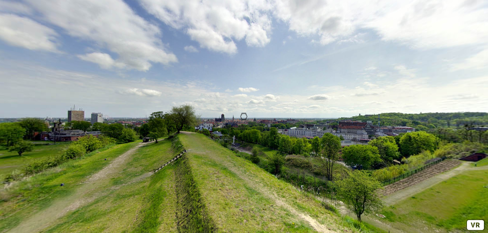
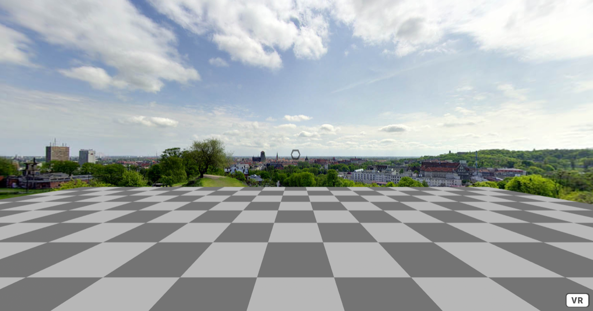
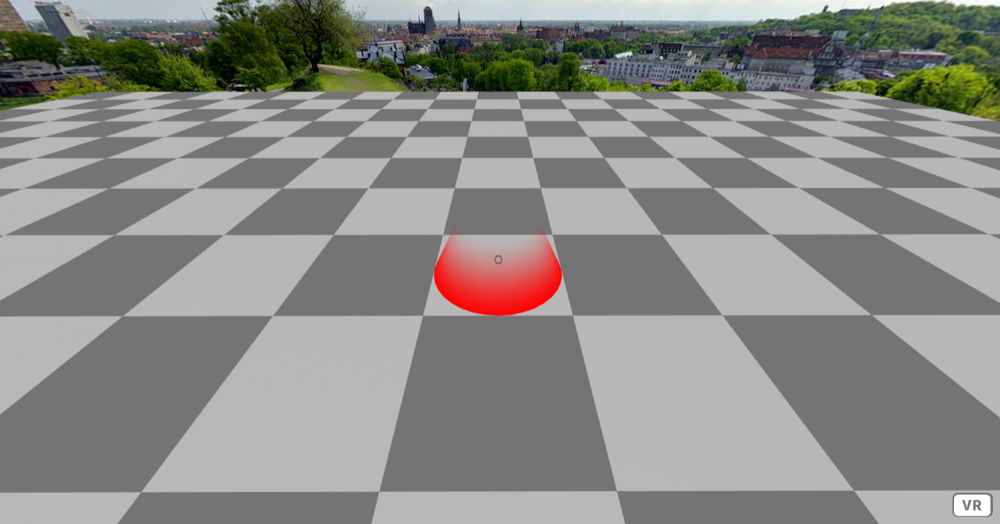
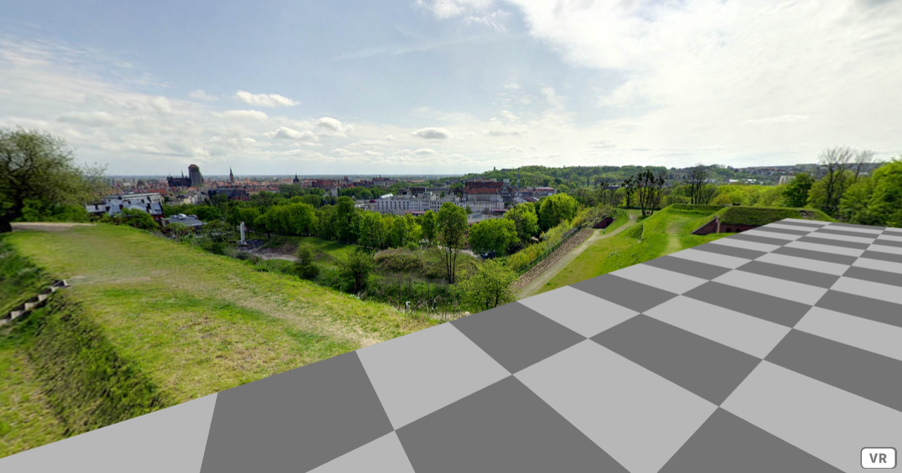
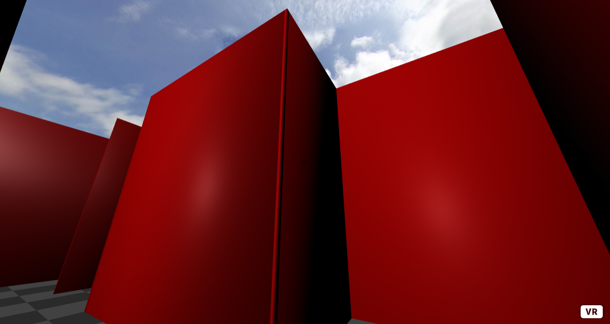

Title: Tile Based Locomotion
Author: David McNamara
Date: 16/07/2020
Category: Web & VR
Tags: VR, virtual reality, locomotion, VR locomotion, VR movement
Slug: Tile Based Locomotion
Series: Web & VR
Series_index: 06
Sortorder: 06

## **Web & Virtual Reality Tile Based Locomotion**
Check out the files for each step for the code up to that point

## Tile Based Movement
The tile based movement tutorial will allow the user the gaze at a tile that they would like to move to. The user will be teleported to the center of the tile that they have gazed at. This type of locomotion may be useful when designing scenes where the user is supposed to navigate in a defined space.
## **Step 1: Tile Setup**
This tutorial will require the aframe framework
```HTML
<!-- A-Frame -->
    <script src="https://aframe.io/releases/1.0.4/aframe.min.js"></script>
```
There will be three assets used in this tutorial. An image that will be used as a glowing effect, another image that will be used as the sky, and an obj file that is a 3D model of a maze.
```HTML
<a-assets>
        
        
        <!-- maze model -->
        <a-asset-item
          id="maze-obj"
                      crossorigin="anonymous"
          src="https://cdn.glitch.com/6371daf2-253b-4584-912d-cdf772194763%2Fmaze.obj?v=1594198049361"
        ></a-asset-item>
      </a-assets>
```
To create the skybox, simply set the src of the to the id that was given to the sky image in the asset manager
```HTML
<!-- sky -->
      <a-sky src="#sky"></a-sky>
```
To create the floor container, give an a unique id so that it can be easily referenced. Make sure to set it's rotation to -90 degrees about the X-axis. And give this entity the play-area component and set the size of the play-area to 25. Don't worry about this component just yet as it still has to be written.
```HTML
<!-- floor -->
      <a-entity
        id="momentGrid"
        position="0 0 0"
        rotation="-90 0 0"
        play-area="size: 25"
      >
      </a-entity>
```
To make the user rig for this tutorial, wrap a cursor inside of a camera inside of an entity, make sure to uniquely id each of the entities of this rig. The outer is required as it is easier to change the position of this entity rather than moving the . If you want to not allow the user to use keyboard WASD controls to move about the scene, you can give the camera the wasd-controls-enabled component and set it equal to false. This is not necessary for this tutorial but it will help demonstrate tile based locomotion. In the it is important to set the fuse and fuse-timeout. This lets the user to look at objects to interact with them, and defines how long it takes in milliseconds it takes for the interaction to take place. The position should be set to 0 0 -0.01, so that the cursor is just in front of the user's eyes. This will ensure that there are no problems later with intersections of different entities. Set the geometry and material of the cursor to whatever shape you would prefer your crosshair to be, but make sure that its size is very small as the cursor is very close the user's eyes. The raycaster component acts as a laser that is used to get information about what the user is looking at, how far things are and much more. Make sure to set the raycaster's object to be .clickable, this will ensure that the raycaster only recognizes objects that are of class clickable. You can set how far the raycaster can travel and you can set the interval in milliseconds between interval tests.
```HTML
<!-- User Rig for Tile Movement -->
      <a-entity id="user">
        <a-camera id="camera" wasd-controls-enabled="false">
          <a-cursor
            id="caster"
            fuse="true"
            fuse-timeout="1000"
            position="0 0 -0.01"
            geometry="radiusOuter:0.0003;
                    radiusInner: 0.0002;
                    segmentsTheta: 6"
            material="color: black;
                     opacity: 0.5"
            raycaster="objects: .clickable; far: 4; interval: 0; showLine: true"
            animation__fusing="property: scale; startEvents: fusing; easing: easeInCubic; dur: 1000; from: 1 1 1; to: 0.5 0.5 0.5"
            animation__mouseleave="property: scale; startEvents: mouseleave; easing: easeInCubic; dur: 1000; to: 1 1 1"
          ></a-cursor>
        </a-camera>
      </a-entity>
```

## Step 2: play-area Component
This tutorial requires some custom components, there are 3 components that need to be written. Each of the components should be written in a script before the body. To create a component, used AFRAME.registerComponent("component-name", {what this component does}); If you want to read more about writing components have a look at the a-frame documentation https://aframe.io/docs/1.0.0/core/component.html#sidebar

The play-area component is used to create a grid of tiles that the user can use to move about the scene. To allow the user to set the size that they want. Add a schema to this component. In the schema define size to be of type number and set the default value to 10. This means that unless the user explicitly defines what size they want their play-area to be, the default size will be 10x10. Add an init function, this is a function that will run when initialized. To make reference to the parent object, or the container in which the tiles will be added, create a variable parent, and set it to this.el. This means that the element that has play-area component will be the parent. Create a variable size, and set it's value to this.data.size, this will get the user defined size value. Create a variable user, and set it to the user element. The user element can be found by searching the document for the element with the user id. To set the user's location to the center of the play-area, use the a-frame setComponentProperty function to set its position to the approximate center, that can be found by dividing the size by 2. https://aframe.io/docs/1.0.0/core/utils.html#sidebar

To create all of the tiles of the play-area. Use a nested for loop set to terminate when reaching the user defined size. At each point of the loop, we want to create a tile element to place here. To do this, create a tile element, make a tile variable to be . give this tile variable attributes using .setAttribute("attribute", "value"). Set the position of the tile to be dependent on the index values of the nested for loop. Set the class of the tile to be clickable, as the user will be interacting with each tile. Give the tile the teleport and the highlight attribute, these do not have to be given a value and will be defined later on in this tutorial. To create a tile color pattern similar to a chess board, when ever the i and j are even or when the i and j are not even, set the color of the tile to be a light grey, otherwise, set the color of the tile to be a dark grey. Of course you can change these colors to which ever you prefer. At the end of each for loop, append the tile to the parent using parent.appendChild(tile).
```JavaScript
// play area component
    AFRAME.registerComponent("play-area", {
      schema: {
        size: { type: "number", default: 10 }
      },
      init: function() {
        var parent = this.el; // reference to the object that has the play-area component
        var size = this.data.size; // the size that was specified
        var user = document.getElementById("user");
        AFRAME.utils.entity.setComponentProperty(user, "position", {
          x: size / 2,
          z: -(size / 2)
        }); // reposition the user to the middle of the play-area
        for (var i = 0; i < size; i++) {
          for (var j = 0; j < size; j++) {
            var tile = document.createElement("a-plane"); // make the tile
            // change color of the tiles to make chess board pattern
            if ((i % 2 == 0 && j % 2 == 0) | (i % 2 != 0 && j % 2 != 0)) {
              tile.setAttribute("color", "#a1a1a1");
            } else {
              tile.setAttribute("color", "#666666");
            }
            tile.setAttribute("position", i + " " + j + " 0"); // set position
            tile.setAttribute("teleport", ""); // make a teleport tile
            tile.setAttribute("class", "clickable"); // make clickable
            tile.setAttribute("highlight", ""); // make the tile highlight
            parent.appendChild(tile); // add to the scene
          }
          parent.appendChild(tile); // add to the scene
        }
      }
    });
```

## Step 3: Highlight Component

To improve User Experience, it would be a good idea to highlight the tile that the user is currently looking at. To do this, create a new component called highlight. The highlight component only needs an init function. Add an event listener to this.el .Set the event listener to trigger when there is a raycaster-interescted. This will trigger will the user's raycaster intersects the tile, or when the user is looking at this tile. In this event listener function, create an element called glow. Set the position to 0 0 0.5. Set the rotation to 90 degrees about the X-axis. Using the a-frame setComponentProperty of the glow define the geometry to have a primitive of cone, openEnded to be true, and radiusBottom to be 0.5. Using the setComponentProperty to define the material of glow to have side = front, src= #glow, emission = red and transparent. Note that #glow will be the image in the asset with id = glow. You can set the emission to whatever color you would like the highlight to be. Then append the glow to the tile that the user is looking at with this.appendChild(glow) To remove the highlight when the user to no longer looking at a particular tile, add an event listener that triggers when there is a raycaster-intersected-cleared event. Simply this function set this.innerHTML to be empty. This will remove any children of the tile.
```JavaScript
// highlight component
    AFRAME.registerComponent("highlight", {
      init: function() {
        var el = this.el; // reference to this object
        // triggers when the user is looking at the tile
        this.el.addEventListener("raycaster-intersected", function() {
          var glow = document.createElement("a-entity"); // create highlight
          glow.setAttribute("position", "0 0 0.5"); // set relative position
          glow.setAttribute("rotation", "90 0 0"); // set relative rotation
          // define the geometry of the highlight
          AFRAME.utils.entity.setComponentProperty(glow, "geometry", {
            primitive: "cone",
            openEnded: true,
            radiusBottom: 0.5
          });
          // define the material of the highlight
          AFRAME.utils.entity.setComponentProperty(glow, "material", {
            side: "front",
            src: "#glow",
            emissive: "red",
            transparent: true
          });
          this.appendChild(glow);
        });
        // triggers when the user is no longer looking at the tile
        this.el.addEventListener("raycaster-intersected-cleared", function() {
          this.innerHTML = ""; // clear the highlight
        });
      }
    });
```

## Step 4: Teleport Component

To allow the user to move about the scene, create a new component with the name teleport. The teleport component has an init function that gives this.el an event listener that triggers when ever the user clicks on this element. When the user clicks on this element, and the event is triggered. Create a variable user and set it to the element with id, user. Create a variable pos, this will hold the position information of the user. Set pos equal to the user's current position using the a-frame getComponentProperty function. https://aframe.io/docs/1.0.0/core/utils.html#getcomponentproperty-entity-componentname-delimiter39-39 . 
Create a variable tile that represents the position of this tile. set tile equal to this.getAttribute("position"). Now that we have the positional information about the user and the tile that they are looking at, set the pos.x = tile.x, pos.y = tile.z, pos.z = -tile.y. Using the tile position, we are changing user position to match the appropriate tile position. Note the pos.y and pos.z are swapped with z and -y tile position to account for the -90 degree X-axis rotation on the floor container. Then using the a-frame setComponentProperty set the user's x y z position to the corresponding pos x y z position
```JavaScript
// teleport
    AFRAME.registerComponent("teleport", {
      init: function() {
        // when the user clicks on this
        this.el.addEventListener("click", function() {
          // make reference to the user
          var user = document.getElementById("user");
          // get the position of the user
          var pos = AFRAME.utils.entity.getComponentProperty(user, "position");
          // get the position of this tiled
          var tile = this.getAttribute("position");
          // set the user position x y z to the appropiate tile x y z
          pos.x = tile.x;
          pos.y = tile.z;
          pos.z = -tile.y;
          // set the new user position
          AFRAME.utils.entity.setComponentProperty(user, "position", {
            x: pos.x,
            y: pos.y,
            z: pos.z
          });
        });
      }
    });
```
The user is now able to move around by gazing at the tiles


## Step 5: Adding the maze

To add the maze object to the scene, create an entity and set the obj-model to the obj file that was added to the asset manager. For the provided maze obj file, set the scale to 0.25 0.25 -0.25 and set the position to -0.75 0 0.8. Give the maze class clickable, this will prevent the user from passing through walls.	
```HTML
<!-- maze -->
      <a-entity
        id="maze"
        obj-model="obj: #maze-obj"
        scale="0.25 0.25 -0.25"
        position="-0.75 0 0.8"
        material="color: red"
        class="clickable"
      ></a-entity>
```
To position the user at the start of the maze, in the play-area component, instead of setting the position to the center of the set the position to x: 11, y: 0, z: 0. This is the starting position for the provided maze.
```JavaScript
// change the position of the user to the start of the maze
        AFRAME.utils.entity.setComponentProperty(user, "position", {
          //x: size / 2,
          //z: -(size / 2)
          x: 11,
          y: 0,
          z: 0
        });
```

## Further tasks:

 - Change how far the raycaster travels, what is the result of this?
 - Change the scale of the maze, can you make it bigger or smaller? You
   may have to change the size of the play area and starting position of
   the user.
 - Change the material of the maze, change the color, opacity, texture,
   to what ever you prefer.
