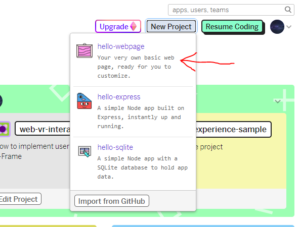
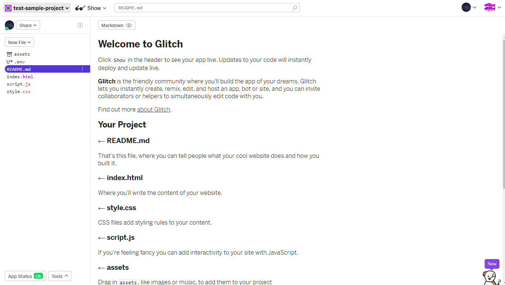
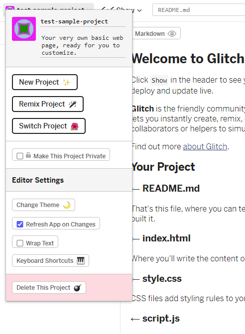
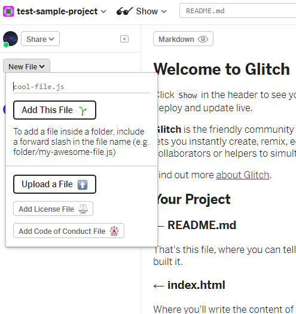
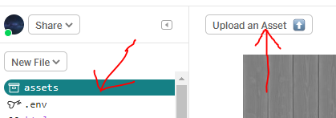
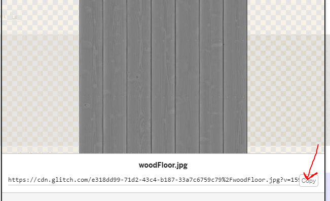
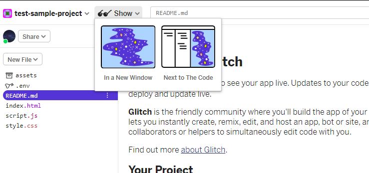

Title: How To Use Glitch
Author: David McNamara
Date: 16/07/2020
Category: Web & VR
Tags: VR, virtual reality, glitch, setup, glitch setup
Slug: How To Use Glitch
Series: Web & VR
Series_index: 01
Sortorder: 01

## **Web & Virtual Reality How To Use Glitch**
## **Step 1: Signup/Login**
Go to https://glitch.com/
Create or login into an account
## **Step 2: Making A Project**
To create a New Project click on the New Project button
Select hello-webpage template, this will create a blank project where you can begin to code

On the left is a panel where you can manage your files and assets, on the right is the file that is currently
being edited. 

Clicking in the top left, will allow you to access the project options where you can.
- Change the name of the project
- Change the description of the project
- As well as other options

## **Step 3: New Files & Preview**
To create new files click on the new file button where you can name your file with it's file type.

The asset manager allows you to upload assets that can be used in your projects.
To upload assets, click on the upload an asset button. Find the file that you would like to upload.
To get the link to the asset that was just uploaded, click on the preview of that asset and copy its link.
There is also a delete option on this panel if you accidentally uploaded an asset that you do not want to
use.

To preview the code that you have written, click on the show button.
There will be two options to show in a new window and to show next to the code.
These will allow you to view the code that you have written.

