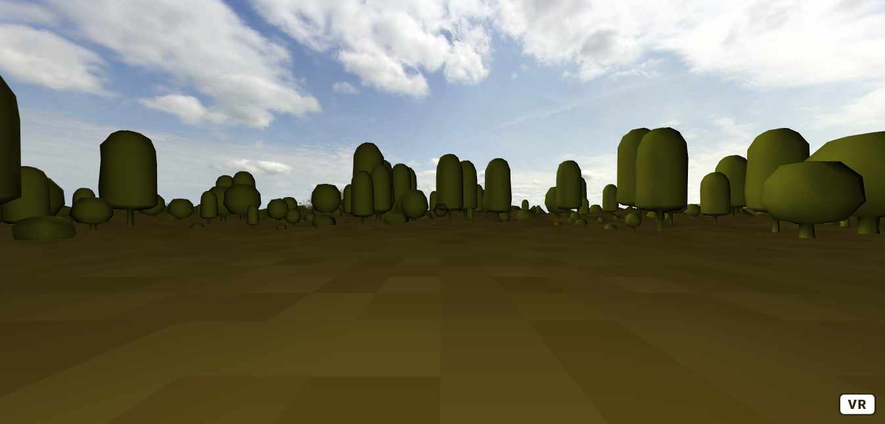
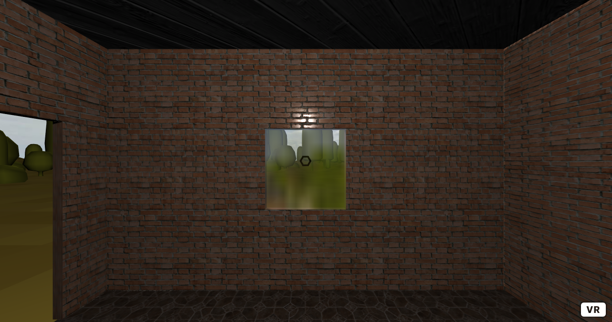
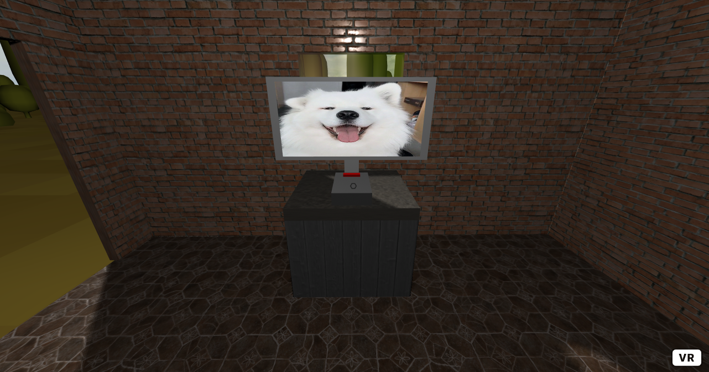
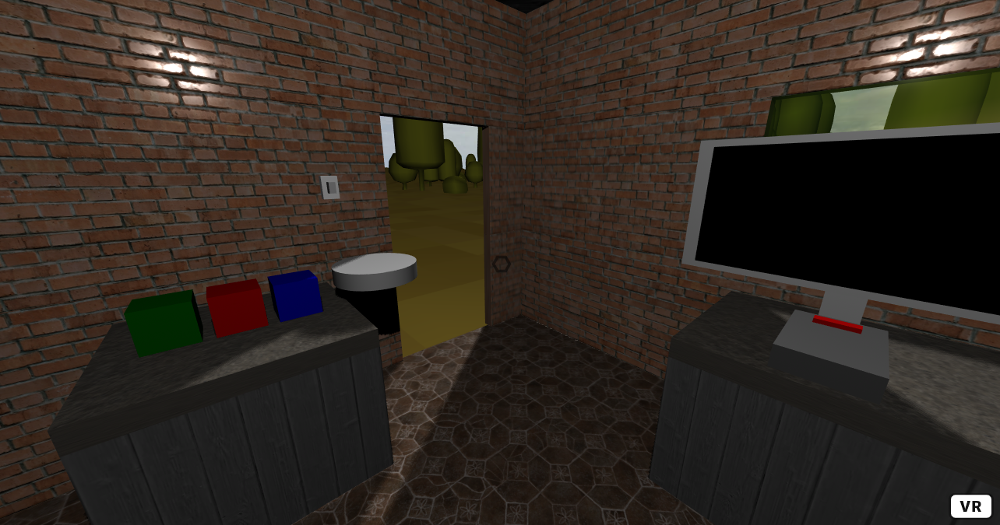
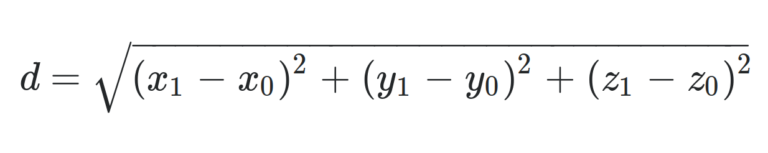
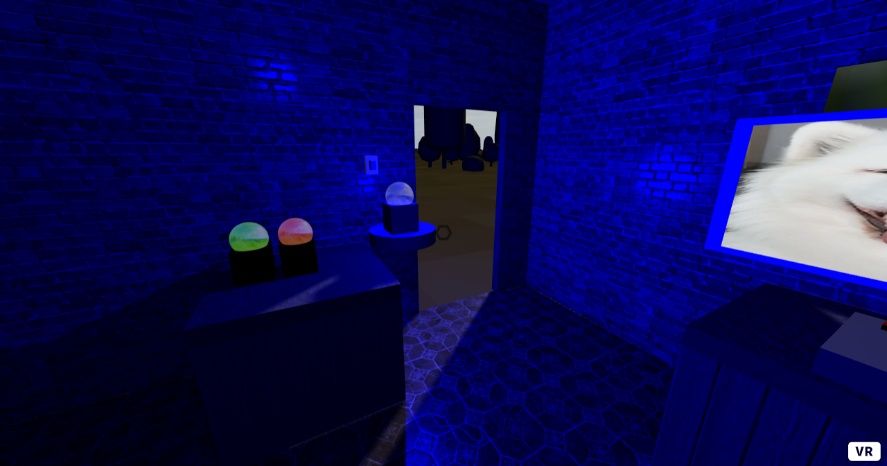

Title: Interaction
Author: David McNamara
Date: 16/07/2020
Category: Web & VR
Tags: VR, virtual reality, interaction, VR interactions
Slug: Interaction
Series: Web & VR
Series_index: 04
Sortorder: 04
## **Web & Virtual Reality Interaction**
Check out the files for each step for the code up to that point
## **Step: 1 Setup Frameworks & Scene**
```HTML
<!-- A-Frame framework -->
    <script src="https://aframe.io/releases/1.0.4/aframe.min.js"></script>
    <!-- environment component -->
    <script src="https://unpkg.com/aframe-environment-component/dist/aframe-environment-component.min.js"></script>
    <!-- super hands -->
    <script src="https://unpkg.com/super-hands@3.0.0/dist/super-hands.min.js"></script>
    <!-- physics -->
    <script src="https://unpkg.com/aframe-physics-system@1.4.0/dist/aframe-physics-system.min.js"></script>
```
When creating the a-scene to make the scene use the physics component, include the gravity and debug component.
```HTML
<a-scene physics="gravity: -9.8" debug>
```
In the asset manager a-assets include a reference to each asset provided including all textures and video files.
```HTML
<!-- Asset manager -->
      <a-assets>
        <!-- sky -->
        
        <!-- wood -->
        
        <!-- wood normal -->
        
        <!-- concrete -->
        
        <!-- concrete normal -->
        
        <!-- brick -->
        
        <!-- brick roughness -->
        
        <!-- tile -->
        
        <!-- tile normal -->
        
        <!-- leather -->
        
        <!-- leather-normal -->
        
      </a-assets>
```
To make the background of this scene, using the environment component to generate an interesting background and a custom skybox. The sky makes reference to the id of the day-sky image in the asset manager. The environment component includes many presets that can be used, in this tutorial the forest preset will be used with no sky type, no fog and no lighting
```HTML
<!-- sky box -->
      <a-sky src="#day-sky"></a-sky>
```
```HTML
<!-- environment -->
      <a-entity
        environment="preset: forest; skyType: none; fog: 0; lighting: none"
        position="0 -0.01 0"
      ></a-entity>
```
To add in the custom lighting that will be used in this tutorial. This light will be suitable for the indoor and outdoor lighting of the scene that will be made in this tutorial
```HTML
<!-- custom lighting -->
      <a-entity id="lighting">
        <a-entity
          id="ceilingLight"
          light="type: point; color: white; intensity: 0.4; castShadow: true"
          position="0 2.6 0"
        ></a-entity>
        <a-entity
          light="intensity: 0.6; castShadow: true"
          position="-6.2892 5.76874 -7.95738"
        ></a-entity>
      </a-entity>
```
The user rig that will be used in this tutorial . This rig uses a cursor and raycaster with help from the super-hands component will allow the user to interact with the scene around them. The user will be able to interact with clickable objects by gazing at them and if the user has a mouse to click they will be able to grab grabbable objects and move them around the scene.
```HTML
<!-- User -->
      <a-entity id="user">
        <a-camera id="camera">
          <a-entity
            id="caster"
            cursor="fuse:  true; fuseTimeout:  1000"
            position="0 0 -1"
            geometry="primitive: ring; segmentsTheta:  6; 
                      radiusOuter:  0.03; radiusInner:  0.02"
            material="color: black; opacity: 0.5"
            raycaster="objects: .clickable"
            animation__fusing="property: scale; 
                               startEvents: fusing; 
                               easing: easeInCubic; 
                               dur: 1000; 
                               from: 1 1 1; to: 0.5 0.5 0.5"
            animation__mouseleave="property: scale; 
                                   startEvents: mouseleave; 
                                   easing: easeInCubic; 
                                   dur: 1000; to: 1 1 1"
            super-hands="colliderEvent: raycaster-intersection;
             colliderEventProperty: els;
             colliderEndEvent: raycaster-intersection-cleared;
             colliderEndEventProperty: clearedEls"
          ></a-entity>
        </a-camera>
      </a-entity>
```

## Step 2: House setup

Using a slightly modified version of the house that was made in the materials tutorial, if you have not completed the materials tutorial or want to have another look for reference. From the materials tutorial, the code for the floor, chair, walls, walls with window, walls with door and roof is used. On each of the entities that is used to create the house, make sure to include the static-body component as this scene is using the physics component and these entities should act as solid, unmoving objects.
```HTML
<!-- chair -->
      <a-entity class="chair" shadow>
        <a-box
          position="0 0.5 1.37031"
          scale="1 0.4 0.75"
          material="src: #leather; normalMap: #leather-normal"
        >
        </a-box>
        <a-box
          position="0 0.5 1.85031"
          scale="1 1 -0.08"
          material="src: #leather; normalMap: #leather-normal"
        >
        </a-box>
        <a-box
          position="0.61 0.5 1.5"
          scale="0.25 0.69 0.75"
          material="src: #leather; normalMap: #leather-normal"
        >
        </a-box>
        <a-box
          position="-0.61 0.5 1.5"
          scale="0.25 0.69 0.75"
          material="src: #leather; normalMap: #leather-normal"
        >
        </a-box>
      </a-entity>
```
```HTML
<!-- floor -->
      <a-plane
        position="0 0 0"
        rotation="-90 0 0"
        scale="5 5 1"
        material="color: white;
                  src: #tile;
                  repeat: 2.5 2.5;
                  normal-map: #tile-normal;
                  normal-texture-repeat: 5 5;
                  roughness: 0.4;
                  metalness: 0"
        shadow
        static-body
      ></a-plane>
```
```HTML
<!-- wall -->
      <a-entity class="wall" position="0 1.5 2.5" rotation="0 0 0" static-body>
        <a-box
          scale="5 3 0.1"
          shadow
          material="src: #brick;
                         repeat: 2.5 2;
                         roughness-map: #brick-roughness;
                         roughnessTextureRepeat: 2.5 2;
                         roughness: 0.9;
                         metalness: 0"
        >
        </a-box>
      </a-entity>
<!-- wall -->
      <a-entity class="wall" position="2.5 1.5 0" rotation="0 90 0" static-body>
        <a-box
          scale="5 3 0.1"
          shadow
          material="src: #brick;
                         repeat: 2.5 2;
                         roughness-map: #brick-roughness;
                         roughnessTextureRepeat: 2.5 2;
                         roughness: 0.9;
                         metalness: 0"
        >
        </a-box>
      </a-entity>
```
```HTML
<!-- wall with door -->
      <a-entity class="wall-with-door" static-body>
        <a-box
          position="-2.5 2.5 0"
          rotation="0 90 0"
          scale="5 1 0.1"
          shadow
          material="src: #brick;
                         repeat: 2.5 0.5;
                         roughness-map: #brick-roughness;
                         roughnessTextureRepeat: 2.5 0.5;
                         roughness: 0.9; metalness: 0"
        >
        </a-box>
        <a-box
          position="-2.5 1.5 0.75"
          rotation="0 90 0"
          scale="3.5 1 0.1"
          shadow
          material="src: #brick;
                         repeat: 2.5 0.5;
                         roughness-map: #brick-roughness;
                         roughnessTextureRepeat: 2.5 0.5;
                         roughness: 0.9; metalness: 0"
        >
        </a-box>
        <a-box
          position="-2.5 0.5 0.75"
          rotation="0 90 0"
          scale="3.5 1 0.1"
          shadow
          material="src: #brick;
                         repeat: 2.5 0.5;
                         roughness-map: #brick-roughness;
                         roughnessTextureRepeat: 2.5 0.5;
                         roughness: 0.9; metalness: 0"
        >
        </a-box>
        <a-box
          position="-2.5 1.5 -2.25"
          rotation="0 90 0"
          scale="0.5 1 0.1"
          shadow
          material="src: #brick;
                         repeat: 0.5 0.5;
                         roughness-map: #brick-roughness;
                         roughnessTextureRepeat: 2.5 0.5;
                         roughness: 0.9; metalness: 0"
        >
        </a-box>
        <a-box
          position="-2.5 0.5 -2.25"
          rotation="0 90 0"
          scale="0.5 1 0.1"
          shadow
          material="src: #brick;
                         repeat: 0.5 0.5;
                         roughness-map: #brick-roughness;
                         roughnessTextureRepeat: 2.5 0.5;
                         roughness: 0.9; metalness: 0"
        >
        </a-box>
      </a-entity>
```
```HTML
<!-- wall with window -->
      <a-entity class="wall-with-window" position="0 0 0" static-body>
        <a-box
          position="0 0.5 -2.5"
          scale="5 1 0.1"
          shadow
          material="src: #brick;
                         repeat: 2.5 0.5;
                         roughness-map: #brick-roughness;
                         roughnessTextureRepeat: 2.5 0.5;
                         roughness: 0.9; metalness: 0"
        >
        </a-box>
        <a-box
          position="0 2.5 -2.5"
          scale="5 1 0.1"
          shadow
          material="src: #brick;
                         repeat: 2.5 0.5;
                         roughness-map: #brick-roughness;
                         roughnessTextureRepeat: 2.5 0.5;
                         roughness: 0.9; metalness: 0"
        >
        </a-box>
        <a-box
          position="-1.5 1.5 -2.5"
          scale="2 1 0.1"
          shadow
          material="src: #brick;
                         repeat: 1.5 0.5;
                         roughness-map: #brick-roughness;
                         roughnessTextureRepeat: 2.5 0.5;
                         roughness: 0.9; metalness: 0"
        >
        </a-box>
        <a-box
          position="1.5 1.5 -2.5"
          scale="2 1 0.1"
          shadow
          material="src: #brick;
                         repeat: 1.5 0.5;
                         roughness-map: #brick-roughness;
                         roughnessTextureRepeat: 2.5 0.5;
                         roughness: 0.9; metalness: 0"
        >
        </a-box>
        <a-box
          class="window"
          position="0 1.5 -2.5"
          scale="1 1 0.1"
          material="opacity: 0.5;  
                  sphericalEnvMap: #day-sky;
                  roughness: 0; metalness: 1"
        >
        </a-box>
      </a-entity>
```
```HTML
<!-- roof -->
      <a-entity class="roof" static-body>
        <a-plane
          position="0 3.75 0"
          rotation="0 45 0"
          scale="3.5 1.53 3.5"
          shadow
          material="color: white; 
                         src: #wood; 
                         repeat: 2.5 2.5; 
                         roughness: 0.4; 
                         normalMap: #wood-normal; 
                         normalTextureRepeat: 5 5;
                         side: front"
          geometry="primitive: cone; 
                         openEnded: false; 
                         segmentsRadial: 4"
        ></a-plane>
      </a-entity>
```
Now that the house has been added to the scene, and each entity of the house has been made a static-body, objects that the user interacts with will now hit and bounce  off of the walls and floor.

## Step 3: Gaze based Interaction

The first type of interaction that this tutorial will cover is gazed based. This will be demonstrated with a TV and remote control that play different videos when the user gazes at the remote control.

Getting started with this, ensure that the video assets that you want to use are included in the a-asset asset manager. In this tutorial there will be 5 different videos that the user can switch between. The videos provided are gifs converted into mp4 format, but feel free to use whatever videos you prefer, by default the audio included with the mp4 will also be played.
```HTML
<video
          id="vid"
          autoplay
          loop="true"
          src="https://cdn.glitch.com/80ab9e9b-2649-4fe7-bf0e-8f98d84a84a4%2Fezgif-4-24cd34135885.mp4?v=1593171274583"
          crossorigin="anonymous"
        ></video>
        <video
          id="vid_1"
          autoplay
          loop="true"
          src="https://cdn.glitch.com/80ab9e9b-2649-4fe7-bf0e-8f98d84a84a4%2Fvid_1.mp4?v=1593592828928"
          crossorigin="anonymous"
        ></video>
        <video
          id="vid_2"
          autoplay
          loop="true"
          src="https://cdn.glitch.com/80ab9e9b-2649-4fe7-bf0e-8f98d84a84a4%2Fvid_2.mp4?v=1593592829234"
          crossorigin="anonymous"
        ></video>
        <video
          id="vid_3"
          autoplay
          loop="true"
          src="https://cdn.glitch.com/80ab9e9b-2649-4fe7-bf0e-8f98d84a84a4%2Fvid_3.mp4?v=1593592827987"
          crossorigin="anonymous"
        ></video>
        <video
          id="vid_4"
          autoplay
          loop="true"
          src="https://cdn.glitch.com/80ab9e9b-2649-4fe7-bf0e-8f98d84a84a4%2Fvid_4.mp4?v=1593592828267"
          crossorigin="anonymous"
        ></video>
```
Using the same table from the materials tutorial, with the added static-body components placed in front of the user.
```HTML
<!-- table -->
      <a-entity class="table" shadow>
        <a-box material="color: white;
                  src: #wood;
                  repeat: 1 1;
                  normal-map: #wood-normal;
                  normal-texture-repeat: 1 1;
                  roughness: 0.6"
          position="0 0.25 -2" static-body
        >
          <a-box material="color: white;
                  src: #concrete;
                  repeat: 1 1;
                  normal-map: #concrete-normal;
                  normal-texture-repeat: 1 1;
                  roughness: 0.6"
            position="0 0.55 0"
            scale="1 0.1 1" static-body
          >
          </a-box>
        </a-box>
      </a-entity>
```
Add a TV with a screen. The screen can be made using the a-video entity, this is where the videos will be played when the user interacts with the remote control. The TV is a simple box placed on the table that was just placed. The TV does not have any additional features or components.
```HTML
<!-- TV -->
      <a-box
        class="clickable"
        id="tv"
        material=""
        position="0 1.4 -2.3"
        scale="1.5 0.75 0.16"
      >
        <!-- TV stand -->
        <a-box scale="0.1 0.5 0.1" position="0 -0.5 0"> </a-box>
        <!-- screen -->
        <a-plane
          class="clickable"
          id="screen"
          material="color: white"
          position="0 0 0.501"
          scale="0.9 0.9 1"
        >
          <a-video id="video_player" src="#vid" position="0 0 0.01"></a-video>
        </a-plane>
      </a-box>
```
The remote control is again a simple placed on the table. To make the controller do something when the user interacts with it. Include the remote-control component. This is a custom component that you will write make the TV turn on and change the video that it is playing.
```HTML
<!-- remote control -->
      <a-box
        id="remote"
        position="0 0.9 -1.8"
        scale="0.3 0.1 0.5"
        class="clickable"
        material="color: #737373"
        remote-control
      >
        <a-box scale="0.5 0.5 0.1" position="0 0.45 -0.3" color="red"> </a-box>
      </a-box>
```

To make the remote-control component. Above the body> create a script. This is where all of the components will be written.

Create a variable videoCount, this will be used to toggle between the different videos that the user can watch.

Register a new component using AFRAME.registerComponent(name of component, what it does); The remote-control component has an init function that adds an event listener to the element that has the remote-control component attached to it. This means that when this is initialized, an event listener is added to the remote control. The event listener will trigger whenever the user clicks the object.

In the event listener function, create an array that contains all of the id's to the videos that the user can select from, these id's in the array should be the same as the id's of the videos in your asset manager. Create a variable next that is the next element in the array. To make the it loop between all of the videos increment videoCount variable, then modulus that value by the number of videos in the array. What this does is it will toggle between the 5 videos, and will not result in an array out of bounds error if as the modules operation ensure that the maximum index that can be reached is index 4.

After selecting the video that the user will be watching, create a variable video_player, which is the a-video that the video will be played on. This can be selected using the document.getElementById and using the id that was assigned to the a-video.

Create a variable called video, and select the actual video that is going to be played, using the document.querySelector(next).

To update the source of the video to the one that was just selected, change the src value of video_player to next.

Finally to play the video, use video.play()
```JavaScript
var videoCount = 0;
    AFRAME.registerComponent("remote-control", {
      init: function() {
        this.el.addEventListener("click", function() {
          var videos = ["#vid", "#vid_1", "#vid_2", "#vid_3", "#vid_4"];
          var next = videos[++videoCount % videos.length];
          var video_player = document.getElementById("video_player");
          var video = document.querySelector(next);
          video_player.setAttribute("src", next);
          video.play();
        });
      }
    });
```

## Step 4: Grabbable Objects

The super-hands component that was added to the user rig during step 1 of this tutorial allows the user to be able to grab and move around clickable objects that are also defined as grabbable.

To show this in action, an interactive demonstration of this will allow the user to pick up different colored light bulbs and place them on a power pad, which will make the bulb glow and will change the color of the ceiling light in the house.

Start by making another table but place it to the left of the user.
```HTML
<!-- table for light bulbs-->
      <a-entity class="table" shadow>
        <a-box material="color: white;
                  src: #wood;
                  repeat: 1 1;
                  normal-map: #wood-normal;
                  normal-texture-repeat: 1 1;
                  roughness: 0.6"
          position="-2 0.25 0" static-body
        >
          <a-box material="color: white;
                  src: #concrete;
                  repeat: 1 1;
                  normal-map: #concrete-normal;
                  normal-texture-repeat: 1 1;
                  roughness: 0.6"
            position="0 0.55 0"
            scale="1 0.1 1" static-body
          >
          </a-box>
        </a-box>
      </a-entity>
```
Next to make the power pad. Create a cylinder and place it beside the table, this will be where the user is to place the light bulbs. Include the change-color component, this will be a custom component that will be written later in the tutorial.
```HTML
<!-- power pad -->
<a-entity
        id="power_pad"
        geometry="primitive: cylinder; radius: 0.25; height: 0.1"
        scale="1 1 1" material="" position="-2 1 -0.7"
        static-body change-color shadow >
      </a-entity>
```
To make the light bulbs create a box, with a sphere. The box will be the grabbable part of the bulb and the sphere will use the same material as the glass. Inside of the sphere, add a point light.

It is important to use the following structure for each bulb. Give each bulb a unique id, the clickable class. Grabbable, gravity-change, shadow and dynamic-body component. Include the distance component, and set it's target to power_pad. The distance and gravity change component are custom components that will be written later in this tutorial.

Give each sphere the follow component and set it's object to the corresponding bulb, and set it's offset to 0 0.15 0. The follow component will be a custom component that will be written later in this tutorial. Set the material to the same as the window, but set it's emission to the corresponding color.

Inside of the sphere, create a point light that is the corresponding color, and set it's intensity to 0, so that the bulb will be off by default.

Repeat this so that there are 3 different colored bulbs on the table
```HTML
<a-box
        id="blueBulb" class="clickable"
        scale="0.2 0.2 0.2"
        position="-2 1 -0.25" color="blue"
        dynamic-body grabbable gravity-change shadow
        distance="target: power_pad" ></a-box>
      <a-sphere
        radius="0.1"
        follow="object: blueBulb; offset: 0 0.15 0"
        material="opacity: 0.5;  
                  sphericalEnvMap: #day-sky;
                  roughness: 0;
                  metalness: 1;
                  emissive: blue" >
        <a-entity
          light="type: point; color: blue; intensity: 0.0; castShadow: true"
          position="0 0 0">
        </a-entity>
      </a-sphere>
```
Adding onclick functionality to the light switch is very simple. In the script create a new function toggleLight() which selects the light with id ceilingLight. Then using the a-frame getComponentProperty on that element, to get the value of the light intensity. If the light is off or it's intensity is 0. Then use the setComponentProperty to change the intensity to 0.4, so that light will be on. Otherwise, the light must be on and therefore change the intensity to 0, to turn it back off. This function will trigger then the user gazes at the light switch.
```JavaScript
function toggleLight(){
      var el = document.getElementById("ceilingLight");
      if (AFRAME.utils.entity.getComponentProperty(el, "light.intensity") == 0) {
        AFRAME.utils.entity.setComponentProperty(el, "light", {
          intensity: 0.4
        });
      } 
      else {
        AFRAME.utils.entity.setComponentProperty(el, "light", {
          intensity: 0
        });
      }
    }
```
Note, at this stage, the spheres will not stay on the bulbs, and there will be no functionality in the power pad. The bulbs will also be impossible to lift up, because they are by default dynamic-bodies, which means that they will be affected by gravity.

## Step 5: Writing Components

Now that all of the objects have been added to the scene. The only thing left to do is to finish writing some of the custom components.

The follower component is used by the light bulb sphere, so that they will always stay in the same position above their corresponding box.

Create the follow component, define it's schema to accept an object and an offset, both of type string. It is important to set the offset default value to 0 0 0, as the user may not want to include any offset to the follow object.

Create a tick function. A tick will trigger approximately 60 times a second which means that the code written in the function will happen over and over again.

Create a variable pos, that contains the position value of the element that was user defined as the object.

Create a variable offset, which uses coordinates.parse on the set offset value, this will either be the default 0 0 0, or this will whatever the offset the user set.

Finally set this element's position to pos + the offset.

Now the spheres will always be follow their boxes.
```JavaScript
// follower
    AFRAME.registerComponent("follow", {
      schema: {
        object: { type: "string" },
        offset: { type: "string", default: "0 0 0" }
      },
      tick: function() {
        var pos = document
          .getElementById(this.data.object)
          .getAttribute("position");
        var offset = AFRAME.utils.coordinates.parse(this.data.offset);
        AFRAME.utils.entity.setComponentProperty(this.el, "position", {
          x: pos.x + offset.x,
          y: pos.y + offset.y,
          z: pos.z + offset.z
        });
      }
    });
```
To make the bulbs easy to pick up, create the gravity-change component. The gravity-change component will simply add two event listeners on this element. One that triggers when the raycaster-intersected event is met and another when the raycaster-intersected-cleared event is met. So when the user looking at the object, remove the dynamic-body attribute, and when the user is not looking at the object, set the dynamic-body attribute.

This will allow the user to be able to pick up the bulbs and move them around the scene without having to worry about the effects of gravity until they are no longer looking at the object.
```JavaScript
// gravity change
    AFRAME.registerComponent("gravity-change", {
      init: function() {
        // when this entity is intersecting a raycaster it is not dynamic
        this.el.addEventListener("raycaster-intersected", function() {
          this.removeAttribute("dynamic-body");
        });
        // when this entity is no longer intersecting a raycaster it is dynamic
        this.el.addEventListener("raycaster-intersected-cleared", function() {
          this.setAttribute("dynamic-body", "");
        });
      }
    });
```
To change the color of the over head light. Create the change-color component.

The change-color component adds an event listener to this element. The event listener is triggered whenever there is a collide event. Make sure to add an name to the function, so that information about the actual event can be used.

Create a variable input, that is the element that caused the collide event. Which will be the box of the bulb.

Create a variable newColor, which is set to the input's color. This can be found by using the getAttribute function.

To change the color of the power pad, use the setComponentProperty of el to change the material color to be newColor.

Create a variable light that is the element that has the id ceilingLight

To change the color of the light, use the setComponetProperty on light, to change the light color to newColor.

Now the power pad changes the color of the ceiling light to whatever color bulb is placed on it.
```JavaScript
// color change component
    AFRAME.registerComponent("change-color", {
      init: function() {
        var el = this.el;
        this.el.addEventListener("collide", function(evt) {
          var input = evt.detail.body.el;
          var newColor = input.getAttribute("color");
          AFRAME.utils.entity.setComponentProperty(el, "material", {
            color: newColor
          });
          var light = document.getElementById("ceilingLight");
          AFRAME.utils.entity.setComponentProperty(light, "light", {
            color: newColor
          });
        });
      }
    });
```
To make the bulbs themselves light up when placed on the power pad. Create the distance component. The distance component has a schema that defines a target that the user can define, this is the id of the element that they want to find the distance this element is away from.

Inside of a tick function, create a variable a, which is this element's position.

Create a variable b, which is the position of the element that the user defined as the target.

Create a variable bulb which is the next element's first child after this element.

Create a variable distance, which will calculate the distance that the two objects are away from each other.


Using this distance you can find the distance between two objects in 3D space. The code for this formula is below in the code example.

Then finally check if the distance is less than or equal to 0.2. If the distance is less than or equal to 0.2, then turn the light on. Otherwise turn the light off. Note that the toFixed(2) will round the distance value to 2 decimal places.
```JavaScript
// distance
    AFRAME.registerComponent("distance", {
      schema: {
        target: { type: "string" }
      },
      tick: function() {
        var a = this.el.getAttribute("position");
        var b = document
          .getElementById(this.data.target)
          .getAttribute("position");
        var bulb = this.el.nextElementSibling.firstElementChild;
        var distance = Math.sqrt(
          (a.x - b.x) ** 2 + (a.y - b.y) ** 2 + (a.z - b.z) ** 2
        );
        if (distance.toFixed(2) <= 0.2) {
          AFRAME.utils.entity.setComponentProperty(bulb, "light", {
            intensity: 1
          });
        }else{
          AFRAME.utils.entity.setComponentProperty(bulb, "light", {
            intensity: 0
          });
        }
      }
    });
```
The light bulbs will now light up when placed on the power pad and will turn off when they are no longer on the power pad.

## Further Tasks:

 - Try changing the environment preset to some of the other options
   available for the environment component,  here are the available
   options : 'none', 'default', 'contact', 'egypt', 'checkerboard',
   'forest', 'goaland', 'yavapai', 'goldmine', 'arches', 'threetowers',
   'poison', 'tron', 'japan', 'dream', 'volcano', 'starry', 'osiris'
 - Change the videos that play when the user interacts with the remote
   control. Videos that have sound will play their audio.
 - Try creating even more light bulbs, or change the color of the bulbs
   to your favorite colors.
 - What happens if you remove the link to the physics system? You could
   experiment with working without any physics, how does this change the
   interaction with the light bulbs? Or what happens if you use a very
   weak gravity force?
