Title: Material
Author: David McNamara
Date: 16/07/2020
Category: Web & VR
Tags: VR, virtual reality, material, VR material
Slug: Material 
Series: Web & VR
Series_index: 02
Sortorder: 02

## **Web & Virtual Reality Materials**
Check out the files for each step for the code up to that point

## **Step: 1 Setup Frameworks & Scene**
In the head of the HTML file include the following links to the A-Frame framework and to an environment component.
```HTML
<!-- A-Frame framework -->
<script src="https://aframe.io/releases/1.0.4/aframe.min.js"></script>
<!-- environment component -->
<script src="https://unpkg.com/aframe-environment-component/dist/aframe-environment-component.min.js"></script>
```
This will allow us to use A-Frame and get started with Web VR. Check out the A-Frame documentation for help with the setup [https://aframe.io/docs/1.0.0/introduction/](https://aframe.io/docs/1.0.0/introduction/)
Let's make a floor that the user can stand on

In the a-scene create a plane. To position the plane under the user, we must change some of the properties. As we are working in 3D space, A-Frame uses the X Y Z coordinate system. So, setting the position of the plane to 0 0 0, means that the plane will be located at X=0, Y=0, Z=0. Change the rotation of the plane to -90 degrees about the X-axis. And change the scale so that it is a bit bigger.

You can also do a simple color change by setting the color property, you can type the name of a color, e.g. color = "grey" or you can use hexadecimal values, e.g. color = # 4d4d4d. If you are not familiar with hexadecimal color values, check out the w3school color picker [https://www.w3schools.com/colors/colors_picker.asp](https://www.w3schools.com/colors/colors_picker.asp)
```HTML
<!-- floor -->
<a-plane position="0 0 0" scale="20 20 1" rotation="-90 0 0" color="#4d4d4d"></a-plane>
```
```HTML
<!-- sky box -->
<a-sky color="blue"></a-sky>
```
To add objects or entities to the scene, A-Frame has many built-in shapes. Here are some samples. But check out the full list of built-in shapes here: [https://aframe.io/docs/1.0.0/components/geometry.html#built-in-geometries](https://aframe.io/docs/1.0.0/components/geometry.html#built-in-geometries)
```HTML
<!-- basic shapes -->
      <a-sphere position="-6 2 -8"></a-sphere>
      <a-cone position="-4 2 -8"></a-cone>
      <a-cylinder position="-2 2 -8"></a-cylinder>
      <a-dodecahedron position="0 2 -8"></a-dodecahedron>
      <a-octahedron position="2 2 -8"></a-octahedron>
      <a-torus position="4 2 -8"></a-torus>
      <a-box position="6 2 -8"></a-box>
```
Experiment by changing the position, rotation, scale and color of shapes in A-Frame.
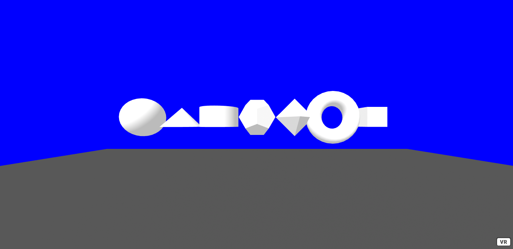
## **Set 2: Opacity**
Pick a shape that play with the opacity. The default opacity value of shapes is set to 1, which means 100% opacity. You can change this by setting the opacity in a similar way to how you changed the color. Try to change the opacity of some of the shapes you have already created and try to change the colors too. Here is an example that changes the color, position and opacity of some boxes.
```HTML
<!-- opacity -->
<a-box position="-2 1 -3" color = "red" opacity = "1"></a-box>
<a-box position="-1 1 -3" color = "orange" opacity = "0.8"></a-box>
<a-box position="0 1 -3" color = "yellow" opacity = "0.6"></a-box>
<a-box position="1 1 -3" color = "green" opacity = "0.4"></a-box>
<a-box position="2 1 -3" color = "purple" opacity = "0.2"></a-box>
```
Try making some sphere inside of each other that get smaller but with the sample low opacity value, which gives a cool visual effect.
```HTML
<!-- opacity spheres -->
<a-sphere position = "0 4 -4" radius = "0.2" color = "yellow" opacity = "0.2"></a-sphere>
<a-sphere position = "0 4 -4" radius = "0.3" color = "yellow" opacity = "0.2"></a-sphere>
<a-sphere position = "0 4 -4" radius = "0.4" color = "yellow" opacity = "0.2"></a-sphere>
<a-sphere position = "0 4 -4" radius = "0.5" color = "yellow" opacity = "0.2"></a-sphere>
<a-sphere position = "0 4 -4" radius = "0.6" color = "yellow" opacity = "0.2"></a-sphere>
```
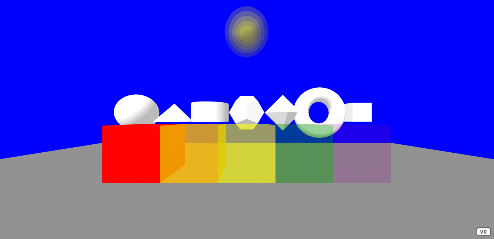
## Step 3: Textures & Environment

Next, we will work with using textures which can allow you make more detailed and realistic scenes.

The rest of this tutorial will be using different shapes, textures and lighting to create a house.

To easily manage the textures and other assets we can use the A-Frame asset manager a-assets. In the asset manager we need to assign each asset a unique id and a source.

If you are using glitch, you can use the assets tab to upload your files to your project. From the assets tab you can copy the source of each asset.

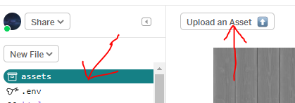<br>
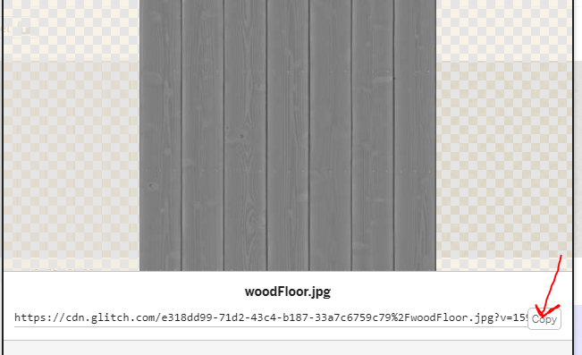<br>

Using the textures provided, or your own. Upload each texture to the glitch asset manager and add them to your scene in the a-assets . Here is an example of what your asset manager code might look like. Remember to assign each texture it's own unique id and link to the correct glitch source, as seen above.
```HTML
<!-- Asset manager -->
      <a-assets>
        <!-- sky -->
        
        <!-- wood -->
        
        <!-- wood normal -->
        
        <!-- concrete -->
        
        <!-- concrete normal -->
        
        <!-- brick -->
        
        <!-- brick roughness -->
        
        <!-- tile -->
        
        <!-- tile normal -->
        
        <!-- leather -->
        
        <!-- leather-normal -->
        
      </a-assets>
```
You can replace the sky box color with a link to the sky asset, which will use that image instead of the base color. By giving each of the assets a unique id, they can be referenced easily with a #.
```HTML
<!-- sky box -->
<a-sky src="#day-sky"></a-sky>
```
To easily create a full environment, you can use Kevin Ngo's environment component. https://github.com/supermedium/aframe-environment-component
Below is some environment code with some custom lighting that will be used throughout the rest of this tutorial.
```HTML
<!-- environment -->
      <a-entity
        environment="preset: forest; skyType: none; fog: 0; lighting: none"
        position="0 -0.01 0"
      ></a-entity>
      <!-- custom lighting -->
      <a-entity id="lighting">
        <a-entity
          light="type: point; color: white; intensity: 0.4; castShadow: true"
          position="0 2.6 0"
        ></a-entity>
        <a-entity
          light="intensity: 0.6; castShadow: true"
          position="-6.2892 5.76874 -7.95738"
        ></a-entity>
      </a-entity>
```
Here are some environment preset options. Try some of them out
```HTML
['none', 'default', 'contact', 
'egypt', 'checkerboard', 
'forest', 'goaland', 'yavapai', 
'goldmine', 'arches', 'threetowers', 
'poison', 'tron', 'japan', 'dream',
 'volcano', 'starry', 'osiris']
```
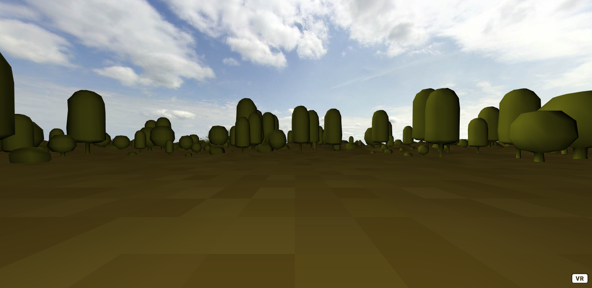
## Step 4: Normal Maps, Roughness & Metalness
To start off the house, create a plane, rotate about the X-Axis -90 degrees and scale to an appropriate size. To make the floor look more like a real floor that might be found in a house. Apply a texture and normal map.

Each addition to the house will be placed inside of the #house entity.
```HTML
<!-- lets make a house-->
      <a-entity id="house">
        <!-- floor -->
        <a-plane
          position="0 0 0"
          rotation="-90 0 0"
          scale="5 5 1"
          material="color: white;
                  src: #tile;
                  repeat: 2.5 2.5;
                  normal-map: #tile-normal;
                  normal-texture-repeat: 2.5 2.5;
                  roughness: 0.4;
                  metalness: 0"
          shadow
        ></a-plane>
      </a-entity>
```
The material of the plane references the tile texture that has been added to the asset manager. This material also includes a normal map. Which is another asset that provides additional information about how light should interact with this material. Using normal maps helps to create the illusion of depth on a material.

You can also adjust a materials roughness and how metallic it is. By changing the roughness and metalness of a material, you are describing how light reflects and disperses across the material.

The shadow attribute will allow this object to cast and receive shadows, which will be used later in this tutorial.

Tile floor without normal map
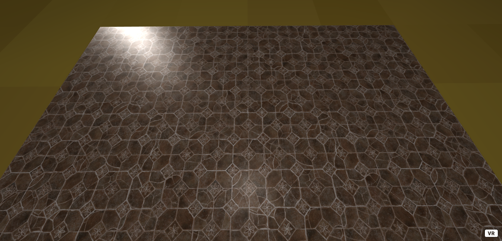
Tile floor with normal map
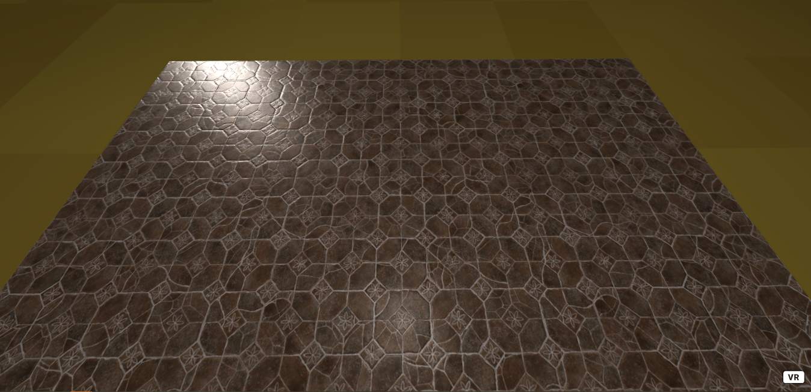
Play around with the roughness and metalness of this material. Can you make this floor look smooth and polished? Or can you make this floor look rough and dull. Experiment by changing the repeat values of the texture.

For more about materials check out the A-Frame documentation [https://aframe.io/docs/1.0.0/components/material.html#sidebar](https://aframe.io/docs/1.0.0/components/material.html#sidebar)

## Step 5: Brick Walls & Glass
The walls of the house will use a brick texture with a roughness map. Feel free to use a different texture on the walls and adjust the roughness and metalness as you see fit.

Each of the walls is a collection of boxes placed at different positions and rotations. Walls with additional detail like a door or window require most code, as the wall must be broken up into different pieces. Feel free to use the code provided.
```HTML
<!-- wall -->
        <a-entity class="wall" position="0 1.5 2.5" rotation="0 0 0">
          <a-box
            scale="5 3 0.1"
            shadow
            material="src: #brick;
                         repeat: 2.5 2;
                         roughness-map: #brick-roughness;
                         roughnessTextureRepeat: 2.5 2;
                         roughness: 0.9;
                         metalness: 0"
          >
          </a-box>
        </a-entity>
        <!-- wall -->
        <a-entity class="wall" position="2.5 1.5 0" rotation="0 90 0">
          <a-box
            scale="5 3 0.1"
            shadow
            material="src: #brick;
                         repeat: 2.5 2;
                         roughness-map: #brick-roughness;
                         roughnessTextureRepeat: 2.5 2;
                         roughness: 0.9;
                         metalness: 0"
          >
          </a-box>
        </a-entity>
```
The wall with a window is more complicated.
```HTML
<!-- wall with window -->
        <a-entity class="wall-with-window" position="0 0 0">
          <a-box
            position="0 0.5 -2.5"
            scale="5 1 0.1"
            shadow
            material="src: #brick;
                         repeat: 2.5 0.5;
                         roughness-map: #brick-roughness;
                         roughnessTextureRepeat: 2.5 0.5;
                         roughness: 0.9;
                         metalness: 0"
          >
          </a-box>
          <a-box
            position="0 2.5 -2.5"
            scale="5 1 0.1"
            shadow
            material="src: #brick;
                         repeat: 2.5 0.5;
                         roughness-map: #brick-roughness;
                         roughnessTextureRepeat: 2.5 0.5;
                         roughness: 0.9;
                         metalness: 0"
          >
          </a-box>
          <a-box
            position="-1.5 1.5 -2.5"
            scale="2 1 0.1"
            shadow
            material="src: #brick;
                         repeat: 1.5 0.5;
                         roughness-map: #brick-roughness;
                         roughnessTextureRepeat: 2.5 0.5;
                         roughness: 0.9;
                         metalness: 0"
          >
          </a-box>
          <a-box
            position="1.5 1.5 -2.5"
            scale="2 1 0.1"
            shadow
            material="src: #brick;
                         repeat: 1.5 0.5;
                         roughness-map: #brick-roughness;
                         roughnessTextureRepeat: 2.5 0.5;
                         roughness: 0.9;
                         metalness: 0"
          >
          </a-box>
        </a-entity>
```
To create a glass material. Decrease the opacity so the user can see through it. Make the roughness equal 0 and the metalness equal 1, as glass is very smooth and shiny. Finally, to make the glass reflective, use the a sphericalEnvMap and set it to the same texture as the sky. This will give the illusion of the glass being reflective. Don't forget to put the window inside of the wall-with-window entity.
```HTML
<a-box
            class="window"
            position="0 1.5 -2.5"
            scale="1 1 0.1"
            material="opacity: 0.5;  
                  sphericalEnvMap: #day-sky;
                  roughness: 0;
                  metalness: 1"
          >
          </a-box>
```
In a similar way to how the wall-with-window was made. Create a wall-with-door.
```HTML
<!-- wall with door -->
        <a-entity class="wall-with-door" shadow>
          <a-box
            position="-2.5 2.5 0"
            rotation="0 90 0" scale="5 1 0.1"
            material="src: #brick; repeat: 2.5 0.5; roughness-map: #brick-roughness; roughnessTextureRepeat: 2.5 0.5; roughness: 0.9; metalness: 0">
          </a-box>
          <a-box
            position="-2.5 1.5 0.75"
            rotation="0 90 0" scale="3.5 1 0.1"
            material="src: #brick; repeat: 2.5 0.5; roughness-map: #brick-roughness; roughnessTextureRepeat: 2.5 0.5; roughness: 0.9; metalness: 0">
          </a-box>
          <a-box
            position="-2.5 0.5 0.75"
            rotation="0 90 0" scale="3.5 1 0.1" 
            material="src: #brick; repeat: 2.5 0.5; roughness-map: #brick-roughness; roughnessTextureRepeat: 2.5 0.5; roughness: 0.9; metalness: 0">
          </a-box>
          <a-box
            position="-2.5 1.5 -2.25"
            rotation="0 90 0" scale="0.5 1 0.1"
            material="src: #brick; repeat: 0.5 0.5; roughness-map: #brick-roughness; roughnessTextureRepeat: 2.5 0.5; roughness: 0.9; metalness: 0">
          </a-box>
          <a-box
            position="-2.5 0.5 -2.25"
            rotation="0 90 0" scale="0.5 1 0.1" 
            material="src: #brick; repeat: 0.5 0.5; roughness-map: #brick-roughness; roughnessTextureRepeat: 2.5 0.5; roughness: 0.9; metalness: 0">
          </a-box>
        </a-entity>
```
Remember that all of the code up to this point can be found in the included files.
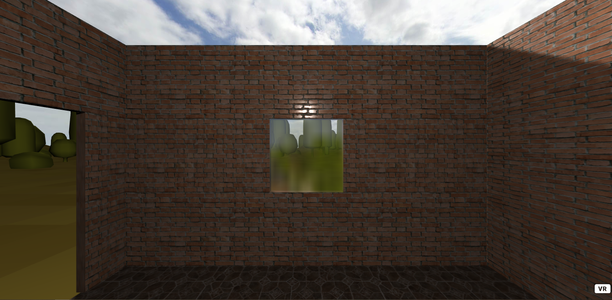
## Step 6: Roof
To make a roof, create an entity with it's geometry set to the cone primitive. To make the cone less circular, decrease the segmentsRadial to 4. This will make the cone only have 4 corners, making the shape look like a pyramid. Change the rotation 45 degrees about the Y-axis so that it is inline with the four walls. Position and scale appropriately. Set the material to however you would like the roof to look.
```HTML
<!-- roof -->
        <a-entity class="roof">
          <a-entity
            position="0 3.75 0"
            rotation="0 45 0"
            scale="3.5 1.53 3.5"
            material="color: white; 
                         src: #wood; 
                         repeat: 2.5 2.5; 
                         roughness: 0.4; 
                         normal-map: #wood-normal; 
                         normalTextureRepeat: 5 5;
                         side: front"
            shadow
            geometry="primitive: cone; 
                         openEnded: false; 
                         segmentsRadial: 4"
          ></a-entity>
       </a-entity>
```
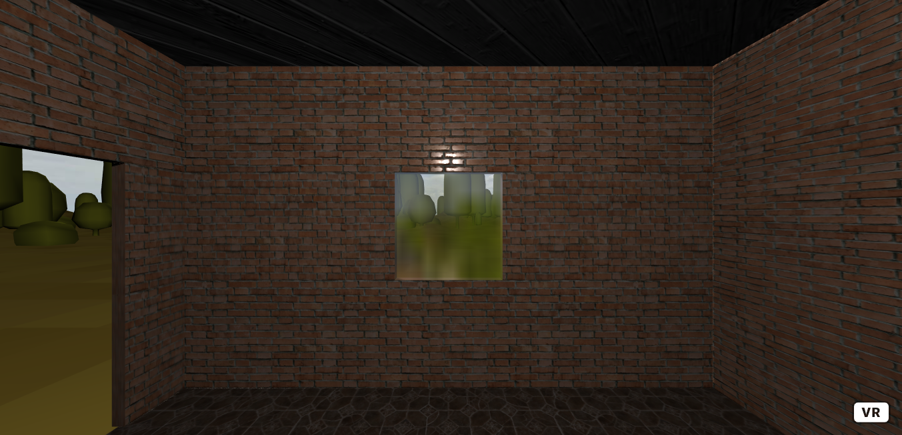
## Step 7: Furniture

To make the scene more interesting, let's make some furniture. A small table and chair.

To make a table, create a box and give it a texture. To make a counter top, scale and position it so that it its smaller and sits on top. Give it a different texture.
```HTML
<!-- table -->
        <a-entity class="table" shadow>
          <a-box
            material="color: white;
                  src: #wood;
                  repeat: 1 1;
                  normal-map: #wood-normal;
                  normal-texture-repeat: 1 1;
                  roughness: 0.6"
            position="0 0.25 -2"
          >
            <a-box
              material="color: white;
                  src: #concrete;
                  repeat: 1 1;
                  normal-map: #concrete-normal;
                  normal-texture-repeat: 1 1;
                  roughness: 0.6"
              position="0 0.55 0"
              scale="1 0.1 1"
            >
            </a-box>
          </a-box>
        </a-entity>
```
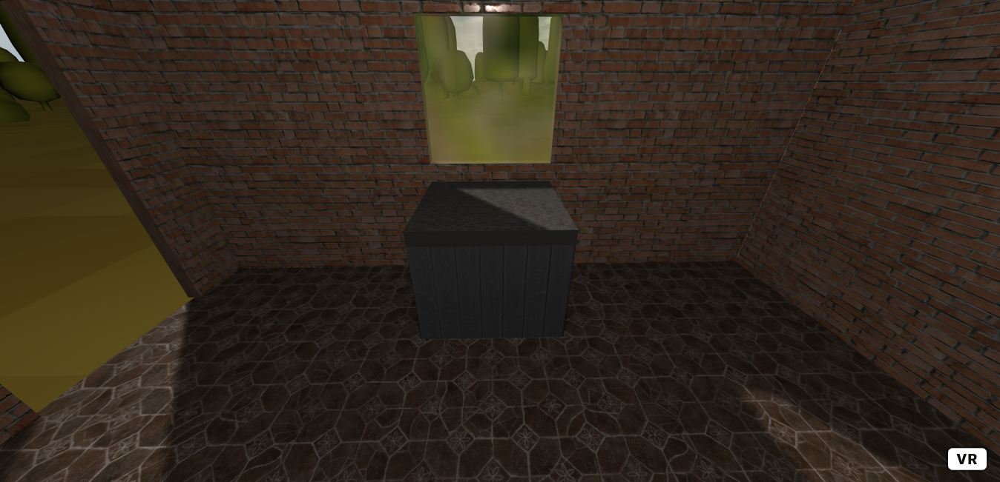
To make a chair you will just need four boxes positioned and scaled to look like an arm chair.

In this example, the chair is positioned behind the user, feel free to move it wherever you prefer.
```HTML
<!-- chair -->
        <a-entity class="chair" shadow>
          <a-box
            position="0 0.5 1.37031"
            scale="1 0.4 0.75"
            material="src: #leather; normalMap: #leather-normal"
          >
          </a-box>
          <a-box
            position="0 0.5 1.85031"
            scale="1 1 -0.08"
            material="src: #leather; normalMap: #leather-normal"
          >
          </a-box>
          <a-box
            position="0.61 0.5 1.5"
            scale="0.25 0.69 0.75"
            material="src: #leather; normalMap: #leather-normal"
          >
          </a-box>
          <a-box
            position="-0.61 0.5 1.5"
            scale="0.25 0.69 0.75"
            material="src: #leather; normalMap: #leather-normal"
          >
          </a-box>
        </a-entity>
```
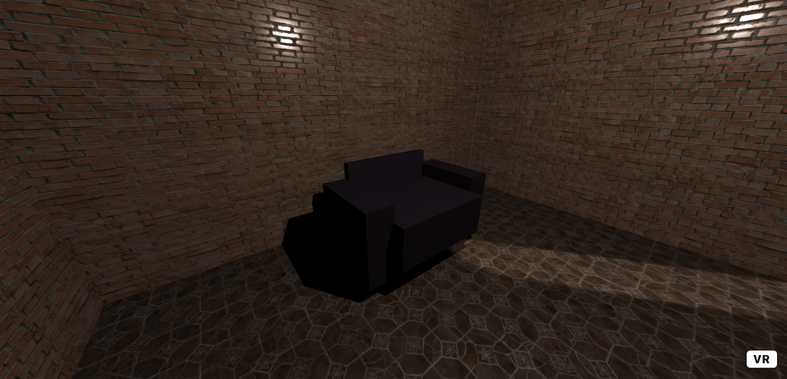
Can you think of any other furniture to create?
## Step 8: Decoration

Finally to create some decorations. To make a cup, create an open ended cone with appropriate top and bottom radius. Then place a circle at the bottom of the cup to close one of the ends.
```HTML
<!-- cup -->
        <a-entity id="cup" position="-0.35 1 -2" shadow>
          <a-entity geometry="primitive: cone; height: 0.3; segmentsHeight: 16; 
                              openEnded: true; radiusBottom: 0.11; radiusTop: 0.15" 
                    material="side: double; color: white"
          ></a-entity>
          <a-entity
            geometry="primitive: circle; radius: 0.11"
            rotation="-90 0 0"
            position="0 -0.13 0"
            material="color: white"
          >
          </a-entity>
        </a-entity>
```
To make a jug, similarly create a cone with a different top and bottom radius. By making the jug have a glass material, you can fill the jug, by copying the same shape, scaling it down and changing it's material to look like some drink in the jug. Then to create a spout and handle, use some modified rings. Scale, position and rotate as needed.
```HTML
<!-- jug -->
        <a-entity id="jug" position="0.125 0.8 -2.125" shadow>
          <a-entity
            geometry="primitive: cone; radiusBottom: 0.2; radiusTop: 0.1; height: 0.5"
            material="roughness:  0.2; metalness:  0.6;  opacity: 0.75; sphericalEnvMap:  #day-sky"
            position=" 0 0.25 0"
          ></a-entity>
          <a-entity
            geometry="primitive: cone; radiusBottom: 0.2; radiusTop: 0.1; height: 0.5"
            material="roughness: 1;  metalness:  0; color: yellow"
            position=" 0 0.25 0"
            scale="0.75 0.75 0.75"
          ></a-entity>
          <a-entity
            geometry="primitive: ring; radiusInner: 0.12; radiusOuter: 0.18; segmentsPhi: 9; segmentsTheta: 3; thetaLength: 90; thetaStart: 0.63"
            material="roughness:  1;   metalness:  0;  color : black; side: double"
            scale="1.38 1.57 1"
            position="0.1 0.2"
          ></a-entity>
          <a-entity
            geometry="primitive: ring; segmentsTheta: 36; radiusInner: 0.12; radiusOuter: 0.18; thetaStart: 0.63; thetaLength: 90; segmentsPhi: 9"
            material="roughness:  0.2;   metalness:  0.6;  sphericalEnvMap:  #day-sky; side: double"
            scale="1.38 1.57 1"
            rotation="0 0 180"
            position="0 0.45 0"
          ></a-entity>
        </a-entity>

```
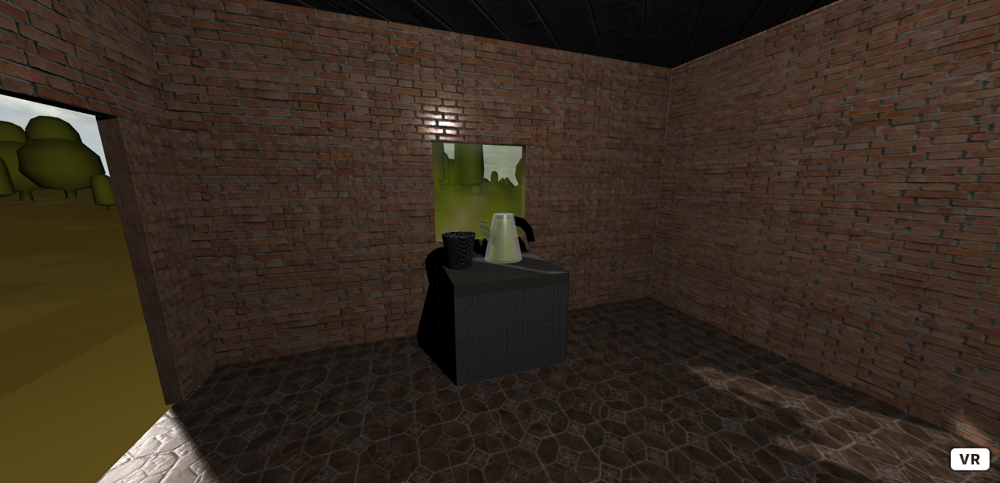

## Further Tasks:

 - What other objects can you create?
 - Experiment with different textures, play with the roughness and
   metalness values of materials to help make interesting materials.
 - Have a look for other materials to play with, you can use these
   websites to find some.
   [https://www.textures.com/](https://www.textures.com/) 
   [https://texturify.com/index.php](https://texturify.com/index.php)
