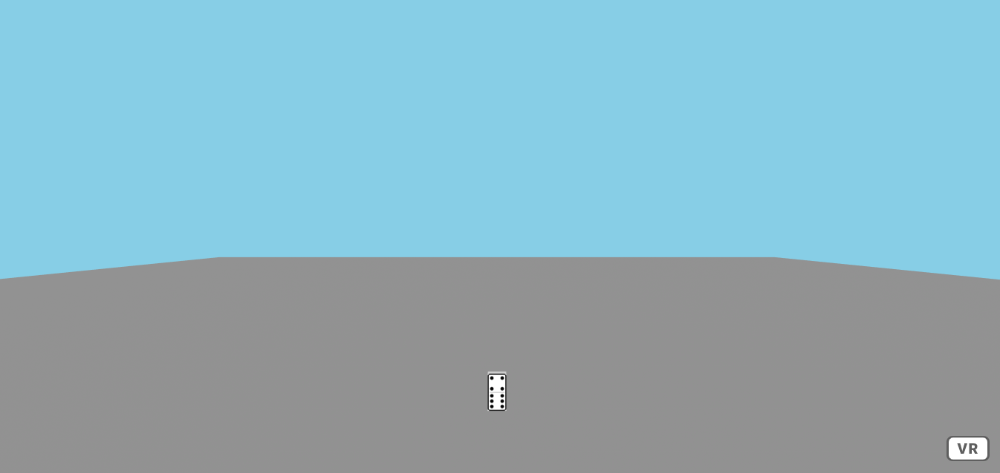
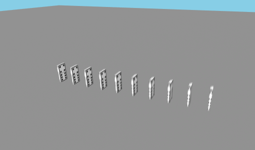
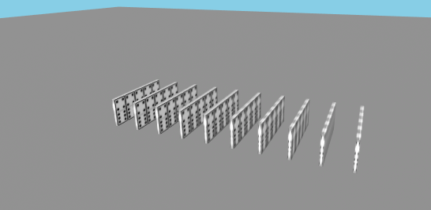
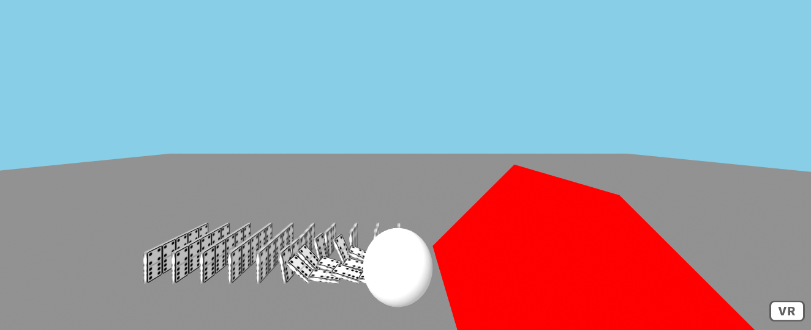
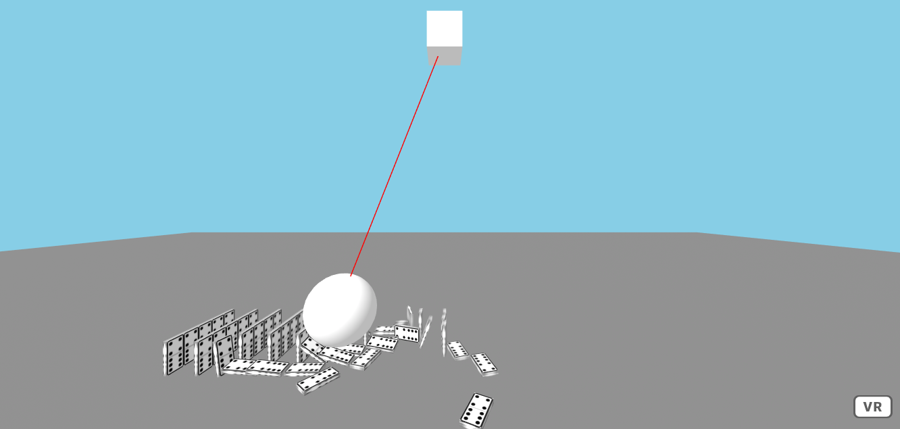

Title: Physics
Author: David McNamara
Date: 16/07/2020
Category: Web & VR
Tags: VR, virtual reality, physics, VR physics
Slug: Physics
Series: Web & VR
Series_index: 03
Sortorder: 03

## **Web & Virtual Reality Physics**
Check out the files for each step for the code up to that point

## **Step: 1 Setup Frameworks & Scene**

Start off by including the following links to A-frame and the A-frame physics system so that the scene can use all the physics components.
```HTML
<!-- AFrame -->
<script src="https://aframe.io/releases/1.0.4/aframe.min.js"></script>
<!-- physis system -->
<script src="https://unpkg.com/aframe-physics-system@1.4.0/dist/aframe-physics-system.min.js"></script>
```
This tutorial will be using the aframe physics system written by Don McCurdy. Check it out here: [https://github.com/donmccurdy/aframe-physics-system](https://github.com/donmccurdeery/aframe-physics-system)
Using this physics system, we can make objects in a scene even more realistic and interesting.

When creating the a-scene you will have to include the physics attribute. Here you can define the gravity, friction and restitution (how bouncy things are) and how many iterations of calculations there are. The more calcuations the more accurate the physics will be. Make sure to add the debug attribute to the scene, this will ensure that objects update appropriately. 
```HTML
<a-scene physics="gravity: -9.8; friction: 0.01; restitution: 0.3; iterations: 100" debug>
```
Create a floor that the dominoes can sit on. Unlike before, because we want to use the physics system you will have to include some additional information when creating objects. For example, when creating the floor, scale, position and rotate so that it is under the user. Additionally, include the static-body attribute. The static-body attribute defines this object to be static, it will stay in the one position and will be a solid surface, allowing things to be able to hit off it rather than pass through it
```HTML
<!-- floor -->
 <a-plane rotation="-90 0 0" scale="100 100 1" color="grey" static-body></a-plane>
```
Create a sky box of your liking, there is no additional physics related attributes needed for the sky box.
```HTML
<!-- sky -->
<a-sky id="background" color="#87cee6"></a-sky>
```
In the asset manager, upload and define the texture that you will use for the domino. Give it a unique id so that this texture can be referenced easily.

In the asset manager, along with the texture. Create a a-mixin , this mixin will be an asset that defines what a domino is. This is useful as it will save a lot of time writing code, as each domino will be the same.

Define the dominoes geometry, its height, width, depth, color and texture. To make the domino respond to the physics, add the attribute dynamic-body. This will let the domino be a solid object that can move and rotate based on it's interaction with the environment.

The mass, linear and angular damping (how easily it moves and rotates) of a dynamic-body can also be defined. Changing these values will affect how the object will interact with the world around it.
```HTML
<!-- asset manager-->
<a-assets>
	  
      <a-mixin
        id="domino"
        geometry="primitive: box; height: 1; width: 0.5; depth: 0.125"
        material="shader: standard;
                  src: #domino-texture"
        dynamic-body="mass: 1;
                      angularDamping: 0.01;
                      linearDamping: 0.01"
      ></a-mixin>
 </a-assets>
```
In this tutorial the camera is positioned differently to the default camera position, as to make it so that the user will be able to see much more when loading into the scene.
```HTML
<!-- camera -->
<a-camera id="user" position="0 5 3"></a-camera>
```
To test that the mixin and physics work, create an entity and give it the mixin attribute = domino. This will give the entity all of the properties of the domino. Position it high in the sky so that it can fall down. The domino should fall and hit the floor.
```HTML
<!-- sample domino -->
<a-entity mixin="domino" position="0 10.6 -5"></a-entity>
```


## **Step 2: Making Lots of Dominoes**
To save a lot of time and lines of code, instead of making a new domino and positioning it manually every time, we can write a function to do it for us. 

First create an entity that will be used as a container for all of the dominoes to added to. 
```HTML
<!-- container for all of the dominoes -->
<a-entity id="container" position = "0 0 -5"> </a-entity>
```

Create a script where you will write javascript functions.

To make a function to create a line of domino in a row.
Find the element that will be used as a container so that the dominoes can be appended to the document easily.
Use a for loop to repeat the creation of the domino many times.
Create a new element of type a-entity and set it's attribute mixin to domino. Set it's rotation and position. To not have the dominoes spawn in the same position, have the position value be influenced by the i value of the for loop. Below is a function that creates 10 dominoes in a row.
```JavaScript
// function to make a line of dominoes
      line();
      function line() {
        var start = document.getElementById("container");
        for (var i = 0; i < 10; i++) {
          var block = document.createElement("a-entity");
          block.setAttribute("mixin", "domino");
          block.setAttribute("rotation", "0 -90 0");
          block.setAttribute("position", -(i * 0.9) + " 0.6 -5");
          start.appendChild(block);
        }
      }
```


For the rest of this tutorial, a function that creates a block of dominoes will be used.
This is similar to the line function, but there is a nested for loop that will make a line several times next to each other.
```JavaScript
// function to make a block of dominoes
      block();
      function block() {
        var start = document.getElementById("container");
        for (var i = 0; i < 10; i++) {
          for (var j = 0; j < 5; j++) {
            var block = document.createElement("a-entity");
            block.setAttribute("mixin", "domino");
            block.setAttribute("rotation", "0 -90 0");
            block.setAttribute(
              "position",
              -(i * 0.9) + " 0.6 " + ((-j * 0.5) - 5)
            );
            start.appendChild(block);
          }
        }
      }
```


Experiment by changing the number of iterations each for loop makes, this will change how many dominoes are created. Be careful about creating hundreds or thousands of domino, as this may cause performance issues.

## **Step 3: Rolling Ball**
Let's create a rolling ball that will knock down the dominoes.
Start by creating a slope by making a large box at a 45 degree angle about the Z-axis and make the box a static-body. Position this box before the block of dominoes so that a ball could roll down and knock them over.
```HTML
<!-- slope -->
    <a-box
      position="5 0 -5"
      rotation="0 0 45"
      scale="5 5 5"
      color="red"
      static-body
    ></a-box>
```
Next make a sphere above the slope and give it the dynamic-body attribute. This will allow the sphere to fall and roll down the slope. Try changing the dynamic-body parameters of the ball. What happens if you make the ball very heavy by increasing it's mass. Or what happens if you make the ball very light by decreasing the ball's mass?
```HTML
<!-- ball -->
    <a-sphere
      position="4 5 -5"
      scale="1 1 1"
      dynamic-body="mass: 1;
                    angularDamping: 0.01;
                    linearDamping: 0.01"
    >
    </a-sphere>  
```

## **Step 4: Swinging Ball**
Finally, another way to knock over the dominoes could be a swinging  ball. To achieve this you will have to create a block that represents  the ceiling that the ball will hang from. A ball that is constrained to the ceiling and a line connecting them together to create the illusion of a string or chain connecting the ball to the ceiling.

To make the ceiling, create a static-body box with a unique id, and position it high in the sky.
```HTML
<!-- ceiling -->
<a-box id="ceiling" position="0 10 -5" static-body> </a-box>
```
Next to make the ball, create a sphere with a unique id, giving it the dynamic-body attribute. Also include the constraint attribute, set the constraint type to coneTwist. Set the target to the id of the ceiling. Set the pivot location to where the pivot begins, and set the targetPivot to where the ball will finally end up.
```HTML
<!-- ball -->
    <a-sphere
      id="ball"
      position="7 2.5 -5"
      dynamic-body="mass: 10;
                    linearDamping: 0.1;
                    angularDamping: 0.1"
      constraint="type: coneTwist;
                    target: #ceiling;
                    pivot: 0 8.5 0;
                    targetPivot: 0 0 0"
   ></a-sphere>
````
To make a line between the ceiling and the ball, as to create the illusion of them being connected. Create a entity with a line, set its start position to the same position as the ceiling. And give the line a color so it can be easy to see. Instead of hard coding the end position of the line. It would look more realistic to dynamically change the end position of the line based off of the location of the ball. To do this you will have to create a custom component. But first give the line an attribute called track, and set track target equal to ball.
```HTML
<!-- string -->
    <a-entity
      track="target: ball"
      line="start: 0, 10, -5; color: red"
    ></a-entity>
```
To write the custom track component, you will have to make a new script that is after the body and before the a-scene


Call the component track, with the schema target of type string. The component will use the data that is given to it. In this case, it will be given the data track = "target: ball" which means that the ball is going to be tracked. Every tick (which happens about 60 times per second) the end position of the line is going to be updated with the current position of the targeted object.
```JavaScript
// custom component that tracks a given object id
    AFRAME.registerComponent("track", {
      schema: {
        target: { type: "string" } // the id of object to track
      },
      tick: function() {
        // get the position of the target object
        var pos = document.getElementById(this.data.target).getAttribute("position");
        // set the end of the line to the position of the target object
        AFRAME.utils.entity.setComponentProperty(this.el, "line", { end: pos });
      }
    });
```

## **Further Tasks:**

 - Consider adjusting the \<a-scene> physics parameters. Try to make
   everything in the scene bouncy by changing the restitution value. Or
   simulate a slippery surface by making the friction very very low or
   even 0. When the friction is set to 0, objects will keep on sliding
   on the floor and will not stop.
 - Experiment by changing the mass of the dominoes and the balls. How
   does changing the mass effect the interactions between the objects.
 - Can you change the gravity from -9.8 (which is the gravity on earth)
   to the gravity on the moon? What happens if you use 0 gravity, or
   gravity with a positive number.
